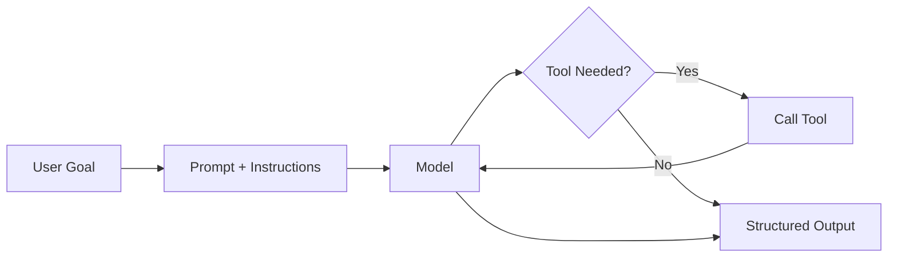
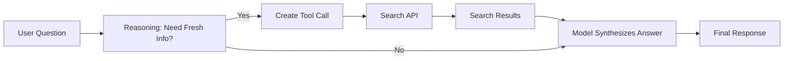
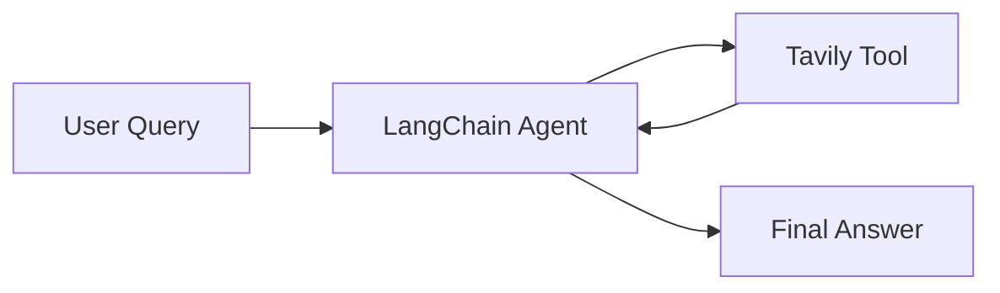
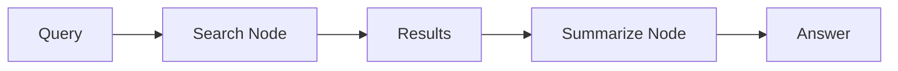
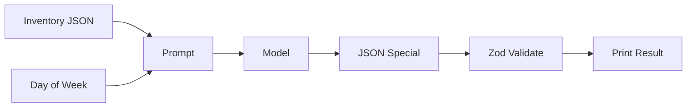
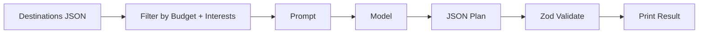
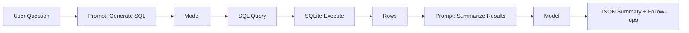

# Chapter 3: Your First Agent (Search & Summarize)

This chapter is your hands-on starting point. You will build a real agent that uses a tool, returns structured output, and follows clear instructions.

We will start with a **Search & Summarize** agent (a ReAct agent that can look things up). After that, you can build three additional agents tailored to different backgrounds: business owner, everyday user, and developer.

All four projects teach the same core skills. Start with Search & Summarize, then explore the others.

## What You Will Learn

- How to structure a simple agent loop
- How to call a tool safely
- How to return clean, predictable output
- How to test and improve prompts

## Prerequisites

- Node.js 18+ installed
- Basic comfort with running a script
- A model API key set in `.env` (for OpenAI) or Ollama installed locally

If you are new to Node.js or APIs, skim Chapter 2 before starting.

## Quick Setup (OpenAI or Ollama)

Choose one provider. You can switch later without changing the core logic.

### Option A: OpenAI

1. Create a `.env` file:

```
OPENAI_API_KEY=your_key_here
```

2. Install dependencies:

```bash
npm install openai dotenv zod
```

### Option B: Ollama (Local)

1. Install Ollama and pull a model:

```bash
ollama pull llama3
```

2. Install dependencies:

```bash
npm install ollama dotenv zod
```

## The Core Agent Pattern (Used in All Projects)

Every starter agent in this chapter follows the same pattern:

1. Receive a goal from the user
2. Decide if a tool is needed
3. Call the tool and collect data
4. Return a structured response

Think of this as a tiny, reliable loop. We are not aiming for magic. We are aiming for a clean, repeatable system.

### Core Agent Flow (Visual)



## Main Project: Search & Summarize (ReAct Agent)

### 1. What Is This Agent?

This is a **ReAct Agent** (Reasoning + Acting). It is not just a chatbot that remembers training data from 2023. It is a system that can say:

> "I don't know the answer, so I will go look it up."

Think of it like a research assistant with a smartphone.

- **Standard ChatGPT**: A genius locked in a windowless room with no internet.
- **Your Search Agent**: The same genius, but you gave them a smartphone.

It cannot memorize the stock market, but it _can_ search to find the current answer.

### 2. How Does It Work? (The Logic Flow)

When you run `agent.run("What is the stock price of Tesla?")`, a 4-step invisible loop happens. This is called the **Agentic Loop**.

**Step 1: The Pause (Reasoning)**  
The LLM receives your question. Instead of answering immediately, it pauses and checks its instructions.

Internal thought:  
"The user asked for the current stock price. My training data is old. I have a search tool. I should use it."

**Step 2: The Call (Tool Use)**  
The LLM outputs a tool call instead of a human answer.

LLM output (example):  
`{"action": "search", "query": "Tesla stock price today"}`

It does not search the web itself. It asks your Node.js script to do it.

**Step 3: The Execution (Action)**  
Your Node.js script detects the tool call and runs the search API.

Node.js script flow:  
Search API -> receives result -> sends result back to the model

**Step 4: The Synthesis (Final Response)**  
The LLM receives the search results and writes the final answer.

Final output (example):  
"The current stock price of Tesla is $215.50, which is up 2% today."

### ReAct Loop (Visual)



### 3. The Code Explained (Line by Line)

Below is the "Hello World" Search & Summarize agent. You can run it with **OpenAI** or **Ollama**. Each variant uses the same logic but different model providers.

### Search API (Beginner Default: Tavily)

If you are new to search APIs, use **Tavily**. It is simple and beginner-friendly.

1. Create a `.env` file and add:

```
TAVILY_API_KEY=your_key_here
```

2. The function below calls Tavily and returns results in a clean format.

Create `react_search_openai.js` (OpenAI):

```js
import "dotenv/config";
import OpenAI from "openai";
import { z } from "zod";

const client = new OpenAI({ apiKey: process.env.OPENAI_API_KEY });

const ToolCall = z.object({
  action: z.string(),
  query: z.string(),
});

const FinalAnswer = z.object({
  answer: z.string(),
  sources: z.array(z.string()),
});

function parseJson(text) {
  let cleaned = text.trim();
  if (cleaned.startsWith("```")) {
    cleaned = cleaned.split("\n", 2)[1] || "";
    if (cleaned.endsWith("```")) {
      cleaned = cleaned.split("\n").slice(0, -1).join("\n");
    }
  }
  return JSON.parse(cleaned);
}

async function searchWeb(query) {
  const resp = await fetch("https://api.tavily.com/search", {
    method: "POST",
    headers: { "Content-Type": "application/json" },
    body: JSON.stringify({
      api_key: process.env.TAVILY_API_KEY,
      query,
      max_results: 3,
      include_answer: false,
    }),
  });
  if (!resp.ok) {
    throw new Error(`Tavily error: ${resp.status}`);
  }
  const data = await resp.json();
  return {
    results: (data.results || []).map((r) => ({
      title: r.title || "",
      url: r.url || "",
      snippet: r.content || "",
    })),
  };
}

const systemPrompt =
  "You are a ReAct agent. If you need current information, " +
  "return a JSON tool call with keys: action, query. " +
  "Otherwise return a JSON final answer with keys: answer, sources.";

const userQuestion = "What is the stock price of Tesla right now?";

const resp = await client.responses.create({
  model: "gpt-4.1-mini",
  input: [
    { role: "system", content: systemPrompt },
    { role: "user", content: userQuestion },
  ],
});

const raw = resp.output_text;
const parsed = parseJson(raw);

if (parsed.action) {
  const toolCall = ToolCall.parse(parsed);
  const searchData = await searchWeb(toolCall.query);
  const followup =
    `Search results: ${JSON.stringify(searchData)}\n` +
    "Write a final answer as JSON with keys: answer, sources.";

  const resp2 = await client.responses.create({
    model: "gpt-4.1-mini",
    input: [
      { role: "system", content: "You summarize search results." },
      { role: "user", content: followup },
    ],
  });

  const final = FinalAnswer.parse(parseJson(resp2.output_text));
  console.log(JSON.stringify(final, null, 2));
} else {
  const final = FinalAnswer.parse(parsed);
  console.log(JSON.stringify(final, null, 2));
}
```

Create `react_search_ollama.js` (Ollama):

```js
import "dotenv/config";
import ollama from "ollama";
import { z } from "zod";

const ToolCall = z.object({
  action: z.string(),
  query: z.string(),
});

const FinalAnswer = z.object({
  answer: z.string(),
  sources: z.array(z.string()),
});

function parseJson(text) {
  let cleaned = text.trim();
  if (cleaned.startsWith("```")) {
    cleaned = cleaned.split("\n", 2)[1] || "";
    if (cleaned.endsWith("```")) {
      cleaned = cleaned.split("\n").slice(0, -1).join("\n");
    }
  }
  return JSON.parse(cleaned);
}

async function searchWeb(query) {
  const resp = await fetch("https://api.tavily.com/search", {
    method: "POST",
    headers: { "Content-Type": "application/json" },
    body: JSON.stringify({
      api_key: process.env.TAVILY_API_KEY,
      query,
      max_results: 3,
      include_answer: false,
    }),
  });
  if (!resp.ok) {
    throw new Error(`Tavily error: ${resp.status}`);
  }
  const data = await resp.json();
  return {
    results: (data.results || []).map((r) => ({
      title: r.title || "",
      url: r.url || "",
      snippet: r.content || "",
    })),
  };
}

const systemPrompt =
  "You are a ReAct agent. If you need current information, " +
  "return a JSON tool call with keys: action, query. " +
  "Otherwise return a JSON final answer with keys: answer, sources.";

const userQuestion = "What is the stock price of Tesla right now?";

const resp = await ollama.chat({
  model: "llama3",
  messages: [
    { role: "system", content: systemPrompt },
    { role: "user", content: userQuestion },
  ],
  options: { temperature: 0.2 },
});

const raw = resp.message.content;
const parsed = parseJson(raw);

if (parsed.action) {
  const toolCall = ToolCall.parse(parsed);
  const searchData = await searchWeb(toolCall.query);
  const followup =
    `Search results: ${JSON.stringify(searchData)}\n` +
    "Write a final answer as JSON with keys: answer, sources.";

  const resp2 = await ollama.chat({
    model: "llama3",
    messages: [
      { role: "system", content: "You summarize search results." },
      { role: "user", content: followup },
    ],
    options: { temperature: 0.2 },
  });

  const final = FinalAnswer.parse(parseJson(resp2.message.content));
  console.log(JSON.stringify(final, null, 2));
} else {
  const final = FinalAnswer.parse(parsed);
  console.log(JSON.stringify(final, null, 2));
}
```

### Terminal Dry Run (Simulated)

```bash
node react_search_openai.js
```

```text
{
  "answer": "Tesla's stock is trading around $215.50 at the moment, up about 2% today.",
  "sources": [
    "https://example.com/market-data",
    "https://example.com/tesla-quote"
  ]
}
```

```bash
node react_search_ollama.js
```

```text
{
  "answer": "Tesla's stock is around $215 today. It is up roughly 2% from the previous close.",
  "sources": [
    "https://example.com/market-data",
    "https://example.com/tesla-quote"
  ]
}
```

## Framework Shortcuts (Same Example, New Tools)

You already built the Search & Summarize agent from scratch. Now you will see the exact same idea using popular frameworks. This helps you recognize the pattern in any tool.

### What Are These Tools?

- **LangChain**: A toolkit that wraps prompts, tools, memory, and agent logic so you write less plumbing code.
- **LangGraph**: A framework for multi-step flows modeled as a graph of nodes and edges.
- **Other tools you may hear about**: CrewAI, AutoGen, LlamaIndex.

### LangChain Version (Search & Summarize)

This version uses the same Search & Summarize goal but with a built-in ReAct-style agent.

**Flow (LangChain)**:



**Install**:

```bash
npm install langchain @langchain/openai @langchain/community dotenv
```

**OpenAI example**:

```js
import "dotenv/config";
import { ChatOpenAI } from "@langchain/openai";
import { TavilySearchResults } from "@langchain/community/tools/tavily_search";
import { AgentExecutor, createReactAgent } from "langchain/agents";
import { pull } from "langchain/hub";

const llm = new ChatOpenAI({ model: "gpt-4o-mini", temperature: 0 });
const tools = [new TavilySearchResults({ maxResults: 3 })];

const prompt = await pull("hwchase17/react");
const agent = await createReactAgent({ llm, tools, prompt });
const executor = new AgentExecutor({ agent, tools, verbose: true });

const query = "What is the stock price of Tesla right now?";
const result = await executor.invoke({ input: query });
console.log(result.output);
```

**Ollama example**:

```js
import "dotenv/config";
import { TavilySearchResults } from "@langchain/community/tools/tavily_search";
import { AgentExecutor, createReactAgent } from "langchain/agents";
import { pull } from "langchain/hub";
import { ChatOllama } from "@langchain/community/chat_models/ollama";

const llm = new ChatOllama({ model: "llama3", temperature: 0 });
const tools = [new TavilySearchResults({ maxResults: 3 })];

const prompt = await pull("hwchase17/react");
const agent = await createReactAgent({ llm, tools, prompt });
const executor = new AgentExecutor({ agent, tools, verbose: true });

const query = "What is the stock price of Tesla right now?";
const result = await executor.invoke({ input: query });
console.log(result.output);
```

**What changed**:

- You no longer write the tool-call parser.
- The framework chooses when to call tools.
- The result is plain text unless you add a structured output step.

### LangGraph Version (Search & Summarize)

LangGraph turns the same pattern into an explicit graph. This helps when you need branching logic, retries, or multi-agent systems.

**Flow (LangGraph)**:



**Install**:

```bash
npm install @langchain/langgraph @langchain/openai @langchain/community langchain dotenv
```

**OpenAI example**:

```js
import "dotenv/config";
import { ChatOpenAI } from "@langchain/openai";
import { TavilySearchResults } from "@langchain/community/tools/tavily_search";
import { StateGraph, END } from "@langchain/langgraph";

const llm = new ChatOpenAI({ model: "gpt-4o-mini", temperature: 0 });
const searchTool = new TavilySearchResults({ maxResults: 3 });

const graph = new StateGraph({
  channels: {
    query: null,
    results: null,
    answer: null,
  },
});

graph.addNode("search", async (state) => {
  const results = await searchTool.invoke(state.query);
  return { ...state, results };
});

graph.addNode("summarize", async (state) => {
  const prompt = `Search results: ${JSON.stringify(state.results)}\nSummarize in 3 sentences.`;
  const answer = (await llm.invoke(prompt)).content;
  return { ...state, answer };
});

graph.setEntryPoint("search");
graph.addEdge("search", "summarize");
graph.addEdge("summarize", END);

const app = graph.compile();
const finalState = await app.invoke({ query: "What is the stock price of Tesla right now?" });
console.log(finalState.answer);
```

**What changed**:

- You see each step as a node.
- It is easy to insert retries, tools, or human approval.
- The flow is explicit and scalable.

## Next Practice Projects

Now that you have built a working ReAct agent, try one of the practice projects below to reinforce the same pattern in different contexts.

## Project A: Cafe Helper Agent (Business Owner)

**Goal**: Help a cafe owner plan daily specials based on inventory and the day of week.

**Input example**:

- Inventory: `eggs, spinach, mushrooms, sourdough`
- Day: `Saturday`

**Output (structured)**:

- `special_name`
- `ingredients_used`
- `estimated_prep_time`
- `short_marketing_blurb`

**Tool**:

- A simple inventory lookup (local JSON or a tiny CSV file)

**Why this project works**:

- The problem is small
- The output must be structured
- It feels realistic for business owners

### Cafe Agent Flow (Visual)



### Steps

1. Create a small inventory file
2. Load it in Node.js
3. Send the inventory + day to the model
4. Validate the model output
5. Print the result in a clean format

### Exact Code (Cafe Helper)

Create a file `inventory.json`:

```json
{
  "eggs": 24,
  "spinach": 12,
  "mushrooms": 10,
  "sourdough": 16,
  "tomatoes": 8
}
```

Create `cafe_agent_openai.js` (OpenAI):

```js
import "dotenv/config";
import { readFileSync } from "node:fs";
import OpenAI from "openai";
import { z } from "zod";

const CafeSpecial = z.object({
  special_name: z.string(),
  ingredients_used: z.array(z.string()),
  estimated_prep_time: z.string(),
  short_marketing_blurb: z.string(),
});

const client = new OpenAI({ apiKey: process.env.OPENAI_API_KEY });

const inventory = JSON.parse(readFileSync("inventory.json", "utf-8"));
const day = "Saturday";

const systemPrompt =
  "You are a helpful cafe assistant. " +
  "Return JSON only, matching this schema: " +
  "{special_name, ingredients_used, estimated_prep_time, short_marketing_blurb}.";

const userPrompt = `Inventory: ${JSON.stringify(inventory)}\nDay: ${day}\nCreate a single daily special using available ingredients.`;

const resp = await client.responses.create({
  model: "gpt-4.1-mini",
  input: [
    { role: "system", content: systemPrompt },
    { role: "user", content: userPrompt },
  ],
});

const special = CafeSpecial.parse(JSON.parse(resp.output_text));
console.log(JSON.stringify(special, null, 2));
```

Create `cafe_agent_ollama.js` (Ollama):

```js
import { readFileSync } from "node:fs";
import ollama from "ollama";
import { z } from "zod";

const CafeSpecial = z.object({
  special_name: z.string(),
  ingredients_used: z.array(z.string()),
  estimated_prep_time: z.string(),
  short_marketing_blurb: z.string(),
});

const inventory = JSON.parse(readFileSync("inventory.json", "utf-8"));
const day = "Saturday";

const systemPrompt =
  "You are a helpful cafe assistant. " +
  "Return JSON only, matching this schema: " +
  "{special_name, ingredients_used, estimated_prep_time, short_marketing_blurb}.";

const userPrompt = `Inventory: ${JSON.stringify(inventory)}\nDay: ${day}\nCreate a single daily special using available ingredients.`;

const resp = await ollama.chat({
  model: "llama3",
  messages: [
    { role: "system", content: systemPrompt },
    { role: "user", content: userPrompt },
  ],
  options: { temperature: 0.2 },
});

const special = CafeSpecial.parse(JSON.parse(resp.message.content));
console.log(JSON.stringify(special, null, 2));
```

### Example Output

```json
{
  "special_name": "Spinach & Mushroom Toast",
  "ingredients_used": ["spinach", "mushrooms", "sourdough", "eggs"],
  "estimated_prep_time": "12 minutes",
  "short_marketing_blurb": "A cozy weekend toast topped with sauteed greens and a soft egg."
}
```

## Project B: Vacation Planner Agent (Daily User)

**Goal**: Help a person plan a short vacation based on budget and preferences.

**Input example**:

- Budget: `$900`
- Duration: `3 days`
- Interests: `food, museums, walkable areas`

**Output (structured)**:

- `destination`
- `day_by_day_plan`
- `estimated_cost`
- `packing_list`

**Tool**:

- A simple dataset of destinations (local JSON)

**Why this project works**:

- Easy for beginners to relate
- Teaches planning and structure
- Demonstrates how tools guide the model

### Vacation Agent Flow (Visual)



### Steps

1. Create a tiny destinations file
2. Filter based on budget and duration
3. Provide the filtered list to the model
4. Ask for a clean JSON plan
5. Validate the response and print it

### Exact Code (Vacation Planner)

Create a file `destinations.json`:

```json
[
  {
    "city": "Chicago",
    "avg_3day_cost": 850,
    "tags": ["food", "museums", "walkable"]
  },
  {
    "city": "Austin",
    "avg_3day_cost": 780,
    "tags": ["food", "music", "nightlife"]
  },
  {
    "city": "Portland",
    "avg_3day_cost": 700,
    "tags": ["coffee", "walkable", "parks"]
  }
]
```

Create `vacation_agent_openai.js` (OpenAI):

```js
import "dotenv/config";
import { readFileSync } from "node:fs";
import OpenAI from "openai";
import { z } from "zod";

const VacationPlan = z.object({
  destination: z.string(),
  day_by_day_plan: z.array(z.string()),
  estimated_cost: z.string(),
  packing_list: z.array(z.string()),
});

const client = new OpenAI({ apiKey: process.env.OPENAI_API_KEY });

const budget = 900;
const durationDays = 3;
const interests = ["food", "museums", "walkable"];

const destinations = JSON.parse(readFileSync("destinations.json", "utf-8"));
const filtered = destinations.filter(
  (d) => d.avg_3day_cost <= budget && interests.every((i) => d.tags.includes(i))
);

const systemPrompt =
  "You are a vacation planner. " +
  "Return JSON only, matching this schema: " +
  "{destination, day_by_day_plan, estimated_cost, packing_list}.";

const userPrompt =
  `Options: ${JSON.stringify(filtered)}\n` +
  `Budget: ${budget}\n` +
  `Duration: ${durationDays} days\n` +
  `Interests: ${JSON.stringify(interests)}\n` +
  "Pick the best destination and build a simple plan.";

const resp = await client.responses.create({
  model: "gpt-4.1-mini",
  input: [
    { role: "system", content: systemPrompt },
    { role: "user", content: userPrompt },
  ],
});

const plan = VacationPlan.parse(JSON.parse(resp.output_text));
console.log(JSON.stringify(plan, null, 2));
```

Create `vacation_agent_ollama.js` (Ollama):

```js
import { readFileSync } from "node:fs";
import ollama from "ollama";
import { z } from "zod";

const VacationPlan = z.object({
  destination: z.string(),
  day_by_day_plan: z.array(z.string()),
  estimated_cost: z.string(),
  packing_list: z.array(z.string()),
});

const budget = 900;
const durationDays = 3;
const interests = ["food", "museums", "walkable"];

const destinations = JSON.parse(readFileSync("destinations.json", "utf-8"));
const filtered = destinations.filter(
  (d) => d.avg_3day_cost <= budget && interests.every((i) => d.tags.includes(i))
);

const systemPrompt =
  "You are a vacation planner. " +
  "Return JSON only, matching this schema: " +
  "{destination, day_by_day_plan, estimated_cost, packing_list}.";

const userPrompt =
  `Options: ${JSON.stringify(filtered)}\n` +
  `Budget: ${budget}\n` +
  `Duration: ${durationDays} days\n` +
  `Interests: ${JSON.stringify(interests)}\n` +
  "Pick the best destination and build a simple plan.";

const resp = await ollama.chat({
  model: "llama3",
  messages: [
    { role: "system", content: systemPrompt },
    { role: "user", content: userPrompt },
  ],
  options: { temperature: 0.2 },
});

const plan = VacationPlan.parse(JSON.parse(resp.message.content));
console.log(JSON.stringify(plan, null, 2));
```

### Example Output

```json
{
  "destination": "Chicago",
  "day_by_day_plan": [
    "Day 1: Riverwalk, deep dish dinner, architecture boat tour",
    "Day 2: Art Institute, Millennium Park, local food market",
    "Day 3: Museum of Science and Industry, coffee crawl"
  ],
  "estimated_cost": "$850",
  "packing_list": ["comfortable shoes", "light jacket", "museum pass"]
}
```

## Project C: SQL Data Helper Agent (Developer)

**Goal**: Help a developer query their own database and explain results.

**Input example**:

- Question: "Which products had the highest revenue last quarter?"

**Output (structured)**:

- `sql_query`
- `result_summary`
- `follow_up_questions`

**Tool**:

- A local SQLite database with sample data

**Why this project works**:

- Very practical for developers
- Shows how agents can work with real data
- Introduces safe SQL practices

### SQL Agent Flow (Visual)



### Steps

1. Create a small SQLite database
2. Ask the model to generate a SQL query
3. Run the query
4. Feed results back to the model
5. Return a summary and follow-ups

### Exact Code (SQL Data Helper)

Install the SQLite library:

```bash
npm install better-sqlite3
```

Create `init_db.js`:

```js
import Database from "better-sqlite3";

const db = new Database("sales.db");
db.exec("DROP TABLE IF EXISTS sales");
db.exec(`
  CREATE TABLE sales (
    product_name TEXT,
    quarter TEXT,
    revenue INTEGER
  )
`);

const stmt = db.prepare("INSERT INTO sales VALUES (?, ?, ?)");
[
  ["Product A", "Q4", 120000],
  ["Product B", "Q4", 108000],
  ["Product C", "Q4", 65000],
  ["Product A", "Q3", 98000],
  ["Product B", "Q3", 91000],
].forEach((row) => stmt.run(...row));

db.close();
```

Create `sql_agent_openai.js` (OpenAI):

```js
import "dotenv/config";
import OpenAI from "openai";
import Database from "better-sqlite3";
import { z } from "zod";

const SQLAnswer = z.object({
  sql_query: z.string(),
  result_summary: z.string(),
  follow_up_questions: z.array(z.string()),
});

const client = new OpenAI({ apiKey: process.env.OPENAI_API_KEY });
const question = "Which products had the highest revenue last quarter?";

const systemPrompt =
  "You are a data assistant. " +
  "Return JSON only, matching this schema: " +
  "{sql_query, result_summary, follow_up_questions}. " +
  "Use SQLite syntax.";

const resp = await client.responses.create({
  model: "gpt-4.1-mini",
  input: [
    { role: "system", content: systemPrompt },
    { role: "user", content: `Question: ${question}` },
  ],
});

const answer = SQLAnswer.parse(JSON.parse(resp.output_text));

const db = new Database("sales.db");
const rows = db.prepare(answer.sql_query).all();
db.close();

const resultPrompt =
  `SQL: ${answer.sql_query}\n` +
  `Rows: ${JSON.stringify(rows)}\n` +
  "Summarize in one short paragraph and suggest 2 follow-up questions. " +
  "Return JSON with keys: sql_query, result_summary, follow_up_questions. " +
  "Use the exact sql_query shown above.";

const resp2 = await client.responses.create({
  model: "gpt-4.1-mini",
  input: [
    { role: "system", content: "You summarize SQL results." },
    { role: "user", content: resultPrompt },
  ],
});

const summary = SQLAnswer.parse(JSON.parse(resp2.output_text));
console.log(JSON.stringify(summary, null, 2));
```

Create `sql_agent_ollama.js` (Ollama):

```js
import ollama from "ollama";
import Database from "better-sqlite3";
import { z } from "zod";

const SQLAnswer = z.object({
  sql_query: z.string(),
  result_summary: z.string(),
  follow_up_questions: z.array(z.string()),
});

const question = "Which products had the highest revenue last quarter?";

const systemPrompt =
  "You are a data assistant. " +
  "Return JSON only, matching this schema: " +
  "{sql_query, result_summary, follow_up_questions}. " +
  "Use SQLite syntax.";

const resp = await ollama.chat({
  model: "llama3",
  messages: [
    { role: "system", content: systemPrompt },
    { role: "user", content: `Question: ${question}` },
  ],
  options: { temperature: 0.2 },
});

const answer = SQLAnswer.parse(JSON.parse(resp.message.content));

const db = new Database("sales.db");
const rows = db.prepare(answer.sql_query).all();
db.close();

const resultPrompt =
  `SQL: ${answer.sql_query}\n` +
  `Rows: ${JSON.stringify(rows)}\n` +
  "Summarize in one short paragraph and suggest 2 follow-up questions. " +
  "Return JSON with keys: sql_query, result_summary, follow_up_questions. " +
  "Use the exact sql_query shown above.";

const resp2 = await ollama.chat({
  model: "llama3",
  messages: [
    { role: "system", content: "You summarize SQL results." },
    { role: "user", content: resultPrompt },
  ],
  options: { temperature: 0.2 },
});

const summary = SQLAnswer.parse(JSON.parse(resp2.message.content));
console.log(JSON.stringify(summary, null, 2));
```

### Example Output

```json
{
  "sql_query": "SELECT product_name, SUM(revenue) AS total_revenue FROM sales WHERE quarter = 'Q4' GROUP BY product_name ORDER BY total_revenue DESC LIMIT 5;",
  "result_summary": "Product A and Product B led revenue in Q4, with Product A ahead by roughly 12 percent.",
  "follow_up_questions": [
    "Do you want this broken down by region?",
    "Should we compare against Q3?"
  ]
}
```

## Choose Your Path

Pick one project and build it end-to-end. If you finish early, try another project to strengthen the pattern.

## Common Pitfalls

- Vague prompts produce messy output
- Missing validation causes fragile systems
- Tool results should be passed back to the model, not ignored

## Running Each Project

```bash
node react_search_openai.js
node react_search_ollama.js
node cafe_agent_openai.js
node cafe_agent_ollama.js
node vacation_agent_openai.js
node vacation_agent_ollama.js
node init_db.js
node sql_agent_openai.js
node sql_agent_ollama.js
```

## Terminal Dry Run (Simulated)

These are example terminal runs so you know what "good" looks like. Your output will vary slightly.

### Cafe Agent (OpenAI)

```bash
node cafe_agent_openai.js
```

```text
{
  "special_name": "Spinach & Mushroom Toast",
  "ingredients_used": ["spinach", "mushrooms", "sourdough", "eggs"],
  "estimated_prep_time": "12 minutes",
  "short_marketing_blurb": "A cozy weekend toast topped with sauteed greens and a soft egg."
}
```

### Cafe Agent (Ollama)

```bash
node cafe_agent_ollama.js
```

```text
{
  "special_name": "Saturday Sunrise Toast",
  "ingredients_used": ["sourdough", "eggs", "spinach", "tomatoes"],
  "estimated_prep_time": "10 minutes",
  "short_marketing_blurb": "Weekend toast with soft eggs, greens, and fresh tomatoes."
}
```

### Vacation Agent (OpenAI)

```bash
node vacation_agent_openai.js
```

```text
{
  "destination": "Chicago",
  "day_by_day_plan": [
    "Day 1: Riverwalk, deep dish dinner, architecture boat tour",
    "Day 2: Art Institute, Millennium Park, local food market",
    "Day 3: Museum of Science and Industry, coffee crawl"
  ],
  "estimated_cost": "$850",
  "packing_list": ["comfortable shoes", "light jacket", "museum pass"]
}
```

### Vacation Agent (Ollama)

```bash
node vacation_agent_ollama.js
```

```text
{
  "destination": "Portland",
  "day_by_day_plan": [
    "Day 1: Coffee tour, Washington Park, local food carts",
    "Day 2: Art museum, river walk, dinner in Pearl District",
    "Day 3: Forest Park hike, Powell's Books, tea stop"
  ],
  "estimated_cost": "$720",
  "packing_list": ["comfortable shoes", "light jacket", "reusable water bottle"]
}
```

### SQL Agent (OpenAI)

```bash
node init_db.js
node sql_agent_openai.js
```

```text
{
  "sql_query": "SELECT product_name, SUM(revenue) AS total_revenue FROM sales WHERE quarter = 'Q4' GROUP BY product_name ORDER BY total_revenue DESC LIMIT 5;",
  "result_summary": "Product A and Product B led revenue in Q4, with Product A ahead by roughly 12 percent.",
  "follow_up_questions": [
    "Do you want this broken down by region?",
    "Should we compare against Q3?"
  ]
}
```

### SQL Agent (Ollama)

```bash
node init_db.js
node sql_agent_ollama.js
```

```text
{
  "sql_query": "SELECT product_name, SUM(revenue) AS total_revenue FROM sales WHERE quarter = 'Q4' GROUP BY product_name ORDER BY total_revenue DESC LIMIT 5;",
  "result_summary": "Product A has the highest Q4 revenue, followed by Product B and Product C.",
  "follow_up_questions": [
    "Do you want to compare Q4 to Q3?",
    "Should we group results by product category?"
  ]
}
```

## Checklist

- My agent accepts a clear user goal
- My agent uses at least one tool
- My output is structured (JSON or a defined schema)
- I can explain what happens at each step

## What Comes Next

In Chapter 4, you will add memory and context so your agent can handle larger tasks without losing the thread.

## What You Can Build Next (Real-World Use Cases)

Here are real projects you can build with the same tools in this chapter.

**Search & Summarize**
- Daily market brief for a business owner
- Competitor tracking for a local cafe or retail shop
- Policy update summaries for HR teams

**Cafe Helper**
- Daily specials planner tied to live inventory
- Seasonal menu generator with cost estimates
- Supplier reorder reminders

**Vacation Planner**
- Weekend trip generator based on budget and interests
- Packing checklist based on weather and activities
- Auto-generated itineraries for families or solo travelers

**SQL Data Helper**
- Weekly sales summaries
- Customer churn analysis questions
- Revenue breakdowns by product or region

**Framework Extensions**
- A multi-agent content pipeline using CrewAI
- A customer support triage bot using LangGraph
- A document Q&A assistant using LlamaIndex
