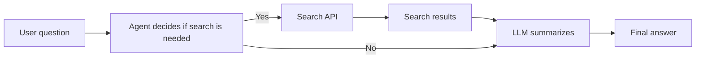
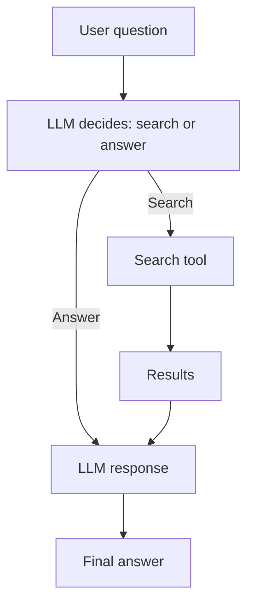

# Chapter 3: Your First Agent (The “Hello World”)

This chapter is your first build. You will create a **Search & Summarize agent** that can take a question, look up information with a search tool, and return a concise answer. It is simple by design — but it contains the exact same loop used in production systems.

You will learn:
- How to set up a clean Python environment for agent development
- How to connect an LLM to a real tool (search)
- How to write prompts that instruct the model *when* to use tools
- How to orchestrate the full agent loop

## 3.1 Project Overview
**Goal:** Build an agent that takes a user question, decides if it needs external data, performs a search, and returns a summary.

**Inputs:** User question
**Outputs:** Short, structured summary with sources



## 3.2 Environment Setup
We are Python-first in this repo. Create a clean environment so you can isolate dependencies.

**Steps:**
- Install Python 3.10+
- Create a virtual environment
- Install dependencies
- Create a `.env` file for API keys

```bash
# create and activate venv
python -m venv .venv
. .venv/bin/activate  # Windows: .venv\Scripts\activate

# install dependencies
pip install openai requests python-dotenv pydantic
```

**.env example:**
```bash
OPENAI_API_KEY=your_key_here
SEARCH_API_KEY=your_key_here
```

## 3.3 Building the Search Tool
The tool is just a small Python function that calls a search API. You can use Tavily, Serper, or any provider you prefer.

**Tool contract:**
- Input: query string
- Output: list of results (title, url, snippet)

```python
import os
import requests

def search(query: str):
    api_key = os.getenv("SEARCH_API_KEY")
    url = "https://api.example.com/search"
    payload = {"q": query}
    headers = {"Authorization": f"Bearer {api_key}"}

    response = requests.post(url, json=payload, headers=headers, timeout=30)
    response.raise_for_status()
    return response.json()["results"]
```

## 3.4 Writing the Prompt (Tool Decision)
Your prompt must teach the model when to use the tool. A good pattern is to give it a clear decision step.

```text
You are an assistant that answers user questions.
If the question needs fresh or factual data, use the SEARCH tool.
If not, answer directly.
Return a short summary and cite sources if search was used.
```

## 3.5 Agent Loop (Orchestration)
Now we connect everything together. The agent:
1. Reads the user question
2. Decides whether to search
3. Calls the search tool if needed
4. Summarizes and responds



A simple orchestration approach in Python:

```python
from openai import OpenAI
from dotenv import load_dotenv

load_dotenv()
client = OpenAI()

def needs_search(question: str) -> bool:
    prompt = (
        "Decide if this question needs web search. "
        "Answer only YES or NO.\n"
        f"Question: {question}"
    )
    resp = client.responses.create(
        model="gpt-4.1-mini",
        input=prompt
    )
    return "YES" in resp.output_text


def answer(question: str, results=None) -> str:
    context = ""
    if results:
        snippets = "\n".join([r["snippet"] for r in results])
        context = f"Use these results:\n{snippets}\n"

    prompt = (
        "You are a helpful assistant. "
        "Write a short answer. "
        "If results are provided, cite them.\n"
        f"{context}\nQuestion: {question}"
    )

    resp = client.responses.create(
        model="gpt-4.1-mini",
        input=prompt
    )
    return resp.output_text


def run_agent(question: str) -> str:
    if needs_search(question):
        results = search(question)
        return answer(question, results)
    return answer(question)
```

## 3.6 Testing Your Agent
Try with different types of questions:
- Current events: “What happened in AI this week?”
- Stable facts: “Explain gradient descent”
- Personal tasks: “Draft an email about a meeting”

You should see the agent choose search only when it needs it.

## 3.7 Common Mistakes
- **Too much searching:** The agent uses tools for everything
- **Too little searching:** It guesses when it should verify
- **Unclear tool outputs:** Search results are noisy or unstructured
- **Long, unfocused prompts:** The model loses the decision step

## Key Takeaways
- A “hello world” agent still uses the full agent loop
- Tool use is a design decision, not an afterthought
- Structured tool outputs make summarization easier
- You now have a blueprint for every agent you will build next

## What Comes Next
In Chapter 4, you will give your agent memory using retrieval (RAG) and vector databases.
