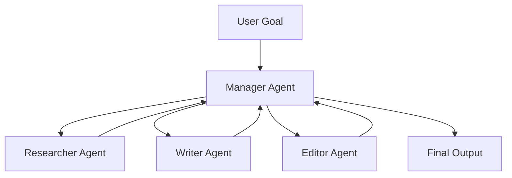
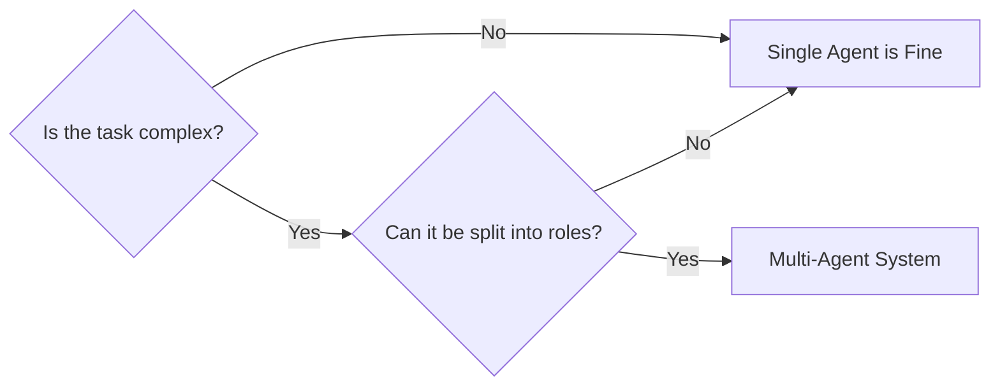
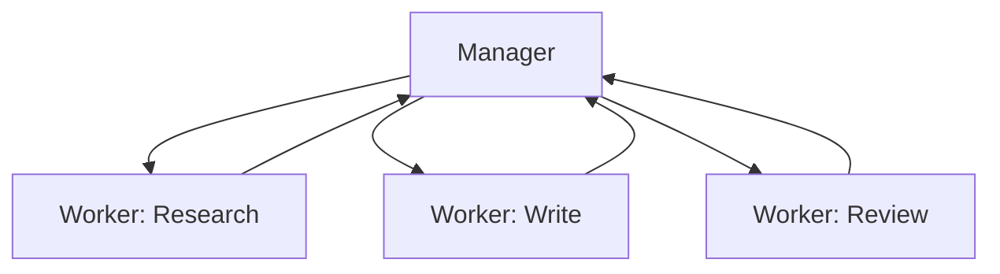
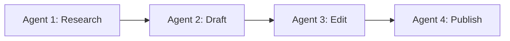
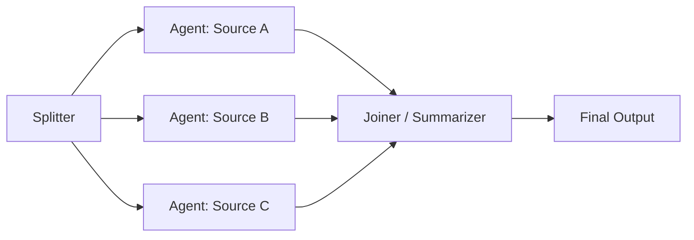
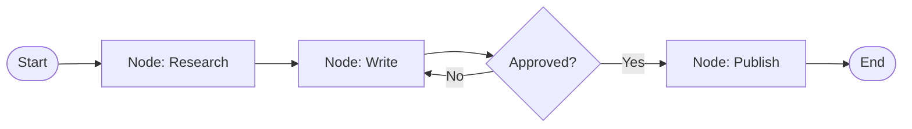
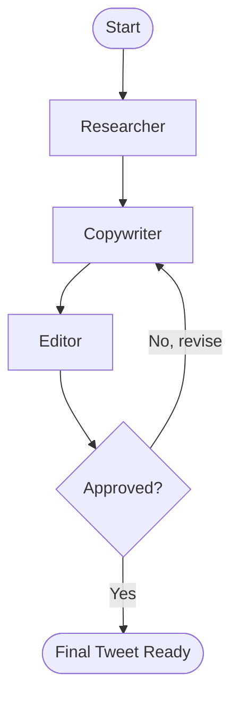
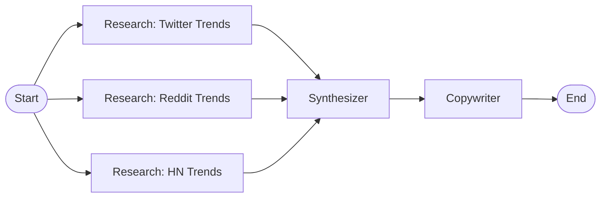

# Chapter 6: Multi-Agent Systems (Orchestration)

One agent is powerful. Multiple agents working together are a force multiplier.

A single agent trying to research a market, write copy, review it for compliance, and post it to social media is like asking one employee to do the job of an entire department — in one sitting, without breaks, without feedback. The quality degrades. The context window fills. The output gets sloppy.

Multi-agent systems solve this by doing what good organizations do: **divide the work, specialize the roles, and coordinate the output**.

## What You Will Learn

- Why single agents hit a ceiling and when to split them up
- The Manager-Worker pattern (the backbone of most production systems)
- How agents communicate and pass state to each other
- How to build a full Marketing Agency in a box using LangGraph
- How to handle failures across multiple agents

## The Core Mental Model

Think of a multi-agent system like a kitchen brigade.

- The **Head Chef (Manager)** reads the order, breaks it into tasks, and delegates
- The **Sous Chef (Researcher)** gathers ingredients (data, trends, facts)
- The **Line Cook (Writer)** executes the specific dish (copy, code, report)
- The **Expeditor (Editor/Critic)** checks quality before it leaves the kitchen

No single person does everything. Each role has a tight scope and a clear handoff.



---

## 1. When to Use Multiple Agents

Not every problem needs multiple agents. Splitting too early adds complexity without benefit.

Use a single agent when:

- The task fits in one context window
- Steps are strictly sequential with no parallelism
- The same "expertise" is needed end to end

Use multiple agents when:

| Signal                           | Example                                 |
| -------------------------------- | --------------------------------------- |
| Task naturally splits into roles | Research + Write + Review               |
| Steps can run in parallel        | Scrape 5 sources simultaneously         |
| Context window would overflow    | Long document + analysis + report       |
| Different tools per stage        | Web search → Code runner → Email sender |
| Quality improves with critique   | Writer → Critic → Revised Writer        |



---

## 2. Patterns of Multi-Agent Architecture

There are three dominant patterns. Most production systems are a combination.

### A. Manager-Worker (Hierarchical)

One planner, many executors. The manager never does the work itself — it only decomposes, delegates, and assembles.



Best for: task pipelines where order and quality control matter.

### B. Pipeline (Sequential)

Each agent's output is the next agent's input. No central coordinator — the chain itself is the structure.



Best for: document generation, content production, data transformation pipelines.

### C. Parallel (Fan-Out / Fan-In)

Multiple agents run simultaneously, then results are merged.



Best for: competitive research, multi-source data gathering, batch processing.

---

## 3. Agent Communication: How State Flows

Agents are just functions. The hard part is **state** — how does Agent B know what Agent A produced?

There are three approaches:

**A. Pass results directly (simple pipelines)**

```python
research_result = researcher_agent.invoke({"topic": "AI trends 2025"})
draft_result    = writer_agent.invoke({"research": research_result["output"]})
final_result    = editor_agent.invoke({"draft": draft_result["output"]})
```

Clean. Simple. Works for linear pipelines. Breaks down when you need branching or loops.

**B. Shared state object (LangGraph)**

All agents read from and write to a shared typed state. No direct passing required. This is the production standard.

```python
from typing import TypedDict

class CampaignState(TypedDict):
    topic: str
    research: str
    draft: str
    feedback: str
    final_copy: str
    approved: bool
```

Every agent receives the full state, makes its contribution, and returns the updated state. The graph decides what runs next.

**C. Message passing (multi-agent chat)**

Agents communicate via a shared message thread, like a group Slack channel. Used in frameworks like AutoGen and CrewAI. Natural for conversational, role-playing workflows.

---

## 4. LangGraph Primer

LangGraph is the framework for building stateful multi-agent systems. It models your workflow as a **directed graph** where nodes are agents (or functions) and edges are the transitions between them.



Key concepts:

- **State**: a typed dict shared across all nodes
- **Node**: a Python function (or agent) that reads state and returns updates
- **Edge**: a transition between nodes (conditional or fixed)
- **Conditional Edge**: a router that decides the next node based on state

### Install

```bash
pip install langgraph langchain-openai langchain
```

### Minimal LangGraph Example

```python
from typing import TypedDict
from langgraph.graph import StateGraph, END
from langchain_openai import ChatOpenAI

class State(TypedDict):
    topic: str
    research: str
    draft: str

llm = ChatOpenAI(model="gpt-4o", temperature=0.3)

# Node 1: Researcher
def researcher(state: State) -> dict:
    result = llm.invoke(
        f"Research this topic in 3 bullet points: {state['topic']}"
    )
    return {"research": result.content}

# Node 2: Writer
def writer(state: State) -> dict:
    result = llm.invoke(
        f"Write a short LinkedIn post based on this research:\n{state['research']}"
    )
    return {"draft": result.content}

# Build the graph
graph = StateGraph(State)
graph.add_node("researcher", researcher)
graph.add_node("writer", writer)

graph.set_entry_point("researcher")
graph.add_edge("researcher", "writer")
graph.add_edge("writer", END)

app = graph.compile()

result = app.invoke({"topic": "The rise of AI agents in 2025", "research": "", "draft": ""})
print(result["draft"])
```

The graph runs `researcher` → `writer` → `END`. State flows through both nodes automatically.

---

## 5. Project: Marketing Agency in a Box

Now let us build the full system described in the roadmap.

**Three agents. One goal.**

- **Agent A (Researcher)**: finds trending topics in a niche
- **Agent B (Copywriter)**: writes a tweet based on the research
- **Agent C (Editor)**: critiques the tweet for tone and compliance, requests a rewrite if needed



### The State

```python
from typing import TypedDict, Optional

class AgencyState(TypedDict):
    niche: str
    trending_topic: str
    tweet_draft: str
    feedback: str
    approved: bool
    revision_count: int
```

### The Agents (Nodes)

````python
from langchain_openai import ChatOpenAI

llm = ChatOpenAI(model="gpt-4o", temperature=0.7)
critic_llm = ChatOpenAI(model="gpt-4o", temperature=0)

# Agent A: Researcher
def researcher(state: AgencyState) -> dict:
    result = llm.invoke(
        f"Identify one specific trending topic in the '{state['niche']}' space right now. "
        f"Give the topic name and a one-sentence context. Be specific, not generic."
    )
    return {"trending_topic": result.content}


# Agent B: Copywriter
def copywriter(state: AgencyState) -> dict:
    feedback_block = ""
    if state.get("feedback"):
        feedback_block = f"\n\nPrevious feedback to incorporate:\n{state['feedback']}"

    result = llm.invoke(
        f"Write a punchy, engaging tweet about this trending topic:\n{state['trending_topic']}"
        f"{feedback_block}\n\n"
        f"Rules: under 280 chars, no hashtag spam (max 2), no em-dashes, conversational tone."
    )
    return {
        "tweet_draft": result.content,
        "revision_count": state.get("revision_count", 0) + 1
    }


# Agent C: Editor
def editor(state: AgencyState) -> dict:
    result = critic_llm.invoke(
        f"You are a social media compliance editor. Review this tweet:\n\n"
        f"{state['tweet_draft']}\n\n"
        f"Check for: misleading claims, overly salesy tone, excessive hashtags, bad grammar.\n"
        f"Respond with a JSON object:\n"
        f'{{"approved": true/false, "feedback": "specific revision notes or empty string if approved"}}'
    )

    import json, re
    raw = result.content.strip()
    # Strip markdown fences if present
    raw = re.sub(r"```json|```", "", raw).strip()
    parsed = json.loads(raw)

    return {
        "approved": parsed["approved"],
        "feedback": parsed.get("feedback", "")
    }
````

### The Router

This is the conditional edge that decides whether to loop back or finish.

```python
def should_revise(state: AgencyState) -> str:
    # Safety valve: never loop more than 3 times
    if state.get("revision_count", 0) >= 3:
        return "end"
    if state["approved"]:
        return "end"
    return "revise"
```

### Assembling the Graph

```python
from langgraph.graph import StateGraph, END

graph = StateGraph(AgencyState)

graph.add_node("researcher",  researcher)
graph.add_node("copywriter",  copywriter)
graph.add_node("editor",      editor)

graph.set_entry_point("researcher")
graph.add_edge("researcher", "copywriter")
graph.add_edge("copywriter", "editor")

graph.add_conditional_edges(
    "editor",
    should_revise,
    {
        "revise": "copywriter",   # loop back
        "end":    END
    }
)

agency = graph.compile()
```

### Running the Agency

```python
initial_state: AgencyState = {
    "niche": "developer tools",
    "trending_topic": "",
    "tweet_draft": "",
    "feedback": "",
    "approved": False,
    "revision_count": 0
}

result = agency.invoke(initial_state)

print("=== FINAL TWEET ===")
print(result["tweet_draft"])
print(f"\nApproved after {result['revision_count']} revision(s)")
```

### What Just Happened?

```mermaid
sequenceDiagram
  participant R as Researcher
  participant W as Copywriter
  participant E as Editor

  R->>W: trending_topic: "Rust-based CLI tooling is surging..."
  W->>E: tweet_draft: "Everyone sleeping on Rust for CLIs..."
  E->>W: approved: false, feedback: "Too vague, add a specific tool name"
  W->>E: tweet_draft: "Starship + Zoxide just changed how I work..."
  E-->>End: approved: true
```

The editor rejected the first draft. The copywriter revised it. The editor approved. You wrote zero scheduling logic — the graph handled it.

---

## 6. Parallel Execution with LangGraph

Some stages do not need to wait for each other. Run them at the same time.



```python
from typing import TypedDict
from langgraph.graph import StateGraph, END

class ResearchState(TypedDict):
    niche: str
    twitter_trends: str
    reddit_trends: str
    hn_trends: str
    synthesis: str
    final_copy: str

def research_twitter(state: ResearchState) -> dict:
    result = llm.invoke(f"What's trending on Twitter/X in {state['niche']} right now?")
    return {"twitter_trends": result.content}

def research_reddit(state: ResearchState) -> dict:
    result = llm.invoke(f"What's trending on Reddit in {state['niche']} right now?")
    return {"reddit_trends": result.content}

def research_hn(state: ResearchState) -> dict:
    result = llm.invoke(f"What's trending on Hacker News in {state['niche']} right now?")
    return {"hn_trends": result.content}

def synthesizer(state: ResearchState) -> dict:
    result = llm.invoke(
        f"Synthesize these three trend reports into one key insight:\n"
        f"Twitter: {state['twitter_trends']}\n"
        f"Reddit: {state['reddit_trends']}\n"
        f"HN: {state['hn_trends']}"
    )
    return {"synthesis": result.content}

graph = StateGraph(ResearchState)

graph.add_node("research_twitter", research_twitter)
graph.add_node("research_reddit",  research_reddit)
graph.add_node("research_hn",      research_hn)
graph.add_node("synthesizer",      synthesizer)

graph.set_entry_point("research_twitter")

# Fan-out: all three run in parallel
graph.add_edge("research_twitter", "synthesizer")
graph.add_edge("research_reddit",  "synthesizer")
graph.add_edge("research_hn",      "synthesizer")
graph.add_edge("synthesizer",      END)

app = graph.compile()
```

> LangGraph waits for all parallel branches to complete before moving to `synthesizer`. You get the speed of parallelism with the safety of synchronization.

---

## 7. Failure Handling Across Agents

In a multi-agent system, one broken node can stall the entire pipeline. Defense in depth is mandatory.

### Graceful Node Failure

Wrap each node so a failure returns a safe fallback rather than raising an exception.

```python
def safe_researcher(state: AgencyState) -> dict:
    try:
        result = llm.invoke(f"Research trends in: {state['niche']}")
        return {"trending_topic": result.content}
    except Exception as e:
        # Log and return a safe default so the graph keeps running
        print(f"[researcher] failed: {e}")
        return {"trending_topic": f"General trends in {state['niche']}"}
```

### Revision Caps

Always cap feedback loops. An infinite revision cycle burns tokens and never ships.

```python
def should_revise(state: AgencyState) -> str:
    if state.get("revision_count", 0) >= 3:
        print("[editor] Max revisions reached. Shipping current draft.")
        return "end"
    return "end" if state["approved"] else "revise"
```

### State Validation with Pydantic

Catch bad state early before it propagates downstream.

```python
from pydantic import BaseModel, validator

class AgencyStateModel(BaseModel):
    niche: str
    trending_topic: str = ""
    tweet_draft: str = ""
    approved: bool = False
    revision_count: int = 0

    @validator("niche")
    def niche_must_not_be_empty(cls, v):
        if not v.strip():
            raise ValueError("niche cannot be empty")
        return v
```

---

## Common Pitfalls

- **Too many agents for a simple task**: if one well-prompted agent can do it, use one agent.
- **No revision cap**: feedback loops without a ceiling will run until you run out of tokens or money.
- **Agents that know too much**: give each agent only the state it needs. A writer does not need the niche's financial data.
- **Skipping intermediate logging**: when a multi-agent pipeline fails silently, you have no idea which node broke. Log every state transition.
- **Using chat-style memory inside stateful graphs**: LangGraph manages state. Do not also plug in `ConversationBufferMemory` — you will double-count history and confuse the model.

---

## Checklist

- Each agent has a single, well-defined role
- All feedback loops have a hard revision cap
- State is typed (TypedDict or Pydantic)
- Each node has error handling with safe fallbacks
- Parallel branches are used for independent operations
- The full state is logged at each node for debugging

---

## What Comes Next

In Chapter 7, you will make your agents **self-correcting** — adding reflection, retry logic for broken APIs, and the most important safety mechanism of all: the human-in-the-loop breakpoint that stops an agent from doing something irreversible without asking you first.
