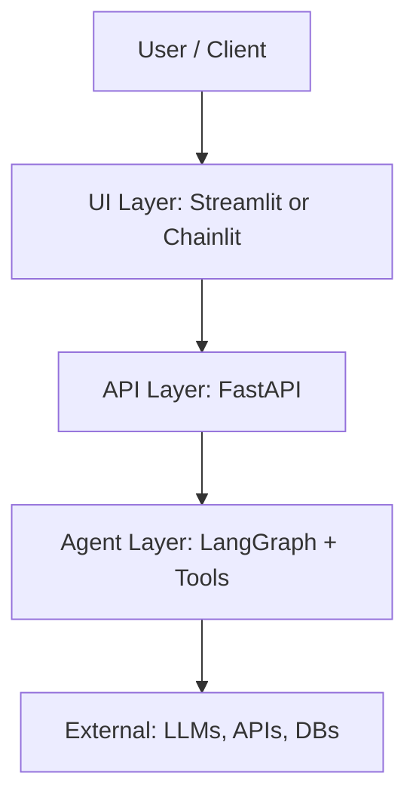
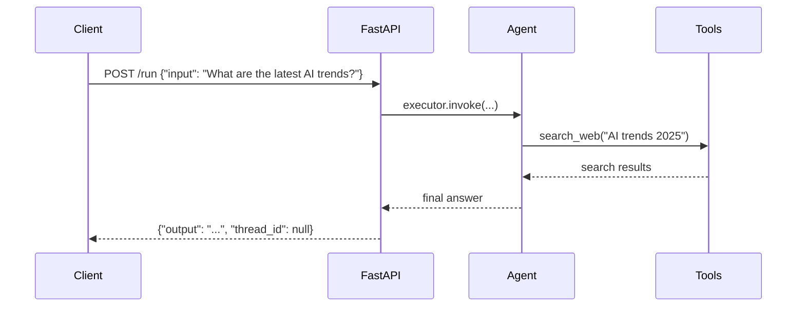
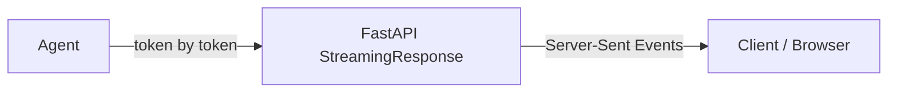
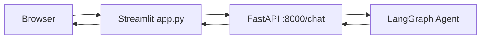
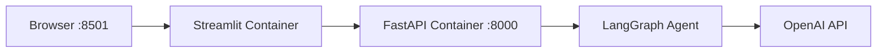

# Chapter 8: Serving Your Agent

Everything you have built so far runs in a terminal. You type a command, the agent runs, you read the output. That is fine for development. It is useless for anything real.

A real product needs an interface. A frontend needs an endpoint to call. A client needs a demo they can click. A CI/CD pipeline needs a URL to hit. This chapter turns your agent from a Python script into a running service that the rest of the world can talk to.

Three tools. One chapter.

- **FastAPI**: wrap your agent in a production-ready REST API
- **Streamlit / Chainlit**: build a UI to demo your agent to clients in an afternoon
- **Docker**: package everything so it runs identically everywhere

## What You Will Learn

- How to expose an agent as an HTTP endpoint with FastAPI
- How to stream agent responses token by token (no more waiting)
- How to build a chat UI with Streamlit and Chainlit
- How to containerize your agent with Docker
- How to connect the UI to the API

## The Core Mental Model

Think in three layers. Each layer has one job.



The UI layer never touches the agent directly. The API layer never builds UI. The agent layer never knows who called it. Clean separation means you can swap any layer without touching the others.

---

## 1. FastAPI: Wrapping Your Agent in a REST API

FastAPI is the standard for Python APIs. It is fast, it validates inputs automatically with Pydantic, and it generates interactive docs at `/docs` with zero extra work.

### Install

```bash
pip install fastapi uvicorn langchain-openai langgraph pydantic
```

### The Minimal Agent API

Start simple. One endpoint. One agent. Confirm it works before adding complexity.

```python
# api.py
from fastapi import FastAPI
from pydantic import BaseModel
from langchain_openai import ChatOpenAI
from langchain_core.tools import tool
from langchain import hub
from langchain.agents import create_react_agent, AgentExecutor

app = FastAPI(title="My Agent API", version="1.0")
llm = ChatOpenAI(model="gpt-4o", temperature=0)

# Define your tools
@tool
def search_web(query: str) -> str:
    """Search the web for current information on a topic."""
    # Replace with Tavily or Serper integration
    return f"Top result for '{query}': AI agent frameworks are growing rapidly in 2025."

tools   = [search_web]
prompt  = hub.pull("hwchase17/react")
agent   = create_react_agent(llm, tools, prompt)
executor = AgentExecutor(agent=agent, tools=tools, max_iterations=5)

# --- Request / Response schemas ---
class RunRequest(BaseModel):
    input: str
    thread_id: str | None = None

class RunResponse(BaseModel):
    output: str
    thread_id: str | None = None

# --- Endpoints ---
@app.get("/health")
def health():
    return {"status": "ok"}

@app.post("/run", response_model=RunResponse)
def run_agent(request: RunRequest):
    result = executor.invoke({"input": request.input})
    return RunResponse(output=result["output"], thread_id=request.thread_id)
```

```bash
uvicorn api:app --reload --port 8000
```

Open `http://localhost:8000/docs` — FastAPI auto-generates a full interactive UI from your Pydantic schemas. You can run test requests directly from the browser.



### Adding Stateful Conversation

For a chat agent that remembers context across turns, pass a `thread_id`. LangGraph uses it to look up the checkpoint for that conversation.

```python
# stateful_api.py
from fastapi import FastAPI, HTTPException
from pydantic import BaseModel
from langgraph.graph import StateGraph, END
from langgraph.checkpoint.memory import MemorySaver
from langchain_openai import ChatOpenAI
from typing import TypedDict
import uuid

app          = FastAPI(title="Stateful Agent API")
checkpointer = MemorySaver()
llm          = ChatOpenAI(model="gpt-4o", temperature=0.5)

# Minimal chat graph
class ChatState(TypedDict):
    messages: list[dict]

def chat_node(state: ChatState) -> dict:
    history = "\n".join([f"{m['role']}: {m['content']}" for m in state["messages"]])
    response = llm.invoke(history)
    return {"messages": state["messages"] + [{"role": "assistant", "content": response.content}]}

graph = StateGraph(ChatState)
graph.add_node("chat", chat_node)
graph.set_entry_point("chat")
graph.add_edge("chat", END)
agent_app = graph.compile(checkpointer=checkpointer)

class ChatRequest(BaseModel):
    message: str
    thread_id: str | None = None  # None = new conversation

class ChatResponse(BaseModel):
    reply: str
    thread_id: str

@app.post("/chat", response_model=ChatResponse)
def chat(request: ChatRequest):
    thread_id = request.thread_id or str(uuid.uuid4())
    config    = {"configurable": {"thread_id": thread_id}}

    state = agent_app.invoke(
        {"messages": [{"role": "user", "content": request.message}]},
        config=config
    )
    reply = state["messages"][-1]["content"]
    return ChatResponse(reply=reply, thread_id=thread_id)
```

The client stores the `thread_id` and sends it on every subsequent request. The agent remembers the entire conversation. No database required — `MemorySaver` holds it in memory for development. Swap it for `SqliteSaver` or `PostgresSaver` for production persistence.

---

## 2. Streaming: Stop Making Users Wait

The biggest UX mistake in AI products is making users stare at a blank screen while the agent generates. A 10-second wait feels like an eternity. The same 10 seconds of watching tokens appear feels fast.

Streaming sends each token as it is generated.



### Streaming Endpoint with FastAPI

```python
from fastapi import FastAPI
from fastapi.responses import StreamingResponse
from pydantic import BaseModel
from langchain_openai import ChatOpenAI

app = FastAPI()
llm = ChatOpenAI(model="gpt-4o", temperature=0.5, streaming=True)

class StreamRequest(BaseModel):
    input: str

@app.post("/stream")
def stream_agent(request: StreamRequest):
    def token_generator():
        for chunk in llm.stream(request.input):
            token = chunk.content
            if token:
                # Server-Sent Event format
                yield f"data: {token}\n\n"
        yield "data: [DONE]\n\n"

    return StreamingResponse(
        token_generator(),
        media_type="text/event-stream",
        headers={"Cache-Control": "no-cache", "X-Accel-Buffering": "no"}
    )
```

### Consuming the Stream in JavaScript

```javascript
const response = await fetch("http://localhost:8000/stream", {
  method: "POST",
  headers: { "Content-Type": "application/json" },
  body: JSON.stringify({
    input: "Explain multi-agent systems in simple terms.",
  }),
});

const reader = response.body.getReader();
const decoder = new TextDecoder();

while (true) {
  const { done, value } = await reader.read();
  if (done) break;
  const text = decoder.decode(value);
  const lines = text.split("\n\n").filter((l) => l.startsWith("data: "));
  for (const line of lines) {
    const token = line.replace("data: ", "");
    if (token !== "[DONE]") process.stdout.write(token);
  }
}
```

### Streaming a LangGraph Agent

For full agent streaming — including tool calls and intermediate steps — LangGraph's `.astream_events()` is the right primitive.

```python
from fastapi import FastAPI
from fastapi.responses import StreamingResponse
from pydantic import BaseModel
import json, asyncio

app = FastAPI()

class StreamRequest(BaseModel):
    input: str
    thread_id: str

@app.post("/agent/stream")
async def stream_agent_events(request: StreamRequest):
    config = {"configurable": {"thread_id": request.thread_id}}

    async def event_generator():
        async for event in agent_app.astream_events(
            {"messages": [{"role": "user", "content": request.input}]},
            config=config,
            version="v2"
        ):
            kind = event["event"]
            # Stream final text tokens only
            if kind == "on_chat_model_stream":
                token = event["data"]["chunk"].content
                if token:
                    yield f"data: {json.dumps({'token': token})}\n\n"
            # Stream tool call notifications
            elif kind == "on_tool_start":
                tool_name = event["name"]
                yield f"data: {json.dumps({'tool_start': tool_name})}\n\n"
        yield "data: [DONE]\n\n"

    return StreamingResponse(event_generator(), media_type="text/event-stream")
```

---

## 3. Streamlit: A Demo UI in 30 Lines

Streamlit turns Python scripts into interactive web apps. It is not production-grade for millions of users, but it is unbeatable for demos, internal tools, and MVPs.

### Install

```bash
pip install streamlit requests
```

### Chat UI That Calls Your FastAPI Agent

```python
# app.py
import streamlit as st
import requests
import uuid

st.set_page_config(page_title="Agent Demo", page_icon="🤖")
st.title("🤖 AI Agent")

# Persist thread ID across reruns
if "thread_id" not in st.session_state:
    st.session_state.thread_id = str(uuid.uuid4())

if "messages" not in st.session_state:
    st.session_state.messages = []

# Render existing messages
for msg in st.session_state.messages:
    with st.chat_message(msg["role"]):
        st.markdown(msg["content"])

# Chat input
if prompt := st.chat_input("Ask your agent anything..."):
    # Show user message immediately
    st.session_state.messages.append({"role": "user", "content": prompt})
    with st.chat_message("user"):
        st.markdown(prompt)

    # Call the API
    with st.chat_message("assistant"):
        with st.spinner("Thinking..."):
            response = requests.post(
                "http://localhost:8000/chat",
                json={"message": prompt, "thread_id": st.session_state.thread_id}
            )
            reply      = response.json()["reply"]
            thread_id  = response.json()["thread_id"]
            st.session_state.thread_id = thread_id

        st.markdown(reply)
        st.session_state.messages.append({"role": "assistant", "content": reply})
```

```bash
streamlit run app.py
```

That is it. A full chat UI, conversation history, persistent thread ID, loading spinner. Thirty lines.



---

## 4. Chainlit: Production Chat UI

Streamlit is fast to build. Chainlit is built specifically for conversational AI and gives you more out of the box: streaming, step visualization, file uploads, user feedback buttons, and authentication hooks.

### Install

```bash
pip install chainlit langchain-openai
```

### Chainlit Agent App

```python
# chainlit_app.py
import chainlit as cl
from langchain_openai import ChatOpenAI
from langchain_core.tools import tool
from langchain import hub
from langchain.agents import create_react_agent, AgentExecutor
from langchain.callbacks.base import BaseCallbackHandler

llm   = ChatOpenAI(model="gpt-4o", temperature=0, streaming=True)

@tool
def search_web(query: str) -> str:
    """Search the web for current information."""
    return f"Search results for '{query}': [simulated results]"

tools    = [search_web]
prompt   = hub.pull("hwchase17/react")
agent    = create_react_agent(llm, tools, prompt)
executor = AgentExecutor(agent=agent, tools=tools, max_iterations=5)

@cl.on_chat_start
async def on_start():
    await cl.Message(content="Hello! I'm your AI agent. How can I help?").send()

@cl.on_message
async def on_message(message: cl.Message):
    # Show a thinking indicator
    msg = cl.Message(content="")
    await msg.send()

    # Stream the response
    async for chunk in executor.astream({"input": message.content}):
        if "output" in chunk:
            await msg.stream_token(chunk["output"])

    await msg.update()
```

```bash
chainlit run chainlit_app.py --watch
```

Chainlit automatically provides:

- A clean chat UI at `http://localhost:8000`
- Collapsible "reasoning steps" showing tool calls
- Copy and thumbs up/down buttons per message
- Built-in authentication (optional)

### When to Use Streamlit vs Chainlit

|                             | Streamlit                         | Chainlit                          |
| --------------------------- | --------------------------------- | --------------------------------- |
| **Best for**                | Internal tools, dashboards, demos | Chat-first products, client demos |
| **Setup time**              | 5 minutes                         | 5 minutes                         |
| **Streaming**               | Manual                            | Built-in                          |
| **Tool step visualization** | Manual                            | Built-in                          |
| **Custom UI**               | Full control                      | Chat-constrained                  |
| **Auth**                    | Manual                            | Built-in hooks                    |

---

## 5. Docker: Packaging Your Agent

"Works on my machine" ends here.

Docker packages your entire application — code, dependencies, environment variables, Python version — into a single image that runs identically on your laptop, your teammate's machine, and any cloud server.

### The Dockerfile

```dockerfile
# Dockerfile
FROM python:3.11-slim

# Set working directory
WORKDIR /app

# Install dependencies first (cached unless requirements.txt changes)
COPY requirements.txt .
RUN pip install --no-cache-dir -r requirements.txt

# Copy application code
COPY . .

# Expose the port FastAPI runs on
EXPOSE 8000

# Run the API server
CMD ["uvicorn", "api:app", "--host", "0.0.0.0", "--port", "8000"]
```

### requirements.txt

```
fastapi
uvicorn
langchain
langchain-openai
langgraph
pydantic
python-dotenv
```

### .dockerignore

```
__pycache__/
*.pyc
.env
.git
*.md
```

> Never copy your `.env` file into the image. Pass secrets as environment variables at runtime.

### Building and Running

```bash
# Build the image
docker build -t my-agent:latest .

# Run the container, passing your API key from the host environment
docker run -p 8000:8000 -e OPENAI_API_KEY=$OPENAI_API_KEY my-agent:latest
```

Your API is now running in a container at `http://localhost:8000`. Same command works on any server.

### Docker Compose: Running the Full Stack

In production you will have an API container and a UI container running together. Docker Compose manages both.

```yaml
# docker-compose.yml
version: "3.9"

services:
  api:
    build: ./api
    ports:
      - "8000:8000"
    environment:
      - OPENAI_API_KEY=${OPENAI_API_KEY}
    healthcheck:
      test: ["CMD", "curl", "-f", "http://localhost:8000/health"]
      interval: 30s
      timeout: 10s
      retries: 3

  ui:
    build: ./ui
    ports:
      - "8501:8501"
    depends_on:
      api:
        condition: service_healthy
    environment:
      - API_URL=http://api:8000
```

```bash
# Start the full stack
docker compose up --build

# Stop it
docker compose down
```



Two containers. One command. Reproducible everywhere.

---

## 6. Putting It All Together

Here is the full directory structure for a production-ready agent service:

```
my-agent/
├── api/
│   ├── Dockerfile
│   ├── requirements.txt
│   ├── api.py              # FastAPI app + endpoints
│   ├── agent.py            # LangGraph agent definition
│   └── tools.py            # Tool definitions
├── ui/
│   ├── Dockerfile
│   ├── requirements.txt
│   └── app.py              # Streamlit or Chainlit UI
├── docker-compose.yml
└── .env                    # Never commit this
```

Each piece has one responsibility. The agent does not know about HTTP. The API does not know about the UI. The UI does not know about LangGraph.

---

## Common Pitfalls

- **Running uvicorn on `127.0.0.1` inside Docker**: the container cannot be reached from outside. Always bind to `0.0.0.0` inside a container.
- **Baking secrets into the Docker image**: use environment variables or a secrets manager. Never `COPY .env` into an image.
- **No `/health` endpoint**: load balancers and Docker Compose health checks need this. Add it before you deploy.
- **Blocking the event loop with sync code**: if your agent uses `async`, make sure all tool calls are async too. One blocking `requests.get()` inside an async FastAPI route stalls the whole server.
- **No timeout on agent calls**: a stuck agent will hold a connection open forever. Set `timeout` on your `AgentExecutor` and on your HTTP client.

---

## Checklist

- FastAPI app binds to `0.0.0.0` inside Docker
- All secrets are passed as environment variables, never baked into the image
- A `/health` endpoint returns 200
- Streaming endpoint uses Server-Sent Events format
- Docker Compose starts API before UI via `depends_on` with health check
- Agent has a `max_iterations` cap so it cannot run indefinitely

---

## What Comes Next

In Chapter 9, you will push this container to the cloud — Railway, Render, and AWS Lambda — and set up observability with LangSmith so you can see exactly what your agent is doing (and how much it is costing you) in production.
