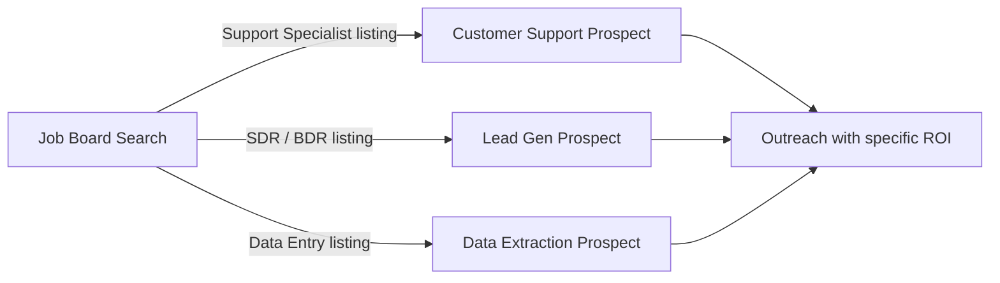
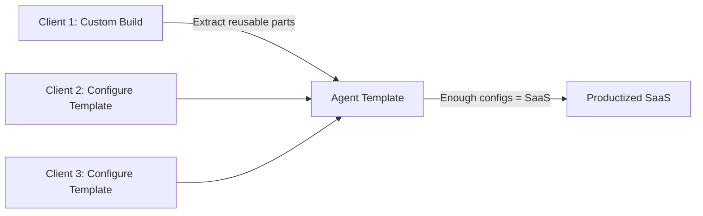

# Chapter 12: The Freelance Path

Building agents is a skill. Selling them is a different skill. Most developers are good at the first and terrible at the second — not because selling is hard, but because they were never taught how to translate technical capability into business value.

This chapter is the business side of the stack. How to find clients who need agents, how to price work so you get paid for outcomes not hours, how to structure engagements so projects do not drag on forever, and how to turn one client into five.

No fluff. No "build your personal brand" advice. Concrete process.

## What You Will Learn

- Which niches are buying agent work right now and why
- How to find your first three clients without a portfolio
- How to price for value instead of hours (and why it makes you more money)
- How to structure a freelance engagement from first call to final invoice
- How to productize your work so the same code earns repeatedly

---

## 1. The Three High-Demand Niches

Not every industry is equally ready to buy AI agent work. The best clients have three things: a clearly repetitive process, an existing budget for labor doing that process, and someone technical enough to understand what you are building (but not technical enough to build it themselves).

### Niche 1: Customer Support Automation

**Who buys**: SaaS companies with 5–50 person support teams, e-commerce brands with high ticket volume, any company running Zendesk or Intercom at scale.

**The pain**: response time is slow, tier-1 tickets are boring and expensive, good support staff churn because they spend all day answering the same questions.

**The ROI**: cost per ticket drops from $8–15 (human) to under $0.10 (agent). Deflection rates of 40–70% are achievable in the first 60 days. Response time for deflected tickets: under 60 seconds.

**How to find them**: look for companies actively hiring "Customer Support Specialists" or "Tier 1 Support" on LinkedIn. They are paying to scale headcount for a problem agents solve. That job listing is your lead.

### Niche 2: Lead Generation & Outreach

**Who buys**: B2B sales teams at companies with 10–200 employees, marketing agencies running outbound for clients, recruiters doing high-volume candidate outreach.

**The pain**: SDRs spend 60–70% of their time on research and personalization, not on conversations. Pipeline is thin because the top of the funnel is a manual bottleneck.

**The ROI**: personalized email volume increases 5–10x at the same headcount. SDR time shifts from data entry to actual selling. Response rates on personalized AI-assisted emails are comparable to fully manual outreach when done well.

**How to find them**: any B2B company with a "Sales Development Representative" or "Business Development" job listing is feeling this pain. Search LinkedIn for companies with SDR roles. Also look at agencies that offer "outbound as a service" — they are motivated buyers because margin improvement goes straight to their bottom line.

### Niche 3: Data Extraction & Entry

**Who buys**: accounting firms processing invoices, logistics companies handling freight documents, legal firms extracting clauses from contracts, real estate agencies processing lease abstractions, insurance companies processing claims.

**The pain**: someone is copying numbers from one document into a spreadsheet or system all day, every day. It is error-prone, expensive, and soul-destroying work.

**The ROI**: near-total elimination of data entry labor for the document types you automate. Accuracy often exceeds manual entry because the agent applies consistent validation rules that humans skip when tired.

**How to find them**: search for job listings with titles like "Data Entry Specialist," "Document Processor," or "Accounts Payable Clerk." The company posting that listing is your prospect. They are paying someone to do what your agent can do better and cheaper.



**The meta-pattern**: companies posting job listings for repetitive roles are your best leads. They have already decided to invest in solving the problem. Your job is to offer a better solution than another hire.

---

## 2. Finding Your First Three Clients

The hardest client is the first. You have no testimonials, no case studies, no referrals. Here is the process that works.

### Step 1: Build One Specific Demo

Do not build a generic "AI assistant." Build a demo of one specific workflow for one specific industry. Take the lead generation agent from Chapter 11 and run it on ten real prospects from a real industry. Take the support agent and train it on a real company's public FAQ. Specificity signals competence. Generality signals uncertainty.

Your demo should answer the question: "What does this look like working in my business?" — not "What is this technology capable of?"

### Step 2: Find the Right Person to Show It To

The buyer is not always the obvious person. Know who signs the check for each niche:

| Niche              | Day-to-day Champion            | Budget Owner / Signer        |
| ------------------ | ------------------------------ | ---------------------------- |
| Support Automation | Head of Support, CS Manager    | VP of Customer Success, COO  |
| Lead Generation    | Head of Sales, SDR Manager     | VP of Sales, CEO (small co.) |
| Data Extraction    | Operations Manager, Controller | CFO, CEO                     |

Reach the champion first. They feel the pain daily and will carry your pitch internally. Do not cold-email the CEO until the champion has seen the demo.

### Step 3: The Outreach Message

Short. Specific. One ask.

```
Subject: Automated 60% of [Company Name]'s tier-1 support tickets in a demo

Hi [Name],

I noticed [Company] is hiring two new support specialists.

I build AI agents that handle tier-1 support tickets automatically —
password resets, billing questions, plan FAQs — without a human in the loop.

I built a demo using your public help center. It answered 23 of your 30
most common questions correctly on the first try.

Worth a 20-minute call to see if it fits?

[Your name]
```

Three things make this work: it references something specific about them (the job listing), it shows you already did homework (the demo on their content), and it asks for something small (20 minutes, not "a proposal").

### Step 4: The Discovery Call

Your goal on the first call is not to pitch — it is to understand their numbers. Ask:

- How many [tickets / leads / documents] do you process per week?
- How long does each one take a person to handle?
- What does that person cost fully loaded?
- What would a 50% reduction in that volume mean for the team?
- What does the current process look like end to end?

Do the math in front of them: volume × time × hourly cost = annual spend on the problem. That number is your pricing anchor. Every proposal you send should reference it.

### Step 5: The Pilot Proposal

Never propose a full build as the first engagement. Propose a paid pilot.

```
Pilot: 30-Day Support Automation Proof of Concept

Scope:
- Train the agent on your top 20 FAQ categories
- Integrate with Zendesk (read tickets, post replies as drafts)
- Human-in-the-loop: all replies drafted, none sent without agent approval
- Weekly reporting: deflection rate, confidence distribution, escalation reasons

Deliverable:
- Working agent in your Zendesk sandbox by Day 7
- Live with draft mode by Day 14
- 30-day performance report with recommendation

Investment: $3,500 flat
Timeline: 30 days

Success metric: agent correctly handles ≥50% of tickets with ≥85% accuracy
                (measured by human review of a random sample)

If the pilot succeeds, the monthly retainer for full deployment is $1,500/mo.
```

A pilot solves the trust problem. The client spends $3,500 to validate before committing to a retainer. You spend 30 days building something you can reuse for the next client. Both sides win.

---

## 3. Pricing for Value, Not Hours

Hourly pricing is a trap. It caps your income at your hours, incentivizes you to work slowly, and puts the client in the position of managing your time rather than buying outcomes.

Value-based pricing breaks the ceiling.

### The Pricing Framework

```
Client's annual spend on the problem
  × Your automation rate (what % you eliminate)
  × Your share (typically 15–30% of value delivered in year 1)
= Your price
```

**Example — Support Automation:**

- 500 tickets/day × 250 working days = 125,000 tickets/year
- At $10/ticket = $1,250,000 annual spend
- Agent deflects 60% = $750,000 in value
- Your share at 20% = **$150,000/year**

That is the ceiling on what you could charge if you delivered 100% of the value. In practice, for a first engagement, you price conservatively — but the math tells you the floor should not be $5,000.

A realistic structure for a mid-size SaaS company:

- Pilot: $4,000–6,000 (one-time)
- Deployment + integration: $8,000–15,000 (one-time)
- Monthly retainer (maintenance, monitoring, retraining): $1,500–3,000/mo

Year one total: $30,000–50,000. Compared to one support hire at $60,000+.

### Pricing by Project Type

| Project            | Pilot        | Build Fee      | Monthly Retainer |
| ------------------ | ------------ | -------------- | ---------------- |
| Support Automation | $3,000–6,000 | $8,000–15,000  | $1,200–2,500     |
| Lead Generation    | $1,500–3,000 | $5,000–10,000  | $800–1,500       |
| Data Extraction    | $4,000–8,000 | $10,000–25,000 | $1,500–3,000     |

Data extraction commands the highest fees because the integration surface is largest (ERP APIs are painful) and the accuracy requirement is highest (wrong data in an ERP is a real business problem).

### What to Say When They Push Back on Price

Most price objections are not really about the number — they are about risk. The client is not sure you will deliver.

Objection: "That seems expensive for a 30-day pilot."

Response: "The pilot is designed so you can validate the ROI before committing to anything bigger. If the agent handles 50% of your tickets with 85% accuracy — which is our success metric — you are saving 62 tickets per day. At $10 per ticket that is $620 per day, $15,500 per month. The $4,000 pilot pays back in three days of successful operation. If it does not hit the metric, we renegotiate."

You are not defending your fee. You are defending their ROI.

---

## 4. Structuring the Engagement

A freelance engagement with no structure is a scope creep disaster. Lock down four things before you write a line of code.

### The Four Things to Lock Down

**1. The success metric**: what number proves this worked? Write it in the contract. "Agent handles ≥50% of tickets with ≥85% accuracy, measured over a 2-week sample" is a success metric. "The client is happy with the agent" is not.

**2. The integration scope**: which systems will the agent connect to? What API access will you need? Who will provide credentials? Agents touch real systems — if you cannot get API access in week one, the project slips.

**3. The human-in-the-loop policy**: which actions require human approval? Write this down. "All outbound emails require human review for the first 30 days" prevents the client from calling you at 11pm because the agent sent something they did not expect.

**4. The data you need to start**: for support agents, you need ticket history. For lead gen, you need the ICP and target list. For data extraction, you need sample documents. Get this before kickoff or you will spend week one waiting.

### The Engagement Timeline (30-Day Pilot Template)

```
Week 1: Setup and Integration
  - Day 1-2:  Credentials, API access, sample data handoff
  - Day 3-4:  Agent built in staging environment
  - Day 5:    Internal demo and review call

Week 2: Shadow Mode
  - Agent processes real inputs but outputs are reviewed, not acted on
  - Daily accuracy check: where is the agent wrong and why?
  - Prompt tuning based on real failure cases

Week 3: Draft Mode
  - Agent outputs acted on, but with human approval gate
  - Track: deflection rate, escalation rate, confidence distribution

Week 4: Measurement and Recommendation
  - Final accuracy audit (random sample of 100 runs)
  - 30-day performance report
  - Recommendation: full deployment, continued pilot, or redesign
```

Shadow mode in Week 2 is the most important phase. You see real failures before they affect the client's business. Most of your prompt tuning happens here. Never skip it.

### The Retainer Structure

After a successful pilot, propose a monthly retainer, not a second project. Retainers cover:

- Monitoring and alerting (LangSmith dashboard review)
- Model retraining when accuracy degrades (quarterly at minimum)
- New category onboarding (adding a new ticket type, a new document format)
- API updates when client's systems change
- Monthly performance report

A retainer client is worth 10 project clients. You do the hard work once (the build) and get paid monthly for the ongoing value. Two retainer clients at $2,000/mo is $48,000/year for maintenance work. That is the business model.

---

## 5. Productizing Your Work

The freelance ceiling is your hours. The way through it is to turn your agent builds into products you configure, not custom builds you start from scratch each time.

### The Template-to-Product Progression



After your second client in the same niche, you have a template. After your fourth, you have a product. The work is configuration, not construction.

**What a productized support agent looks like:**

- Core agent graph: fixed (the code never changes)
- Knowledge base: configured per client (their docs, their FAQs)
- Integrations: selected from a menu (Zendesk, Intercom, Freshdesk)
- Thresholds: configured per client (confidence cutoff, escalation rules)
- Branding: client's name in the response templates

You sell configuration and onboarding, not engineering. Your time per client drops from 40 hours to 8 hours. Your margin quadruples.

### Package Naming and Positioning

Name your packages by outcome, not by technical content.

| Instead of...                | Say...                     |
| ---------------------------- | -------------------------- |
| "AI Agent Build + LangGraph" | "Ticket Deflection System" |
| "LLM API Integration"        | "Outreach Automation"      |
| "RAG Pipeline with FAISS"    | "Document Intelligence"    |

Clients do not buy technology. They buy results. Name your product after the result.

---

## 6. The 90-Day Freelance Roadmap

If you are starting from zero, here is a realistic 90-day path to your first paying client.

```
Days 1–30: Build Your Proof
  - Pick one niche (recommend: Lead Generation)
  - Build a working demo using public data from a real company
  - Document the before/after: manual hours vs. agent hours
  - Set up a simple portfolio page (one demo, one case study, contact form)

Days 31–60: Find Your First Client
  - Identify 20 target companies using the job listing method
  - Send 20 personalized outreach messages (one per day)
  - Goal: 3 discovery calls, 1 paid pilot
  - Refine your pitch based on objections you hear

Days 61–90: Deliver and Expand
  - Execute the pilot with rigor (shadow mode, weekly reports, clear metric)
  - If successful: close the retainer and ask for one referral
  - Add the case study (with client permission) to your portfolio
  - Use the same template to pitch client 2
```

Three things to track weekly:

1. Outreach messages sent (target: 5/week)
2. Discovery calls completed (target: 1–2/week after week 4)
3. Pilot proposals sent (target: 1/month)

Most developers quit at day 20 because they have not heard back from anyone yet. The pipeline takes 4–6 weeks to warm up. Send the messages. Book the calls. The math works if you stay consistent.

---

## Common Pitfalls

- **Underpricing to get the first client**: a $500 project attracts clients who will also expect $500 for the next one. Price based on value from day one, even if it means more rejections early.
- **Building before scoping**: clients will casually expand scope during a call if you let them. Lock down the deliverable in writing before writing code.
- **No escalation path in the contract**: if the agent makes a mistake (and it will), who is responsible? Define it upfront. You are responsible for the agent performing to the stated accuracy metric. You are not responsible for business decisions the client makes based on agent output.
- **Skipping the retainer conversation**: after a successful pilot, most clients will say "great, what's next?" If you have not prepared the retainer proposal, you leave money on the table while you scramble to write one.
- **One client at a time**: always be building your pipeline in parallel with your current project. A retainer that ends is a gap in your income. Two pilots running simultaneously means you always have something converting.

---

## Checklist

- [ ] Demo built on real data from a specific target industry
- [ ] Outreach message references something specific about the prospect
- [ ] Discovery call script includes ROI math questions
- [ ] Pilot proposal includes a written success metric
- [ ] Engagement scope covers: integrations, HITL policy, data handoff, and timeline
- [ ] Retainer proposal ready before pilot ends
- [ ] Agent template extracted from first build for reuse on second client

---

## What Comes Next

In Chapter 13, you will take the same agent you built for one client and turn it into a product that serves hundreds — the SaaS path, how to add proprietary moats that make you impossible to replace, and how to avoid the wrapper trap that kills most AI startups before they scale.
