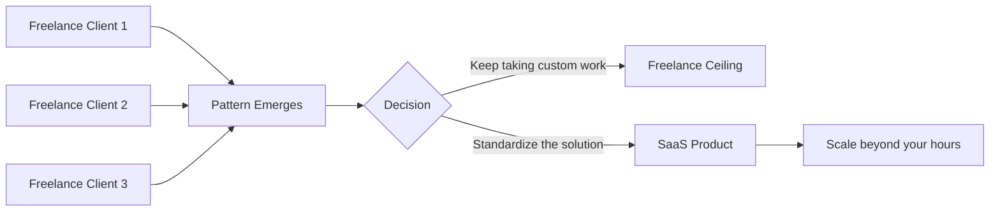
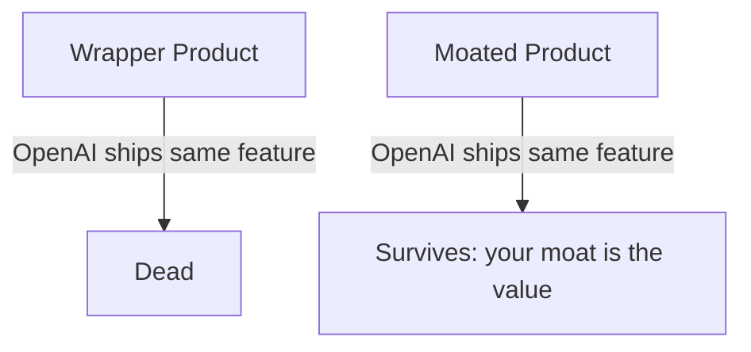
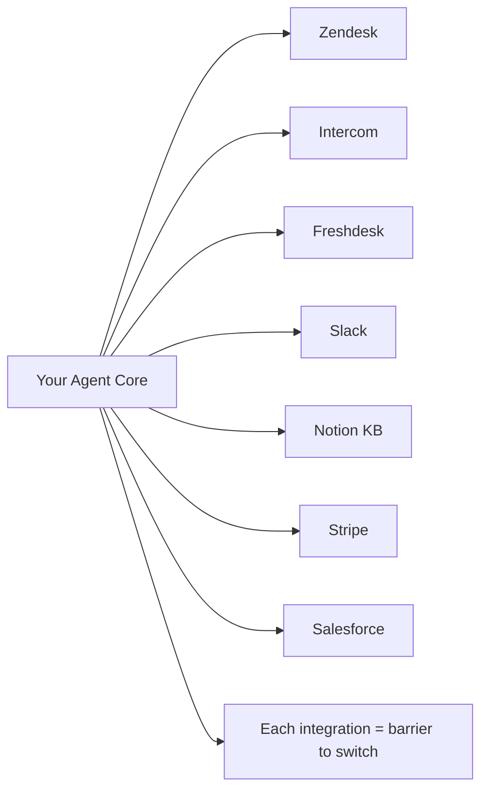
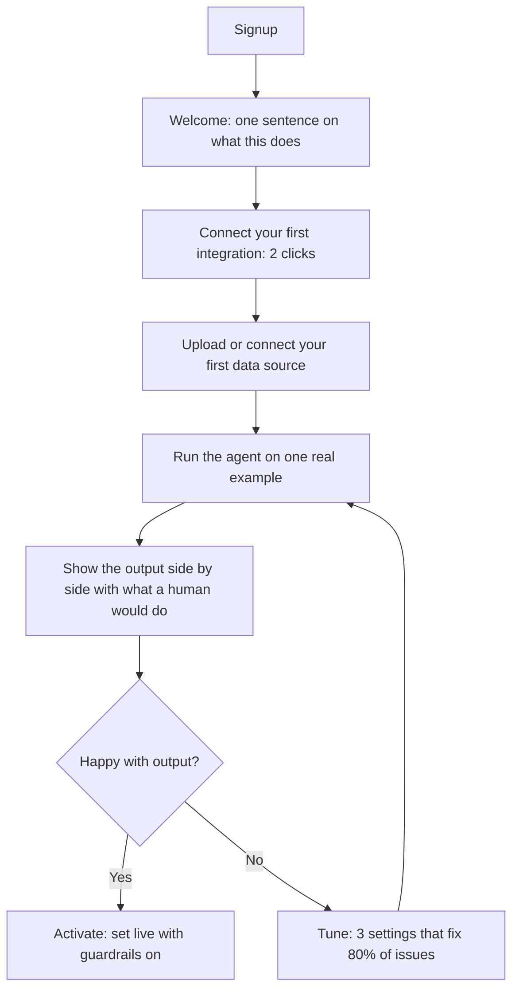

# Chapter 13: The SaaS Path

Freelancing earns you money for your time. SaaS earns you money while you sleep.

The difference between a freelance agent build and a SaaS product is not the technology — it is the same LangGraph, the same tools, the same deployment stack. The difference is the business model: instead of charging one client $15,000 to build something, you charge 150 clients $100/month to use it.

The math is straightforward. The execution is not. This chapter covers how to go from a working agent to a product with paying strangers, how to build moats that make you hard to replace, and how to avoid the wrapper trap that kills most AI startups before they ever reach product-market fit.

## What You Will Learn

- How to identify a SaaS opportunity worth building
- What the wrapper trap is and how to avoid it
- How to build proprietary moats that protect your product
- How to design tiers, pricing, and onboarding for an AI SaaS
- The Micro-SaaS path: narrow, profitable, defensible

---

## 1. From Freelance to Product: The Mental Shift

Freelancing is a service business. You solve one client's specific problem. SaaS is a product business. You solve one category of problem so well that a large number of clients all use the same solution.

The transition happens when you notice a pattern:

- You are building the same agent for different clients in the same niche
- Each build takes less time because you are reusing the core
- Clients in the same niche have the same pain, the same integrations, the same questions

That pattern is product-market fit signaling. The market is telling you: standardize this.



The freelance path is the best way to find this pattern. You are getting paid to do market research. Every client conversation is a free interview. Every support ticket you handle manually is a feature request. Two or three clients in the same niche is enough signal to start productizing.

---

## 2. The Wrapper Trap

The most common AI SaaS failure mode has a name: the wrapper trap.

A wrapper is a product that adds a thin UI on top of a foundation model API and charges for access to the underlying capability. The problem is not that wrappers cannot get users — some get thousands. The problem is they cannot keep them.

When OpenAI, Anthropic, or Google ship the same capability natively (and they will), the wrapper evaporates overnight. The users were never paying for your product. They were paying for temporary convenience.



### What Makes a Wrapper

- The core value is the LLM's capability, not yours
- No proprietary data, no specialized workflow, no unique integration
- Users could replicate it with a ChatGPT custom instruction in 10 minutes
- The pricing is entirely dependent on the underlying API price

### What Makes a Product

A product has something the model does not: your accumulated knowledge about a specific domain, your integration into a specific workflow, your proprietary data, your trained-in quality bar. The model is the engine. Your product is the car.

Ask yourself: if the underlying model were free and open to everyone tomorrow, would users still pay for my product? If the answer is no, you are building a wrapper.

---

## 3. Building Proprietary Moats

A moat is anything that makes your product valuable in a way that cannot be easily copied. For AI SaaS, moats come in four forms.

### Moat 1: Proprietary Data

The model is general. Your data makes it specific.

A "Legal Contract Reviewer for Real Estate Agents" has access to thousands of real estate contracts, common clause patterns, jurisdiction-specific requirements, and historical dispute data. A general LLM does not. You curate, structure, and maintain that data. That curation is the moat.

```python
# General LLM: can review any contract but knows nothing specific
general_review = llm.invoke("Review this contract for issues.")

# Moated product: trained on your curated domain knowledge
domain_review = rag_chain.invoke(
    "Review this contract for issues.",
    context=retrieve_from_domain_kb(contract_text, domain="real_estate_residential")
)
```

Sources of proprietary data:

- Your own scraping and curation (public sources, organized by you)
- Data your users generate (their documents, their feedback, their corrections)
- Licensed datasets nobody else has (industry reports, regulatory databases)
- User-contributed knowledge bases (a community moat)

### Moat 2: Proprietary Workflow

The model can answer questions. Your product automates a specific multi-step process that requires understanding of a professional workflow.

A generic AI assistant can help an accountant. Your "AP Automation Agent" knows the exact steps of a three-way match in accounts payable (purchase order → goods receipt → invoice), knows what discrepancies to flag, knows which approval workflows different amounts require, and knows how to write to the specific ERP APIs your target customers use. That workflow knowledge is the moat.

### Moat 3: Integrations

Every integration you build is a small moat. Not individually — but the combination of integrations into a coherent workflow is.

A support automation product that integrates with Zendesk, Intercom, Freshdesk, Notion (as a KB), Slack (for escalations), and Stripe (for billing lookups) has built something that would take a new competitor 6–12 months to replicate. You compound this over time.



### Moat 4: Accumulated Quality Signal

Every run your agent completes is a data point. Every time a human reviews an output and approves or rejects it, that is a training signal. Over time, your product gets better at your specific use case in ways that a new entrant starting from zero cannot match.

Build feedback loops into your product from day one:

```python
# Every time a human reviews agent output, log the signal
def log_feedback(
    run_id: str,
    output: str,
    human_verdict: str,  # "approved", "rejected", "edited"
    edited_output: str | None = None
):
    # Store in your database
    # Use monthly to:
    #   - Identify prompt weaknesses
    #   - Build fine-tuning datasets
    #   - Track quality trend over time
    db.insert("feedback_log", {
        "run_id":         run_id,
        "output":         output,
        "verdict":        human_verdict,
        "edited_output":  edited_output,
        "timestamp":      datetime.utcnow().isoformat()
    })
```

Six months of feedback is a moat. Two years of feedback is a fortress.

---

## 4. Micro-SaaS: Narrow, Profitable, Defensible

The temptation is to build a horizontal product that serves everyone. "AI for any business process." That product will lose to the incumbents who have the distribution to serve everyone.

The winning strategy for an indie developer or small team is the opposite: go narrower than feels comfortable.

**Horizontal**: "AI document processing for businesses"
**Vertical**: "Lease abstraction agent for commercial real estate brokers"

The horizontal product competes with everyone. The vertical product owns a category. The commercial real estate broker market is large enough to support a $5M ARR business. It is narrow enough that a two-person team can dominate it.

### The Micro-SaaS Selection Criteria

A good Micro-SaaS opportunity scores well on all five:

| Criterion             | Question                                                            | Red Flag                              |
| --------------------- | ------------------------------------------------------------------- | ------------------------------------- |
| **Niche clarity**     | Can you describe the exact job title and industry of your customer? | "Any business"                        |
| **Pain specificity**  | Is there one workflow so painful they would pay to eliminate it?    | "Generally want to be more efficient" |
| **Budget existence**  | Are they already paying someone to do this manually?                | New problem with no budget            |
| **Reachability**      | Can you find 1,000 of them in one place?                            | Scattered, no community               |
| **Build feasibility** | Can you build an MVP with the agent skills you have?                | Requires data you cannot get          |

### Five Micro-SaaS Ideas Ready to Build

Each of these passes the selection criteria. Each has a clear buyer, a clear workflow to automate, and a clear moat path.

**1. Legal Contract Reviewer for Real Estate Agents**

- Buyer: independent real estate agents and small brokerages
- Workflow: review purchase agreements and lease contracts for non-standard clauses, missing terms, and red flags before signing
- Moat: proprietary KB of common clause patterns by state and transaction type
- Pricing: $79–149/mo per agent
- Market size: 1.5M+ licensed real estate agents in the US alone

**2. Job Description Screener for Recruiting Agencies**

- Buyer: boutique recruiting and staffing agencies
- Workflow: score inbound resumes against a job description, extract key matches and gaps, draft the first-pass rejection or advancement email
- Moat: accumulated scoring data and feedback from recruiters over time
- Pricing: $199–499/mo per recruiter seat
- Market size: 20,000+ staffing agencies in the US

**3. Medical Referral Letter Generator**

- Buyer: GP practices and specialist clinics
- Workflow: draft referral letters from structured clinical notes — include patient history, reason for referral, urgency level, and relevant test results
- Moat: specialty-specific templates built from real referral patterns; HIPAA compliance infrastructure
- Pricing: $299–599/mo per practice
- Market size: every GP in the English-speaking world

**4. E-commerce Return Reason Analyzer**

- Buyer: DTC e-commerce brands with >$1M revenue
- Workflow: process return request free text, categorize by reason (sizing, quality, expectation gap), flag patterns by SKU, generate weekly insight report
- Moat: SKU-level return pattern data accumulates over time; benchmarks across the customer base
- Pricing: $299–799/mo based on return volume
- Market size: 100,000+ DTC brands globally

**5. Grant Proposal Assistant for Nonprofits**

- Buyer: small and mid-size nonprofits (2–20 staff)
- Workflow: extract requirements from grant RFPs, map against organization's program data, draft proposal sections, track deadlines and submission requirements
- Moat: grant database, successful proposal patterns by funder, organization-specific program library
- Pricing: $149–299/mo per organization
- Market size: 1.5M+ nonprofits in the US, chronically underfunded for admin

---

## 5. Building the Product: Architecture for SaaS

A single-tenant freelance build and a multi-tenant SaaS product have different architecture requirements. The core agent graph is largely the same. What changes is the infrastructure around it.

### Multi-Tenancy: Isolation by Design

Every tenant (customer) must be isolated from every other. Their data, their agent configuration, their retrieved documents — none of it should ever appear in another customer's context.

```python
from fastapi import FastAPI, Depends, HTTPException
from pydantic import BaseModel

app = FastAPI()

# Every API endpoint receives a tenant_id from the auth layer
def get_tenant_id(api_key: str) -> str:
    tenant = db.query("SELECT tenant_id FROM api_keys WHERE key = ?", api_key)
    if not tenant:
        raise HTTPException(status_code=401, detail="Invalid API key")
    return tenant["tenant_id"]

class RunRequest(BaseModel):
    input: str

@app.post("/run")
def run_agent(request: RunRequest, tenant_id: str = Depends(get_tenant_id)):
    # Load this tenant's configuration
    config = load_tenant_config(tenant_id)

    # Retrieve from this tenant's knowledge base ONLY
    context = vectorstore.similarity_search(
        request.input,
        filter={"tenant_id": tenant_id}  # CRITICAL: always filter by tenant
    )

    # Run the agent with tenant-scoped config and context
    return agent.invoke({"input": request.input, "config": config, "context": context})
```

Never skip the `filter={"tenant_id": tenant_id}` on retrieval. This is the most common multi-tenancy data leak in RAG-based SaaS products.

### Tenant Configuration System

Each customer configures the agent to their needs without touching code.

```python
from pydantic import BaseModel
from typing import Optional

class TenantConfig(BaseModel):
    tenant_id:           str
    product_name:        str
    agent_persona:       str        # "You are a support agent for Acme Corp..."
    escalation_email:    str
    confidence_threshold: float     # below this, escalate to human
    allowed_actions:     list[str]  # ["draft_reply", "apply_refund", "escalate"]
    knowledge_base_id:   str        # which vector store index to use
    max_response_length: int        # word limit for generated responses
    custom_rules:        Optional[str]  # "Never mention competitor names. Always..."

def load_tenant_config(tenant_id: str) -> TenantConfig:
    row = db.query("SELECT * FROM tenant_configs WHERE tenant_id = ?", tenant_id)
    return TenantConfig(**row)
```

### Usage Metering

SaaS pricing is often usage-based. Track what you need to bill accurately and enforce limits.

```python
from datetime import datetime, timezone

def track_usage(tenant_id: str, event_type: str, units: int = 1):
    """
    Track usage for billing.
    event_type examples: "agent_run", "tokens_used", "documents_processed"
    """
    db.insert("usage_events", {
        "tenant_id":  tenant_id,
        "event_type": event_type,
        "units":      units,
        "timestamp":  datetime.now(timezone.utc).isoformat()
    })

def check_usage_limit(tenant_id: str, event_type: str) -> bool:
    """Returns True if the tenant is within their plan limits."""
    plan    = get_tenant_plan(tenant_id)
    limit   = PLAN_LIMITS[plan][event_type]
    current = get_monthly_usage(tenant_id, event_type)
    return current < limit

PLAN_LIMITS = {
    "starter": {"agent_run": 500,   "documents_processed": 50},
    "growth":  {"agent_run": 5000,  "documents_processed": 500},
    "pro":     {"agent_run": 50000, "documents_processed": 5000},
}
```

---

## 6. Pricing Your SaaS

### The Three-Tier Model

Almost every successful B2B SaaS uses three tiers. Not because three is magic — because it forces customers to self-select and anchors perception of value.

```
Starter         Growth              Pro
$49–99/mo       $199–399/mo         $599–999/mo

For: individuals  For: small teams    For: growing teams
                                      + API access
                                      + priority support
```

**Design principles:**

- The middle tier should be the one you actually want most customers on. Price it to reflect the full value.
- The starter tier exists to convert free trials and remove the "too expensive" objection. It should be genuinely useful but meaningfully limited.
- The pro tier anchors the middle tier as reasonable. It should include things power users actually need: higher limits, API access, SLA guarantees, custom integrations.

### What to Gate

Gate on the things that correlate with value delivery — not on features that frustrate users.

| Gate on                                 | Do not gate on                                     |
| --------------------------------------- | -------------------------------------------------- |
| Volume (runs per month, docs processed) | Core functionality that defines the product        |
| Number of seats / users                 | Basic reporting and usage stats                    |
| Integrations (more in higher tiers)     | Email support (lock paying customers out of help?) |
| API access                              | The ability to export their own data               |
| SLA / uptime guarantee                  | Onboarding and documentation                       |

A customer on your starter tier who hits the limit is a conversion opportunity. A customer who cannot use the product because a core feature is locked will churn and write a bad review.

### Usage-Based vs. Seat-Based vs. Flat

| Model                     | Best for                                   | Risk                          |
| ------------------------- | ------------------------------------------ | ----------------------------- |
| **Flat monthly**          | Predictable workflows, consistent volume   | You eat cost spikes           |
| **Per seat**              | Team tools, collaboration features         | Enterprises negotiate down    |
| **Usage-based**           | Variable volume (invoices, leads, tickets) | Hard to predict for customers |
| **Hybrid** (base + usage) | Most AI SaaS                               | More complex to communicate   |

For most agent SaaS products, a hybrid model works best: flat monthly base fee (predictable for the customer) plus per-unit overages above the plan limit (you are not subsidizing high-volume users).

---

## 7. Onboarding: The Make-or-Break Moment

In B2B SaaS, the activation rate — the percentage of signups who complete onboarding and see first value — is the most important metric in your first year. A product with 40% activation and 60% month-2 retention is a better business than one with 80% signups and 15% activation.

Most AI SaaS products have terrible onboarding because the developer assumes the user understands how the agent works. They do not. They signed up for an outcome, not a technology.

### The Onboarding Goal

Get the customer to their first successful agent run within 10 minutes of signup. Not a demo run. A real run on their own data.

### The Onboarding Flow



```python
# Track onboarding progress per tenant
ONBOARDING_STEPS = [
    "integration_connected",
    "knowledge_base_uploaded",
    "first_run_completed",
    "first_run_approved",
    "live_mode_enabled"
]

def get_onboarding_status(tenant_id: str) -> dict:
    completed = db.query(
        "SELECT step FROM onboarding_events WHERE tenant_id = ?", tenant_id
    )
    completed_steps = {r["step"] for r in completed}
    return {
        "completed": [s for s in ONBOARDING_STEPS if s in completed_steps],
        "next_step": next((s for s in ONBOARDING_STEPS if s not in completed_steps), None),
        "percent_complete": len(completed_steps) / len(ONBOARDING_STEPS) * 100
    }
```

Show the onboarding progress bar on every page until it is complete. Send an automated email for each step not completed after 24 hours. Most churn in the first 30 days is an onboarding failure, not a product failure.

---

## 8. The SaaS Launch Sequence

Building the product is 40% of the work. Getting the first 100 paying customers is the other 60%.

### Phase 1: Friends and Freelance Clients (0 → 10 customers)

Your first customers should be people who already trust you. Convert your freelance clients to the self-serve product at a discount. Give early access to people in your network who match the ICP.

Goal: validate that strangers can onboard without your help.

### Phase 2: Community and Content (10 → 100 customers)

Go where your buyers already congregate. For a real estate contract reviewer, that is ActiveRain, BiggerPockets, and Facebook groups for agents. For a recruiting screener, that is ERE, recruiting Slack communities, and LinkedIn. Show up, be helpful, share what you are building.

Content that converts for AI SaaS:

- Before/after comparisons (manual process vs. agent output, side by side)
- Accuracy reports (we reviewed 500 contracts; the agent caught 94% of the issues a lawyer flagged)
- Workflow teardowns (here is exactly how the agent handles an edge case)

Do not write about AI. Write about the problem your buyers have. AI is the solution, not the topic.

### Phase 3: Paid Acquisition and Partnerships (100 → 1000 customers)

At $10k MRR you have enough signal on your unit economics to test paid channels. Google Ads targeting job titles in your niche. LinkedIn Ads to the specific companies and roles. Integration partnerships with the tools your customers already use (Zendesk's app marketplace, Zapier's integration directory).

---

## Common Pitfalls

- **Building for everyone**: "any business can use this" is the product graveyard. Pick a niche before you write a line of code and do not widen it until you have 100 customers in the original niche.
- **Launching without an onboarding flow**: if a customer signs up and cannot figure out how to run the agent on their own data in 15 minutes, they will churn regardless of how good the product is.
- **Ignoring the accumulation moat**: every run, every feedback signal, every edge case you handle makes your product better. If you are not logging and reviewing this data, you are leaving your best moat uncollected.
- **Pricing too low at launch**: low prices attract price-sensitive customers who churn when a cheaper option appears. Price to the value. A $499/mo product that saves $5,000/mo in labor is still a bargain.
- **Building the pro tier first**: most teams build complex enterprise features before validating that anyone will pay for the basic version. Build the growth tier first. Add the pro tier when customers ask for specific things it should contain.

---

## Checklist

- [ ] Niche is specific enough to describe the exact job title and industry of the buyer
- [ ] Proprietary moat identified: data, workflow, integrations, or accumulated signal
- [ ] Multi-tenancy enforced at the retrieval layer (every query filtered by tenant_id)
- [ ] Usage metering in place before launch
- [ ] Three-tier pricing designed with growth tier as the target
- [ ] Onboarding flow gets a new user to their first successful run in under 10 minutes
- [ ] Feedback logging active from day one
- [ ] First 10 customers sourced from existing network before public launch

---

## What Comes Next

In Chapter 14, you will go deeper on the techniques that separate good agents from great ones: evaluations (how to measure agent quality systematically), fine-tuning (when and how to train a model on your domain), and advanced prompt engineering patterns that unlock capabilities the basic ReAct loop cannot reach.
