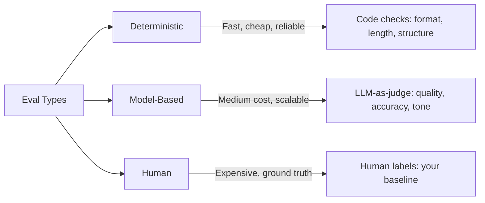
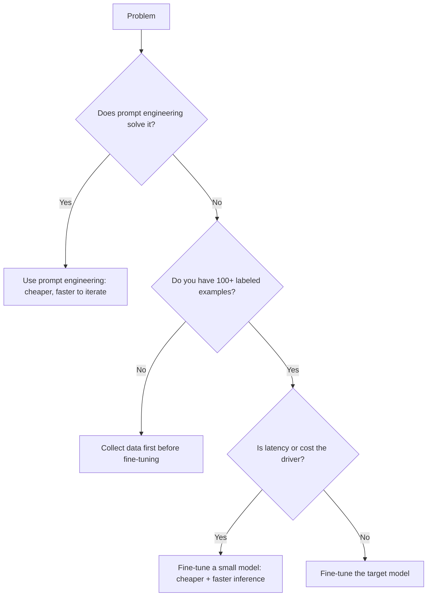
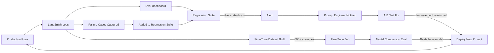

# Chapter 14: Advanced Techniques

The gap between a developer who builds agents that work and one who builds agents that are trusted in production comes down to three capabilities: knowing how to _measure_ quality systematically, knowing when and how to _train_ a model on your domain, and knowing the prompt engineering patterns that unlock behaviors the basic ReAct loop cannot reach.

This chapter is for when good enough is not enough.

## What You Will Learn

- How to build an evaluation harness that measures agent quality automatically
- When fine-tuning beats prompt engineering (and when it does not)
- How to fine-tune a model on your domain data
- Advanced prompt patterns: Tree of Thought, Self-Consistency, Reflexion, and Constitutional AI
- How to run A/B tests on prompts in production without guessing

---

## 1. Evaluations: Measuring What Actually Matters

Most developers eyeball their agent's outputs. They run a few test cases, they look good, they ship. Six weeks later a client calls because the agent started doing something wrong and nobody caught it.

Evaluations (evals) are automated tests for agent quality. Not unit tests for code — tests for _output quality_. They answer the question: "Is the agent doing the right thing, consistently, across a representative set of inputs?"

### The Three Types of Evals



**Deterministic evals**: check things code can verify — response length, format compliance, required fields present, no forbidden words, valid JSON output. Fast, free, run on every commit.

**Model-based evals**: use an LLM to judge quality — accuracy, helpfulness, tone, groundedness. Scalable, moderately cheap, run on every release.

**Human evals**: a human reviews a sample of outputs and labels them. Expensive and slow but essential for establishing the ground truth your automated evals are calibrated against.

### Building a Deterministic Eval Suite

```python
from dataclasses import dataclass
from typing import Callable

@dataclass
class EvalCase:
    name:     str
    input:    dict
    checks:   list[Callable[[str], tuple[bool, str]]]

def check_length(max_words: int):
    def _check(output: str) -> tuple[bool, str]:
        count = len(output.split())
        passed = count <= max_words
        return passed, f"Word count: {count} (limit: {max_words})"
    return _check

def check_no_forbidden(words: list[str]):
    def _check(output: str) -> tuple[bool, str]:
        found = [w for w in words if w.lower() in output.lower()]
        return (not found), f"Forbidden words found: {found}" if found else "Clean"
    return _check

def check_contains(required: str):
    def _check(output: str) -> tuple[bool, str]:
        passed = required.lower() in output.lower()
        return passed, f"Required phrase {'found' if passed else 'MISSING'}: '{required}'"
    return _check

def check_valid_json(output: str) -> tuple[bool, str]:
    import json
    try:
        json.loads(output)
        return True, "Valid JSON"
    except Exception as e:
        return False, f"Invalid JSON: {e}"

# Define your eval suite
eval_suite = [
    EvalCase(
        name="support_reply_length",
        input={"ticket": "How do I reset my password?"},
        checks=[
            check_length(150),
            check_no_forbidden(["I don't know", "I cannot help", "As an AI"]),
            check_contains("password")
        ]
    ),
    EvalCase(
        name="extraction_valid_json",
        input={"document": "Invoice #1234, dated 2025-07-01, total $500"},
        checks=[check_valid_json]
    )
]

def run_eval_suite(agent_fn: Callable, suite: list[EvalCase]) -> dict:
    results = {"passed": 0, "failed": 0, "details": []}
    for case in suite:
        output  = agent_fn(case.input)
        case_results = []
        all_passed = True
        for check in case.checks:
            passed, message = check(output)
            case_results.append({"check": check.__name__, "passed": passed, "message": message})
            if not passed:
                all_passed = False
        results["passed" if all_passed else "failed"] += 1
        results["details"].append({"case": case.name, "passed": all_passed, "checks": case_results})
    return results
```

### Model-Based Evals (LLM-as-Judge)

For quality dimensions code cannot measure — accuracy, helpfulness, tone — use a second LLM as the judge.

```python
from langchain_openai import ChatOpenAI
from pydantic import BaseModel

judge_llm = ChatOpenAI(model="gpt-4o", temperature=0)

class JudgeResult(BaseModel):
    score: int          # 1–5
    reasoning: str
    passed: bool        # score >= threshold

def eval_groundedness(question: str, context: str, answer: str) -> JudgeResult:
    """
    Measures: does the answer follow from the context, or is the model hallucinating?
    """
    structured = judge_llm.with_structured_output(JudgeResult)
    return structured.invoke(
        f"Score this answer for groundedness (1–5) where:\n"
        f"  5 = Answer is fully supported by the context\n"
        f"  3 = Answer is partially supported\n"
        f"  1 = Answer contradicts or ignores the context\n\n"
        f"Question: {question}\n"
        f"Context: {context}\n"
        f"Answer: {answer}\n\n"
        f"Score 4 or 5 = passed. Be strict."
    )

def eval_helpfulness(task: str, output: str) -> JudgeResult:
    """Measures: does the output actually complete the task?"""
    structured = judge_llm.with_structured_output(JudgeResult)
    return structured.invoke(
        f"Score this output for task completion (1–5) where:\n"
        f"  5 = Fully completes the task with no gaps\n"
        f"  3 = Partially completes it\n"
        f"  1 = Does not complete the task\n\n"
        f"Task: {task}\n"
        f"Output: {output}\n\n"
        f"Score 4 or 5 = passed."
    )
```

### Building a Regression Test Dataset

Every time your agent fails on a real input in production, save that input as a test case. This is your regression suite — a growing collection of the edge cases that have burned you before.

```python
import json
from datetime import datetime, timezone

def save_regression_case(
    input_data: dict,
    expected_behavior: str,
    failure_description: str,
    source: str = "production"
):
    case = {
        "id":          f"reg_{datetime.now(timezone.utc).strftime('%Y%m%d_%H%M%S')}",
        "input":       input_data,
        "expected":    expected_behavior,
        "failure":     failure_description,
        "source":      source,
        "created_at":  datetime.now(timezone.utc).isoformat()
    }
    with open("regression_cases.jsonl", "a") as f:
        f.write(json.dumps(case) + "\n")
```

Run the full regression suite before every deployment. A prompt change that fixes one case should not break ten others.

### Eval Metrics to Track Over Time

```python
def compute_eval_metrics(results: list[dict]) -> dict:
    total  = len(results)
    passed = sum(1 for r in results if r["passed"])
    scores = [r.get("score", 0) for r in results if "score" in r]
    return {
        "pass_rate":    round(passed / total * 100, 1),
        "fail_rate":    round((total - passed) / total * 100, 1),
        "mean_score":   round(sum(scores) / len(scores), 2) if scores else None,
        "total_cases":  total,
    }
```

Track pass rate over time. A declining pass rate after a model upgrade or prompt change is a regression signal before your users find it.

---

## 2. Fine-Tuning: When and How

Fine-tuning trains a model on your specific data to improve performance on your specific task. It is powerful — and frequently misused.

### When Fine-Tuning Is the Right Tool

Fine-tune when **all three** of these are true:

1. You have at least 50–100 high-quality labeled examples (ideally 500+)
2. Prompt engineering has hit a ceiling — the model still makes the same class of errors regardless of how you phrase the instructions
3. The behavior you need is consistent and well-defined (not creative or open-ended)



**Fine-tuning is not the answer to**:

- A bad prompt (fix the prompt first — it is free and takes minutes)
- A lack of domain knowledge (add a RAG pipeline instead — it is more updatable)
- An unclear task definition (if you cannot label examples consistently, the model cannot learn consistently)

### Preparing Fine-Tuning Data

OpenAI's fine-tuning format requires JSONL files where each line is one training example.

```python
import json

# Each example is a complete conversation the model should learn to replicate
training_examples = [
    {
        "messages": [
            {
                "role": "system",
                "content": "You are a support agent for Acme SaaS. Reply concisely and helpfully. Never say 'I cannot help with that.'"
            },
            {
                "role": "user",
                "content": "I was charged twice this month."
            },
            {
                "role": "assistant",
                "content": "I'm sorry about that. I can see a duplicate charge on your account from July 3rd. I've initiated a refund for $49 — it should appear within 3–5 business days. Can I help with anything else?"
            }
        ]
    },
    # ... 99+ more examples
]

# Write to JSONL
with open("training_data.jsonl", "w") as f:
    for example in training_examples:
        f.write(json.dumps(example) + "\n")

# Validate format
def validate_training_data(path: str) -> dict:
    errors, warnings = [], []
    with open(path) as f:
        for i, line in enumerate(f):
            try:
                example = json.loads(line)
                messages = example.get("messages", [])
                if not messages:
                    errors.append(f"Line {i+1}: no messages")
                if messages[-1]["role"] != "assistant":
                    errors.append(f"Line {i+1}: last message must be assistant")
                total_tokens = sum(len(m["content"].split()) * 1.3 for m in messages)
                if total_tokens > 4000:
                    warnings.append(f"Line {i+1}: long example ({int(total_tokens)} est. tokens)")
            except json.JSONDecodeError as e:
                errors.append(f"Line {i+1}: invalid JSON — {e}")
    return {"errors": errors, "warnings": warnings, "valid": not errors}
```

### Submitting a Fine-Tuning Job

```python
from openai import OpenAI

client = OpenAI()

# Upload training file
with open("training_data.jsonl", "rb") as f:
    training_file = client.files.create(file=f, purpose="fine-tune")

print(f"Training file ID: {training_file.id}")

# Create the fine-tuning job
job = client.fine_tuning.jobs.create(
    training_file=training_file.id,
    model="gpt-4o-mini-2024-07-18",  # fine-tune the mini model to save cost
    hyperparameters={
        "n_epochs": 3,           # 3–5 is typical; more = more likely to overfit
    },
    suffix="support-agent-v1"    # your model name: gpt-4o-mini-...:support-agent-v1
)

print(f"Fine-tuning job: {job.id}, status: {job.status}")

# Check progress
import time
while True:
    status = client.fine_tuning.jobs.retrieve(job.id)
    print(f"Status: {status.status}")
    if status.status in ("succeeded", "failed"):
        break
    time.sleep(30)

if status.status == "succeeded":
    print(f"Fine-tuned model: {status.fine_tuned_model}")
```

### Evaluating the Fine-Tuned Model

Always compare the fine-tuned model against the base model on your eval suite before switching.

```python
from langchain_openai import ChatOpenAI

base_model      = ChatOpenAI(model="gpt-4o-mini", temperature=0)
fine_tuned_model = ChatOpenAI(model="ft:gpt-4o-mini-...:support-agent-v1", temperature=0)

def compare_models(eval_cases: list, agent_fn_a, agent_fn_b) -> dict:
    results = {"model_a": [], "model_b": []}
    for case in eval_cases:
        output_a = agent_fn_a(case["input"])
        output_b = agent_fn_b(case["input"])
        score_a  = eval_helpfulness(case["task"], output_a).score
        score_b  = eval_helpfulness(case["task"], output_b).score
        results["model_a"].append(score_a)
        results["model_b"].append(score_b)
    return {
        "model_a_avg": sum(results["model_a"]) / len(results["model_a"]),
        "model_b_avg": sum(results["model_b"]) / len(results["model_b"]),
        "improvement": (
            (sum(results["model_b"]) - sum(results["model_a"])) / sum(results["model_a"]) * 100
        )
    }
```

Deploy the fine-tuned model only if it beats the base model on your eval suite by a meaningful margin (>5%). A fine-tuned model that is marginally better is not worth the extra maintenance cost.

---

## 3. Advanced Prompt Patterns

The ReAct loop from Chapter 5 is powerful but has a ceiling. These four patterns push past it.

### Pattern 1: Chain of Thought (CoT)

The simplest upgrade. Force the model to reason step by step before answering. The act of writing the reasoning improves the answer quality — the model cannot skip to a conclusion without first articulating the path.

```python
# Without CoT: model guesses
result = llm.invoke("Is this invoice total correct? Items: 3x $25 + 2x $40 = $155")

# With CoT: model reasons first
result = llm.invoke(
    "Is this invoice total correct? Items: 3x $25 + 2x $40 = $155\n\n"
    "Think step by step before answering:\n"
    "1. Calculate each line item total\n"
    "2. Sum the line items\n"
    "3. Compare to the stated total\n"
    "4. State whether it is correct and by how much if not"
)
```

Use CoT when the task involves arithmetic, multi-step logic, or sequential reasoning. The performance gain on hard tasks is substantial. The cost is slightly more output tokens.

### Pattern 2: Self-Consistency

Run the same prompt multiple times with high temperature, collect the outputs, and return the most common answer. This trades cost for accuracy on problems with a correct answer.

```python
from collections import Counter
from langchain_openai import ChatOpenAI

def self_consistent_answer(question: str, n: int = 5, temperature: float = 0.7) -> str:
    """
    Run the same question n times and return the majority answer.
    Most effective for reasoning tasks with a definitive correct answer.
    """
    llm     = ChatOpenAI(model="gpt-4o", temperature=temperature)
    answers = [llm.invoke(question).content.strip() for _ in range(n)]

    # For structured outputs, use the most common value
    counts = Counter(answers)
    majority, frequency = counts.most_common(1)[0]
    confidence = frequency / n

    print(f"Answers: {counts}")
    print(f"Majority: '{majority}' ({confidence:.0%} agreement)")
    return majority

# Use for high-stakes classification where accuracy > cost
category = self_consistent_answer(
    "Classify this support ticket as: billing, technical, account, or feature_request.\n\n"
    "Ticket: 'My API key stopped working after I upgraded my plan last night.'\n\n"
    "Reply with only the category name.",
    n=5
)
```

Self-consistency is most valuable for tasks where one wrong answer is costly (classification decisions that route to irreversible actions, calculations, factual lookups). Cost is linear with n — use it selectively.

### Pattern 3: Reflexion

Reflexion is self-correction with persistent memory of past failures. The agent attempts a task, evaluates its own output, generates a verbal reflection on what went wrong, and stores that reflection as a persistent lesson it uses on the next attempt.

Unlike the basic reflection loop from Chapter 7 (which only keeps the current critique), Reflexion builds a growing memory of failure modes.

```python
from typing import TypedDict
from langgraph.graph import StateGraph, END
from langchain_openai import ChatOpenAI

class ReflexionState(TypedDict):
    task:            str
    attempt:         str
    evaluation:      str
    passed:          bool
    reflections:     list[str]  # persists across attempts — this is the key
    attempt_count:   int

llm    = ChatOpenAI(model="gpt-4o", temperature=0.5)
critic = ChatOpenAI(model="gpt-4o", temperature=0)

def actor(state: ReflexionState) -> dict:
    reflection_block = ""
    if state["reflections"]:
        lessons = "\n".join(f"- {r}" for r in state["reflections"])
        reflection_block = f"\n\nLessons from previous attempts:\n{lessons}\nDo not repeat these mistakes."

    result = llm.invoke(f"{state['task']}{reflection_block}")
    return {
        "attempt":       result.content,
        "attempt_count": state.get("attempt_count", 0) + 1
    }

def evaluator(state: ReflexionState) -> dict:
    result = critic.invoke(
        f"Evaluate this attempt at the task. Be strict.\n\n"
        f"Task: {state['task']}\n"
        f"Attempt: {state['attempt']}\n\n"
        f"Respond with PASS or FAIL followed by your reasoning."
    )
    passed = result.content.strip().upper().startswith("PASS")
    return {"evaluation": result.content, "passed": passed}

def reflector(state: ReflexionState) -> dict:
    """Extract a concise lesson from the failure to remember next time."""
    result = critic.invoke(
        f"The following attempt at a task failed evaluation.\n\n"
        f"Task: {state['task']}\n"
        f"Attempt: {state['attempt']}\n"
        f"Evaluation: {state['evaluation']}\n\n"
        f"Write one concise lesson (under 20 words) that would prevent this failure next time."
    )
    updated_reflections = state.get("reflections", []) + [result.content.strip()]
    return {"reflections": updated_reflections}

def route(state: ReflexionState) -> str:
    if state["passed"] or state.get("attempt_count", 0) >= 4:
        return "end"
    return "reflect"

graph = StateGraph(ReflexionState)
graph.add_node("actor",     actor)
graph.add_node("evaluator", evaluator)
graph.add_node("reflector", reflector)

graph.set_entry_point("actor")
graph.add_edge("actor", "evaluator")
graph.add_conditional_edges("evaluator", route, {"reflect": "reflector", "end": END})
graph.add_edge("reflector", "actor")

reflexion_agent = graph.compile()
```

The `reflections` list is what makes Reflexion different. Each failure adds a lesson. By attempt 3 the agent has explicit memory of what went wrong on attempts 1 and 2 and actively avoids those mistakes.

### Pattern 4: Constitutional AI (Principle-Based Output Filtering)

Constitutional AI gives your agent a set of principles it must apply to its own output. After generating a response, the model reviews it against each principle and revises until the output complies with all of them.

This is more reliable than a single "make it safe" instruction because it is explicit, auditable, and composable — you can add or remove principles without rewriting the system prompt.

```python
from pydantic import BaseModel
from langchain_openai import ChatOpenAI

CONSTITUTION = [
    "The response must not make promises about specific timelines unless explicitly confirmed.",
    "The response must not reveal pricing of products not in the official price list.",
    "The response must address the customer by name if their name is known.",
    "The response must end with an offer to help further.",
    "The response must not exceed 150 words.",
]

class ConstitutionalResult(BaseModel):
    violates_principle: bool
    principle_violated: str
    revised_response:   str

llm   = ChatOpenAI(model="gpt-4o", temperature=0)
critic = ChatOpenAI(model="gpt-4o", temperature=0)

def apply_constitution(response: str, context: str = "") -> str:
    current = response
    for principle in CONSTITUTION:
        structured = critic.with_structured_output(ConstitutionalResult)
        result = structured.invoke(
            f"Check if this response violates the following principle.\n\n"
            f"Principle: {principle}\n"
            f"Context: {context}\n"
            f"Response: {current}\n\n"
            f"If it violates the principle, provide a revised response that complies. "
            f"If it does not violate, return the original response unchanged."
        )
        if result.violates_principle:
            print(f"  ↳ Violated: '{principle[:50]}...' — revised")
            current = result.revised_response
    return current

def constitutional_agent(user_message: str, customer_name: str) -> str:
    # Generate initial response
    raw = llm.invoke(
        f"You are a customer support agent. Reply helpfully.\n\n"
        f"Customer name: {customer_name}\n"
        f"Message: {user_message}"
    ).content

    # Apply constitutional review
    return apply_constitution(raw, context=f"Customer name: {customer_name}")
```

The strength of Constitutional AI is auditability. Every violation is logged. You can tell a client exactly which principles apply to your agent and prove they are being enforced.

---

## 4. A/B Testing Prompts in Production

Prompt engineering without measurement is guessing. A/B testing lets you measure whether a change actually improves the metrics you care about.

### The A/B Testing Infrastructure

```python
import random
import hashlib
from langchain_openai import ChatOpenAI

# Two prompt variants under test
PROMPT_VARIANTS = {
    "control": (
        "You are a helpful support agent. Answer the customer's question accurately and concisely."
    ),
    "treatment": (
        "You are a support agent who specializes in making customers feel heard before solving their problem. "
        "Start by briefly acknowledging the customer's situation, then provide a clear solution. "
        "End with one proactive tip they might not know."
    )
}

def get_variant(user_id: str, experiment: str) -> str:
    """
    Deterministic assignment: same user always gets the same variant.
    Uses a hash so assignment is stable without a database.
    """
    key  = f"{experiment}:{user_id}"
    hash_val = int(hashlib.md5(key.encode()).hexdigest(), 16)
    return "treatment" if hash_val % 2 == 0 else "control"

def run_experiment(user_id: str, message: str) -> dict:
    variant      = get_variant(user_id, "support_prompt_v2")
    system_prompt = PROMPT_VARIANTS[variant]
    llm          = ChatOpenAI(model="gpt-4o", temperature=0.3)
    output       = llm.invoke(f"{system_prompt}\n\nCustomer: {message}").content

    # Log the result for analysis
    log_experiment_result(
        experiment="support_prompt_v2",
        variant=variant,
        user_id=user_id,
        input_length=len(message),
        output_length=len(output),
    )

    return {"output": output, "variant": variant}

def log_experiment_result(experiment: str, variant: str, user_id: str, **metrics):
    # Write to your analytics store (database, LangSmith metadata, etc.)
    print(f"[experiment] {experiment} | {variant} | user={user_id} | {metrics}")
```

### Analyzing Results

After collecting enough samples (minimum 200 per variant, ideally 500+), compare outcomes:

```python
def analyze_experiment(experiment: str, variant_a: str = "control", variant_b: str = "treatment") -> dict:
    # Pull from your database
    results_a = db.query(
        "SELECT * FROM experiment_results WHERE experiment=? AND variant=?",
        experiment, variant_a
    )
    results_b = db.query(
        "SELECT * FROM experiment_results WHERE experiment=? AND variant=?",
        experiment, variant_b
    )

    def summary(results):
        scores       = [r["quality_score"] for r in results if r.get("quality_score")]
        satisfaction = [r["csat"] for r in results if r.get("csat")]
        return {
            "n":               len(results),
            "avg_quality":     round(sum(scores) / len(scores), 2) if scores else None,
            "avg_csat":        round(sum(satisfaction) / len(satisfaction), 2) if satisfaction else None,
            "avg_output_len":  round(sum(r["output_length"] for r in results) / len(results), 0)
        }

    a = summary(results_a)
    b = summary(results_b)

    return {
        variant_a: a,
        variant_b: b,
        "quality_lift":  f"{((b['avg_quality'] - a['avg_quality']) / a['avg_quality'] * 100):+.1f}%" if a["avg_quality"] else "N/A",
        "recommendation": variant_b if (b.get("avg_quality", 0) > a.get("avg_quality", 0)) else variant_a
    }
```

### What Metrics to Measure

| Metric           | How to Collect           | What it Tells You               |
| ---------------- | ------------------------ | ------------------------------- |
| Quality score    | LLM-as-judge on a sample | Output quality trend            |
| CSAT / thumbs up | User feedback widget     | User satisfaction               |
| Escalation rate  | Track in agent state     | Agent confidence                |
| Resolution rate  | Follow-up ticket count   | Whether problem actually solved |
| Output length    | Count tokens             | Verbosity trend                 |

Escalation rate is the most honest metric for support agents — if the agent escalates 40% of tickets to a human, that is a quality signal no LLM judge will give you.

---

## 5. Putting It Together: A Production Quality System

This is the full quality loop for a production agent. Run it continuously.



Every production run feeds the eval suite. Every eval run catches regressions. Every regression triggers an A/B test. Every A/B test that improves metrics gets deployed. Fine-tuning data accumulates in the background until you have enough to train.

This is not a one-time build. It is a continuous improvement system. The teams that win with AI agents are the ones that treat output quality as an engineering discipline, not a vibe.

---

## Common Pitfalls

- **Fine-tuning before prompt engineering**: 99% of the time, a better prompt is faster, cheaper, and more maintainable than a fine-tuned model. Exhaust prompt engineering first.
- **Tiny eval datasets**: 10 test cases tell you almost nothing. You need at least 50 deterministic cases and 100+ model-judged cases before your eval scores are meaningful.
- **Using the same model as judge and generator**: a model grading its own outputs will have systematic blind spots. Use a different model (or a different prompt style at minimum) for evaluation.
- **A/B testing without enough samples**: 50 samples per variant is not enough to trust the result. Wait for 200+ before drawing conclusions. Underpowered experiments produce false winners.
- **Collecting feedback but never reviewing it**: the feedback loop is only useful if you close it. Schedule a monthly prompt review where you look at the last 30 days of eval results and failure cases together.

---

## Checklist

- [ ] Deterministic eval suite runs on every commit (format, structure, forbidden words)
- [ ] Model-based eval suite runs on every release (quality, accuracy, groundedness)
- [ ] Production failures are saved as regression cases automatically
- [ ] Eval pass rate is tracked over time, not just point-in-time
- [ ] Fine-tuning attempted only after prompt engineering ceiling is hit
- [ ] Fine-tuned model compared against base model on eval suite before deployment
- [ ] A/B tests run with deterministic user assignment (same user, same variant)
- [ ] Experiment results analyzed only after 200+ samples per variant
- [ ] Feedback data reviewed monthly with the eval results

---

## What Comes Next

In Chapter 15, you will look past the current stack — Small Language Models that run locally on a user's laptop, voice agents that use the Realtime API, and the skills that will keep you relevant as the underlying models continue to improve faster than any one developer can track.
