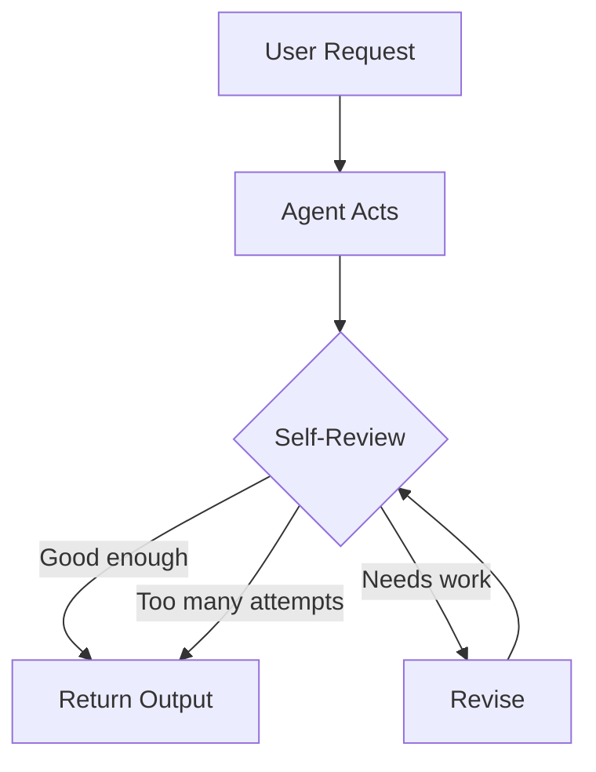
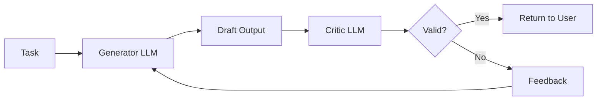
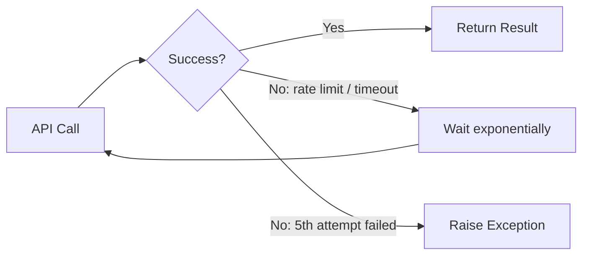
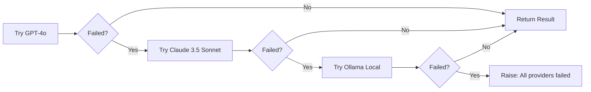
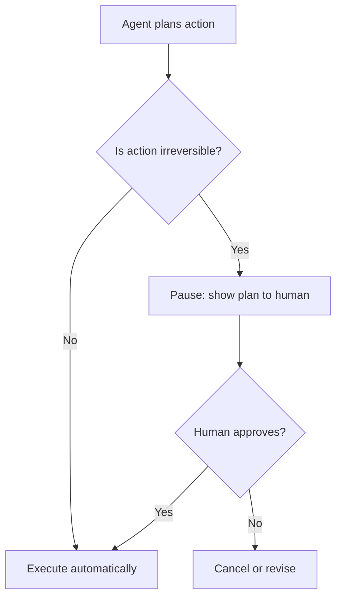
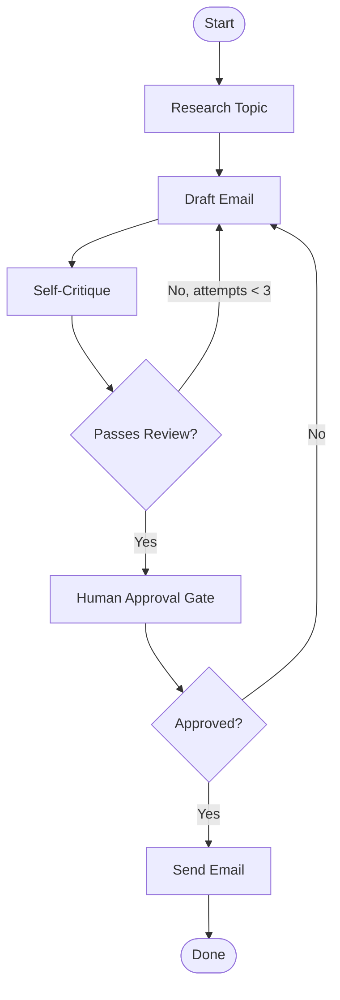

# Chapter 7: Autonomous Loops & Self-Correction

An agent that always gets it right the first time is a fantasy. APIs fail. Models hallucinate. Outputs miss the mark. The real question is not whether your agent will encounter problems — it is whether it can **detect them, recover, and keep going** without you babysitting it.

That is what this chapter is about: reflection, retry logic, and the one safety mechanism that separates a trustworthy agent from a reckless one — the human-in-the-loop breakpoint.

## What You Will Learn

- How to teach an agent to critique its own output before showing it to the user
- How to build retry logic when external APIs fail
- How to implement fallback models so one failure does not kill the whole run
- How to design human-in-the-loop breakpoints for high-stakes actions
- How to combine all of these into a self-correcting agent loop

## The Core Mental Model

Think of a junior employee who submits work without proofreading, versus one who reads it back, catches the obvious mistakes, and only hands it over when they are confident it is good. The second employee is dramatically more valuable — not because they are smarter, but because they have a **feedback loop built into their process**.

Self-correcting agents work the same way.



There are three layers to self-correction:

- **Reflection**: the model critiques its own output
- **Retry logic**: your code handles infrastructure failures
- **Human-in-the-loop**: a human approves before irreversible actions run

---

## 1. Reflection: Teaching the Agent to Critique Itself

Reflection is the simplest and highest-leverage improvement you can make to output quality. You ask the model to evaluate its own response before returning it.

The trick is to use **two separate prompts**: one to generate, one to evaluate. Using the same prompt for both produces a model that agrees with itself. Separation creates productive tension.



### Basic Reflection Pattern

::: code-group

```python [Python]
from langchain_openai import ChatOpenAI
from pydantic import BaseModel

llm       = ChatOpenAI(model="gpt-4o", temperature=0.7)
critic    = ChatOpenAI(model="gpt-4o", temperature=0)

class CritiqueResult(BaseModel):
    passed: bool
    issues: str  # empty string if passed

def generate(task: str) -> str:
    return llm.invoke(task).content

def critique(task: str, output: str) -> CritiqueResult:
    structured_critic = critic.with_structured_output(CritiqueResult)
    return structured_critic.invoke(
        f"You are a strict quality reviewer.\n\n"
        f"Original task:\n{task}\n\n"
        f"Output to review:\n{output}\n\n"
        f"Does this output fully and correctly complete the task? "
        f"If not, describe the specific issues. Be precise."
    )

def reflect_and_generate(task: str, max_attempts: int = 3) -> str:
    attempt = 0
    output  = generate(task)

    while attempt < max_attempts:
        result = critique(task, output)
        if result.passed:
            print(f"✓ Passed on attempt {attempt + 1}")
            return output
        print(f"✗ Attempt {attempt + 1} failed: {result.issues}")
        # Re-generate with the critique attached
        output = generate(f"{task}\n\nPrevious attempt was rejected. Issues: {result.issues}\nPlease fix these issues.")
        attempt += 1

    print("Max attempts reached. Returning best effort.")
    return output

# Usage
result = reflect_and_generate(
    "Write a Python function that checks if a string is a valid email address. "
    "Include type hints and a docstring with examples."
)
print(result)
```

```javascript [Node.js]
import { ChatOpenAI } from "@langchain/openai";
import { z } from "zod";

const llm    = new ChatOpenAI({ model: "gpt-4o", temperature: 0.7 });
const critic = new ChatOpenAI({ model: "gpt-4o", temperature: 0 });

const CritiqueResultSchema = z.object({
  passed: z.boolean(),
  issues: z.string(), // empty string if passed
});

async function generate(task) {
  const result = await llm.invoke(task);
  return result.content;
}

async function critique(task, output) {
  const structuredCritic = critic.withStructuredOutput(CritiqueResultSchema);
  return structuredCritic.invoke(
    `You are a strict quality reviewer.\n\n` +
    `Original task:\n${task}\n\n` +
    `Output to review:\n${output}\n\n` +
    `Does this output fully and correctly complete the task? ` +
    `If not, describe the specific issues. Be precise.`
  );
}

async function reflectAndGenerate(task, maxAttempts = 3) {
  let attempt = 0;
  let output  = await generate(task);

  while (attempt < maxAttempts) {
    const result = await critique(task, output);
    if (result.passed) {
      console.log(`✓ Passed on attempt ${attempt + 1}`);
      return output;
    }
    console.log(`✗ Attempt ${attempt + 1} failed: ${result.issues}`);
    // Re-generate with the critique attached
    output = await generate(
      `${task}\n\nPrevious attempt was rejected. Issues: ${result.issues}\nPlease fix these issues.`
    );
    attempt++;
  }

  console.log("Max attempts reached. Returning best effort.");
  return output;
}

// Usage
const result = await reflectAndGenerate(
  "Write a JavaScript function that checks if a string is a valid email address. " +
  "Include JSDoc with examples."
);
console.log(result);
```

:::

### Reflection in LangGraph

For multi-step pipelines, reflection becomes a node with a conditional edge back to the generator — exactly like the editor loop in Chapter 6, but now the agent critiques itself rather than a separate agent critiquing it.

::: code-group

```python [Python]
from typing import TypedDict
from langgraph.graph import StateGraph, END
from langchain_openai import ChatOpenAI
from pydantic import BaseModel

class BlogState(TypedDict):
    brief: str
    draft: str
    critique: str
    passed: bool
    attempts: int

class CritiqueResult(BaseModel):
    passed: bool
    critique: str

llm    = ChatOpenAI(model="gpt-4o", temperature=0.7)
critic = ChatOpenAI(model="gpt-4o", temperature=0)

def writer(state: BlogState) -> dict:
    feedback = f"\n\nFix this: {state['critique']}" if state.get("critique") else ""
    result = llm.invoke(f"Write a 200-word blog intro for: {state['brief']}{feedback}")
    return {"draft": result.content, "attempts": state.get("attempts", 0) + 1}

def reviewer(state: BlogState) -> dict:
    structured = critic.with_structured_output(CritiqueResult)
    result = structured.invoke(
        f"Review this blog intro for clarity, engagement, and relevance to the brief.\n"
        f"Brief: {state['brief']}\nDraft: {state['draft']}"
    )
    return {"passed": result.passed, "critique": result.critique}

def route(state: BlogState) -> str:
    if state["passed"] or state.get("attempts", 0) >= 3:
        return "end"
    return "revise"

graph = StateGraph(BlogState)
graph.add_node("writer",   writer)
graph.add_node("reviewer", reviewer)
graph.set_entry_point("writer")
graph.add_edge("writer", "reviewer")
graph.add_conditional_edges("reviewer", route, {"revise": "writer", "end": END})

app = graph.compile()
result = app.invoke({"brief": "Why developers are switching to Rust in 2025", "draft": "", "critique": "", "passed": False, "attempts": 0})
print(result["draft"])
```

```javascript [Node.js]
import { ChatOpenAI } from "@langchain/openai";
import { StateGraph, END, START } from "@langchain/langgraph";
import { Annotation } from "@langchain/langgraph";
import { z } from "zod";

const BlogStateAnnotation = Annotation.Root({
  brief:    Annotation(),
  draft:    Annotation(),
  critique: Annotation(),
  passed:   Annotation(),
  attempts: Annotation(),
});

const CritiqueResultSchema = z.object({
  passed:   z.boolean(),
  critique: z.string(),
});

const llm    = new ChatOpenAI({ model: "gpt-4o", temperature: 0.7 });
const critic = new ChatOpenAI({ model: "gpt-4o", temperature: 0 });

async function writer(state) {
  const feedback = state.critique ? `\n\nFix this: ${state.critique}` : "";
  const result = await llm.invoke(`Write a 200-word blog intro for: ${state.brief}${feedback}`);
  return { draft: result.content, attempts: (state.attempts ?? 0) + 1 };
}

async function reviewer(state) {
  const structured = critic.withStructuredOutput(CritiqueResultSchema);
  const result = await structured.invoke(
    `Review this blog intro for clarity, engagement, and relevance to the brief.\n` +
    `Brief: ${state.brief}\nDraft: ${state.draft}`
  );
  return { passed: result.passed, critique: result.critique };
}

function route(state) {
  if (state.passed || (state.attempts ?? 0) >= 3) return "end";
  return "revise";
}

const graph = new StateGraph(BlogStateAnnotation)
  .addNode("writer",   writer)
  .addNode("reviewer", reviewer)
  .addEdge(START, "writer")
  .addEdge("writer", "reviewer")
  .addConditionalEdges("reviewer", route, { revise: "writer", end: END });

const app = graph.compile();
const result = await app.invoke({
  brief: "Why developers are switching to Rust in 2025",
  draft: "", critique: "", passed: false, attempts: 0,
});
console.log(result.draft);
```

:::

---

## 2. Retry Logic: Handling Infrastructure Failures

Reflection handles bad _output_. Retry logic handles failed _infrastructure_ — rate limits, timeouts, network blips, and provider outages.

The golden rule: **never let a transient error kill a long-running agent**.

### The Problem

::: code-group

```python [Python]
# This will crash if the API is rate-limited or flakes
result = llm.invoke("Summarize this 10,000 word report...")
```

```javascript [Node.js]
// This will crash if the API is rate-limited or flakes
const result = await llm.invoke("Summarize this 10,000 word report...");
```

:::

One 429 rate-limit response and the whole run is gone. If you are 40 minutes into a complex pipeline, that is a painful restart.

### Exponential Backoff with Tenacity

`tenacity` is the standard Python library for retry logic. It handles backoff, jitter, and giving up gracefully.

```bash
pip install tenacity
```

::: code-group

```python [Python]
import time
import random
from tenacity import (
    retry,
    stop_after_attempt,
    wait_exponential,
    retry_if_exception_type,
    before_sleep_log
)
import logging
import openai

logger = logging.getLogger(__name__)

@retry(
    retry=retry_if_exception_type((
        openai.RateLimitError,
        openai.APITimeoutError,
        openai.APIConnectionError
    )),
    wait=wait_exponential(multiplier=1, min=2, max=60),
    stop=stop_after_attempt(5),
    before_sleep=before_sleep_log(logger, logging.WARNING)
)
def call_llm_with_retry(llm, prompt: str) -> str:
    return llm.invoke(prompt).content
```

```javascript [Node.js]
// Node.js equivalent using async-retry (npm install async-retry)
import retry from "async-retry";
import { ChatOpenAI } from "@langchain/openai";

const llm = new ChatOpenAI({ model: "gpt-4o", temperature: 0 });

async function callLlmWithRetry(prompt) {
  return retry(
    async (bail, attempt) => {
      try {
        const result = await llm.invoke(prompt);
        return result.content;
      } catch (err) {
        // Only retry on rate limits / timeouts — bail on auth errors
        if (err.status === 401 || err.status === 400) bail(err);
        console.warn(`Attempt ${attempt} failed: ${err.message}. Retrying...`);
        throw err;
      }
    },
    {
      retries:  4,
      factor:   2,
      minTimeout: 2000,
      maxTimeout: 60000,
    }
  );
}
```

:::

What this does:

- Retries on rate limits, timeouts, and connection errors
- Waits 2s → 4s → 8s → 16s → 32s between attempts (exponential backoff)
- Caps at 5 attempts then raises the final exception
- Logs a warning before each retry so you know what is happening



### Wrapping a LangChain Agent Step

::: code-group

```python [Python]
from tenacity import retry, stop_after_attempt, wait_exponential
from langchain_openai import ChatOpenAI

llm = ChatOpenAI(model="gpt-4o", temperature=0)

@retry(stop=stop_after_attempt(4), wait=wait_exponential(min=1, max=30))
def safe_invoke(prompt: str) -> str:
    return llm.invoke(prompt).content
```

```javascript [Node.js]
import retry from "async-retry";
import { ChatOpenAI } from "@langchain/openai";

const llm = new ChatOpenAI({ model: "gpt-4o", temperature: 0 });

async function safeInvoke(prompt) {
  return retry(
    async () => {
      const result = await llm.invoke(prompt);
      return result.content;
    },
    { retries: 3, factor: 2, minTimeout: 1000, maxTimeout: 30000 }
  );
}
```

:::

Drop `safe_invoke` / `safeInvoke` anywhere you call an LLM inside a pipeline node. The rest of the graph is unaffected.

---

## 3. Fallback Models: When One Provider Is Not Enough

Retry handles temporary failures. But what if a model is down for an hour? Or a provider raises their prices overnight? Fallback models let your agent keep running by switching to an alternative automatically.



### LangChain's `.with_fallbacks()`

::: code-group

```python [Python]
from langchain_openai import ChatOpenAI
from langchain_anthropic import ChatAnthropic
from langchain_ollama import ChatOllama

primary   = ChatOpenAI(model="gpt-4o")
secondary = ChatAnthropic(model="claude-sonnet-4-5")
local     = ChatOllama(model="llama3")

# Automatic fallback chain
robust_llm = primary.with_fallbacks([secondary, local])

# Use it like any other LLM — fallback is transparent
result = robust_llm.invoke("Summarize the key points of transformer architecture.")
print(result.content)
```

```javascript [Node.js]
import { ChatOpenAI } from "@langchain/openai";
import { ChatAnthropic } from "@langchain/anthropic";
import { ChatOllama } from "@langchain/ollama";

const primary   = new ChatOpenAI({ model: "gpt-4o" });
const secondary = new ChatAnthropic({ model: "claude-sonnet-4-5" });
const local     = new ChatOllama({ model: "llama3" });

// Automatic fallback chain
const robustLlm = primary.withFallbacks([secondary, local]);

// Use it like any other LLM — fallback is transparent
const result = await robustLlm.invoke("Summarize the key points of transformer architecture.");
console.log(result.content);
```

:::

If `gpt-4o` raises an exception, LangChain tries `claude-sonnet-4-5`. If that fails, it tries `llama3` locally. If all three fail, it raises the last exception.

### Fallback with Different Prompts Per Model

Sometimes the same prompt does not work equally well across models. Use a list of runnables with model-specific prompts.

::: code-group

```python [Python]
from langchain_core.prompts import ChatPromptTemplate
from langchain_core.output_parsers import StrOutputParser

openai_chain = (
    ChatPromptTemplate.from_template("You are a concise analyst. {task}")
    | ChatOpenAI(model="gpt-4o")
    | StrOutputParser()
)

anthropic_chain = (
    ChatPromptTemplate.from_template("Please help with the following task: {task}")
    | ChatAnthropic(model="claude-sonnet-4-5")
    | StrOutputParser()
)

robust_chain = openai_chain.with_fallbacks([anthropic_chain])
result = robust_chain.invoke({"task": "Explain RAG in one paragraph."})
```

```javascript [Node.js]
import { ChatPromptTemplate } from "@langchain/core/prompts";
import { StringOutputParser } from "@langchain/core/output_parsers";
import { ChatOpenAI } from "@langchain/openai";
import { ChatAnthropic } from "@langchain/anthropic";

const openaiChain = ChatPromptTemplate.fromTemplate("You are a concise analyst. {task}")
  .pipe(new ChatOpenAI({ model: "gpt-4o" }))
  .pipe(new StringOutputParser());

const anthropicChain = ChatPromptTemplate.fromTemplate("Please help with the following task: {task}")
  .pipe(new ChatAnthropic({ model: "claude-sonnet-4-5" }))
  .pipe(new StringOutputParser());

const robustChain = openaiChain.withFallbacks([anthropicChain]);
const result = await robustChain.invoke({ task: "Explain RAG in one paragraph." });
```

:::

---

## 4. Human-in-the-Loop (HITL): The Emergency Brake

This is the most important design pattern in this entire book.

Autonomous agents are powerful precisely because they act without waiting for you. But some actions are **irreversible**:

- Sending an email to a client
- Deleting a database record
- Posting to social media
- Charging a payment method
- Deploying code to production

If an agent gets these wrong autonomously, the damage is real. A human-in-the-loop breakpoint is a deliberate pause where the agent stops, shows the user what it is about to do, and waits for explicit approval before continuing.



### The Two Levels of HITL

**Level 1 — Confirm before acting (synchronous)**

The agent pauses and waits for a yes/no before executing. Simple to implement. Requires the user to be present.

::: code-group

```python [Python]
def human_approval_gate(action_description: str) -> bool:
    print("\n" + "="*50)
    print("⚠️  AGENT WANTS TO TAKE THE FOLLOWING ACTION:")
    print(action_description)
    print("="*50)
    response = input("Approve? (yes/no): ").strip().lower()
    return response in ("yes", "y")


def send_email(to: str, subject: str, body: str) -> str:
    description = (
        f"Send email\n"
        f"  To:      {to}\n"
        f"  Subject: {subject}\n"
        f"  Body:    {body[:200]}..."
    )
    if not human_approval_gate(description):
        return "Action cancelled by user."
    # proceed with the actual send
    return f"Email sent to {to}."
```

```javascript [Node.js]
import * as readline from "node:readline/promises";
import { stdin as input, stdout as output } from "node:process";

async function humanApprovalGate(actionDescription) {
  const rl = readline.createInterface({ input, output });
  console.log("\n" + "=".repeat(50));
  console.log("⚠️  AGENT WANTS TO TAKE THE FOLLOWING ACTION:");
  console.log(actionDescription);
  console.log("=".repeat(50));
  const response = (await rl.question("Approve? (yes/no): ")).trim().toLowerCase();
  rl.close();
  return response === "yes" || response === "y";
}

async function sendEmail(to, subject, body) {
  const description =
    `Send email\n` +
    `  To:      ${to}\n` +
    `  Subject: ${subject}\n` +
    `  Body:    ${body.slice(0, 200)}...`;

  if (!(await humanApprovalGate(description))) {
    return "Action cancelled by user.";
  }
  // proceed with the actual send
  return `Email sent to ${to}.`;
}
```

:::

**Level 2 — LangGraph interrupt (async / production)**

For production agents, LangGraph's `interrupt_before` pauses the graph at a specific node and persists state until the human responds — even if that takes hours.

::: code-group

```python [Python]
from langgraph.graph import StateGraph, END
from langgraph.checkpoint.memory import MemorySaver
from typing import TypedDict

class EmailState(TypedDict):
    recipient: str
    subject: str
    body: str
    approved: bool
    sent: bool

def draft_email(state: EmailState) -> dict:
    # In real life, LLM generates this
    return {
        "subject": f"Following up on your inquiry",
        "body": f"Hi, I wanted to reach out about..."
    }

def send_email_node(state: EmailState) -> dict:
    # Only runs after human approval
    print(f"Sending email to {state['recipient']}...")
    return {"sent": True}

def approval_node(state: EmailState) -> dict:
    # This node does nothing — it is just the interrupt point
    # The human will update `approved` externally
    return {}

graph = StateGraph(EmailState)
graph.add_node("draft",    draft_email)
graph.add_node("approval", approval_node)
graph.add_node("send",     send_email_node)

graph.set_entry_point("draft")
graph.add_edge("draft", "approval")
graph.add_edge("approval", "send")
graph.add_edge("send", END)

# MemorySaver persists state between runs
checkpointer = MemorySaver()

# interrupt_before pauses BEFORE the approval node runs
app = graph.compile(
    checkpointer=checkpointer,
    interrupt_before=["approval"]
)

# Thread ID ties the run to a persistent state
config = {"configurable": {"thread_id": "email-run-001"}}

# First invocation: runs "draft", then pauses
state = app.invoke(
    {"recipient": "client@acme.com", "approved": False, "sent": False, "subject": "", "body": ""},
    config=config
)
print("Draft ready for review:", state["subject"])
print("Agent paused. Waiting for approval.")
```

```javascript [Node.js]
import { StateGraph, END, START } from "@langchain/langgraph";
import { MemorySaver } from "@langchain/langgraph";
import { Annotation } from "@langchain/langgraph";

const EmailStateAnnotation = Annotation.Root({
  recipient: Annotation(),
  subject:   Annotation(),
  body:      Annotation(),
  approved:  Annotation(),
  sent:      Annotation(),
});

function draftEmail(state) {
  // In real life, LLM generates this
  return {
    subject: "Following up on your inquiry",
    body:    "Hi, I wanted to reach out about...",
  };
}

function sendEmailNode(state) {
  // Only runs after human approval
  console.log(`Sending email to ${state.recipient}...`);
  return { sent: true };
}

function approvalNode(state) {
  // This node does nothing — it is just the interrupt point
  return {};
}

const graph = new StateGraph(EmailStateAnnotation)
  .addNode("draft",    draftEmail)
  .addNode("approval", approvalNode)
  .addNode("send",     sendEmailNode)
  .addEdge(START, "draft")
  .addEdge("draft",    "approval")
  .addEdge("approval", "send")
  .addEdge("send",     END);

// MemorySaver persists state between runs
const checkpointer = new MemorySaver();

// interrupt_before pauses BEFORE the approval node runs
const app = graph.compile({
  checkpointer,
  interruptBefore: ["approval"],
});

// Thread ID ties the run to a persistent state
const config = { configurable: { threadId: "email-run-001" } };

// First invocation: runs "draft", then pauses
const state = await app.invoke(
  { recipient: "client@acme.com", approved: false, sent: false, subject: "", body: "" },
  config
);
console.log("Draft ready for review:", state.subject);
console.log("Agent paused. Waiting for approval.");
```

:::

::: code-group

```python [Python]
# --- Later, after the human reviews ---

# Resume with approval
app.update_state(config, {"approved": True})
final_state = app.invoke(None, config=config)
print("Sent:", final_state["sent"])  # True
```

```javascript [Node.js]
// --- Later, after the human reviews ---

// Resume with approval
await app.updateState(config, { approved: true });
const finalState = await app.invoke(null, config);
console.log("Sent:", finalState.sent); // true
```

:::

The agent genuinely paused. State was checkpointed. The human reviewed and approved. Then the graph resumed exactly where it stopped.

---

## 5. Putting It All Together: A Self-Correcting Agent

Now combine reflection, retry logic, fallback models, and human-in-the-loop into one cohesive pipeline.

**The scenario**: an agent researches a topic, drafts an outreach email, critiques its own draft, and then asks a human before sending.



::: code-group

```python [Python]
from typing import TypedDict, Optional
from langgraph.graph import StateGraph, END
from langgraph.checkpoint.memory import MemorySaver
from langchain_openai import ChatOpenAI
from langchain_anthropic import ChatAnthropic
from pydantic import BaseModel
from tenacity import retry, stop_after_attempt, wait_exponential
import openai

# --- LLM setup with fallback ---
primary   = ChatOpenAI(model="gpt-4o", temperature=0.5)
secondary = ChatAnthropic(model="claude-sonnet-4-5")
llm       = primary.with_fallbacks([secondary])

critic_llm = ChatOpenAI(model="gpt-4o", temperature=0)

# --- Pydantic schemas ---
class CritiqueResult(BaseModel):
    passed: bool
    issues: str

class AgentState(TypedDict):
    topic: str
    recipient: str
    research: str
    draft: str
    critique: str
    passed: bool
    attempts: int
    human_approved: bool
    sent: bool

# --- Retry decorator ---
@retry(
    retry_if_exception_type=(openai.RateLimitError, openai.APITimeoutError),
    wait=wait_exponential(min=2, max=30),
    stop=stop_after_attempt(4)
)
def safe_invoke(prompt: str) -> str:
    return llm.invoke(prompt).content

# --- Nodes ---
def research(state: AgentState) -> dict:
    result = safe_invoke(f"Research 3 key facts about: {state['topic']}")
    return {"research": result}

def draft(state: AgentState) -> dict:
    fix = f"\n\nFix these issues: {state['critique']}" if state.get("critique") else ""
    result = safe_invoke(
        f"Write a short, professional outreach email to {state['recipient']} "
        f"based on this research:\n{state['research']}{fix}"
    )
    return {"draft": result, "attempts": state.get("attempts", 0) + 1}

def self_critique(state: AgentState) -> dict:
    structured = critic_llm.with_structured_output(CritiqueResult)
    result = structured.invoke(
        f"Review this outreach email. Is it professional, clear, and relevant? "
        f"Recipient: {state['recipient']}\nEmail:\n{state['draft']}"
    )
    return {"passed": result.passed, "critique": result.issues}

def human_gate(state: AgentState) -> dict:
    # Interrupt point — graph pauses here in production
    return {}

def send(state: AgentState) -> dict:
    print(f"✓ Email sent to {state['recipient']}")
    return {"sent": True}

# --- Routers ---
def after_critique(state: AgentState) -> str:
    if state["passed"] or state.get("attempts", 0) >= 3:
        return "approve"
    return "revise"

def after_approval(state: AgentState) -> str:
    return "send" if state.get("human_approved") else "revise"

# --- Graph ---
graph = StateGraph(AgentState)
graph.add_node("research",      research)
graph.add_node("draft",         draft)
graph.add_node("self_critique", self_critique)
graph.add_node("human_gate",    human_gate)
graph.add_node("send",          send)

graph.set_entry_point("research")
graph.add_edge("research", "draft")
graph.add_edge("draft", "self_critique")
graph.add_conditional_edges("self_critique", after_critique, {
    "revise":  "draft",
    "approve": "human_gate"
})
graph.add_conditional_edges("human_gate", after_approval, {
    "send":   "send",
    "revise": "draft"
})
graph.add_edge("send", END)

checkpointer = MemorySaver()
app = graph.compile(checkpointer=checkpointer, interrupt_before=["human_gate"])
config = {"configurable": {"thread_id": "outreach-001"}}

# Run until the human gate
initial = {
    "topic": "LangGraph for production AI agents",
    "recipient": "cto@startup.io",
    "research": "", "draft": "", "critique": "",
    "passed": False, "attempts": 0,
    "human_approved": False, "sent": False
}
state = app.invoke(initial, config=config)

print("\n=== DRAFT FOR REVIEW ===")
print(state["draft"])
print(f"\nPassed self-critique: {state['passed']} ({state['attempts']} attempt(s))")
print("\nGraph paused. Awaiting human approval.")
```

```javascript [Node.js]
import { ChatOpenAI } from "@langchain/openai";
import { ChatAnthropic } from "@langchain/anthropic";
import { StateGraph, END, START } from "@langchain/langgraph";
import { MemorySaver, Annotation } from "@langchain/langgraph";
import { z } from "zod";
import retry from "async-retry";

// --- LLM setup with fallback ---
const primary   = new ChatOpenAI({ model: "gpt-4o", temperature: 0.5 });
const secondary = new ChatAnthropic({ model: "claude-sonnet-4-5" });
const llm       = primary.withFallbacks([secondary]);

const criticLlm = new ChatOpenAI({ model: "gpt-4o", temperature: 0 });

// --- Zod schemas ---
const CritiqueResultSchema = z.object({
  passed: z.boolean(),
  issues: z.string(),
});

// --- State ---
const AgentStateAnnotation = Annotation.Root({
  topic:         Annotation(),
  recipient:     Annotation(),
  research:      Annotation(),
  draft:         Annotation(),
  critique:      Annotation(),
  passed:        Annotation(),
  attempts:      Annotation(),
  humanApproved: Annotation(),
  sent:          Annotation(),
});

// --- Retry wrapper ---
async function safeInvoke(prompt) {
  return retry(
    async () => {
      const result = await llm.invoke(prompt);
      return result.content;
    },
    { retries: 3, factor: 2, minTimeout: 2000, maxTimeout: 30000 }
  );
}

// --- Nodes ---
async function research(state) {
  const result = await safeInvoke(`Research 3 key facts about: ${state.topic}`);
  return { research: result };
}

async function draft(state) {
  const fix = state.critique ? `\n\nFix these issues: ${state.critique}` : "";
  const result = await safeInvoke(
    `Write a short, professional outreach email to ${state.recipient} ` +
    `based on this research:\n${state.research}${fix}`
  );
  return { draft: result, attempts: (state.attempts ?? 0) + 1 };
}

async function selfCritique(state) {
  const structured = criticLlm.withStructuredOutput(CritiqueResultSchema);
  const result = await structured.invoke(
    `Review this outreach email. Is it professional, clear, and relevant? ` +
    `Recipient: ${state.recipient}\nEmail:\n${state.draft}`
  );
  return { passed: result.passed, critique: result.issues };
}

function humanGate(state) {
  // Interrupt point — graph pauses here in production
  return {};
}

function send(state) {
  console.log(`✓ Email sent to ${state.recipient}`);
  return { sent: true };
}

// --- Routers ---
function afterCritique(state) {
  if (state.passed || (state.attempts ?? 0) >= 3) return "approve";
  return "revise";
}

function afterApproval(state) {
  return state.humanApproved ? "send" : "revise";
}

// --- Graph ---
const graph = new StateGraph(AgentStateAnnotation)
  .addNode("research",    research)
  .addNode("draft",       draft)
  .addNode("selfCritique", selfCritique)
  .addNode("humanGate",   humanGate)
  .addNode("send",        send)
  .addEdge(START, "research")
  .addEdge("research", "draft")
  .addEdge("draft", "selfCritique")
  .addConditionalEdges("selfCritique", afterCritique, {
    revise:  "draft",
    approve: "humanGate",
  })
  .addConditionalEdges("humanGate", afterApproval, {
    send:   "send",
    revise: "draft",
  })
  .addEdge("send", END);

const checkpointer = new MemorySaver();
const app = graph.compile({
  checkpointer,
  interruptBefore: ["humanGate"],
});
const config = { configurable: { threadId: "outreach-001" } };

// Run until the human gate
const initial = {
  topic:         "LangGraph for production AI agents",
  recipient:     "cto@startup.io",
  research: "", draft: "", critique: "",
  passed: false, attempts: 0,
  humanApproved: false, sent: false,
};
const state = await app.invoke(initial, config);

console.log("\n=== DRAFT FOR REVIEW ===");
console.log(state.draft);
console.log(`\nPassed self-critique: ${state.passed} (${state.attempts} attempt(s))`);
console.log("\nGraph paused. Awaiting human approval.");
```

:::

::: code-group

```python [Python]
# Human reviews and approves (or rejects)
approve = input("\nApprove and send? (yes/no): ").strip().lower() == "yes"
app.update_state(config, {"human_approved": approve})
final = app.invoke(None, config=config)
print("Sent:", final["sent"])
```

```javascript [Node.js]
// Human reviews and approves (or rejects)
import * as readline from "node:readline/promises";
import { stdin as input, stdout as output } from "node:process";

const rl = readline.createInterface({ input, output });
const answer = (await rl.question("\nApprove and send? (yes/no): ")).trim().toLowerCase();
rl.close();

const approve = answer === "yes" || answer === "y";
await app.updateState(config, { humanApproved: approve });
const final = await app.invoke(null, config);
console.log("Sent:", final.sent);
```

:::

---

## Common Pitfalls

- **Infinite reflection loops**: always set `max_attempts`. A critic that never passes anything is worse than no critic.
- **Catching all exceptions in retry**: only retry on transient errors (rate limits, timeouts). Do not retry on logic errors or bad API keys — you will just retry the same failure forever.
- **Skipping HITL for "low-risk" actions**: define what "low-risk" means before deployment, not after an incident.
- **Weak critique prompts**: a critic that says "looks good" to everything adds latency and cost with zero benefit. Test your critic independently before trusting it.
- **No logging on retries**: if retries are happening silently in production, you are missing a signal that something is wrong with your provider or prompts.

---

## Checklist

- All LLM calls that could fail are wrapped with retry logic
- Reflection loops have a hard maximum attempt count
- Fallback models are configured for production pipelines
- Every irreversible action has a human-in-the-loop gate
- Critiques are tested independently to confirm they actually catch bad output
- State is checkpointed so a paused agent can resume without restarting

---

## What Comes Next

In Chapter 8, you will take everything you have built — tools, memory, multi-agent graphs, self-correction — and wrap it in a **FastAPI service** so a frontend or external system can actually talk to your agent over HTTP. Deployment begins here.
