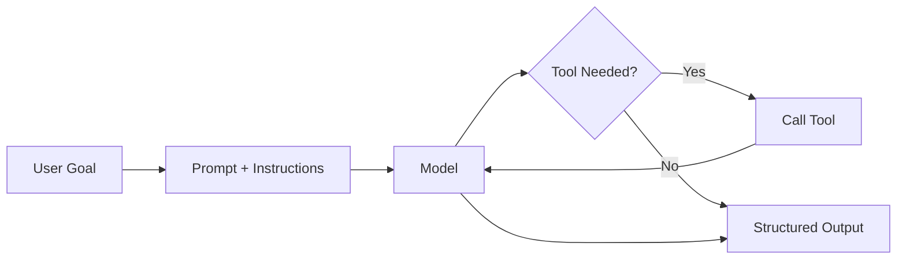
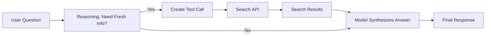
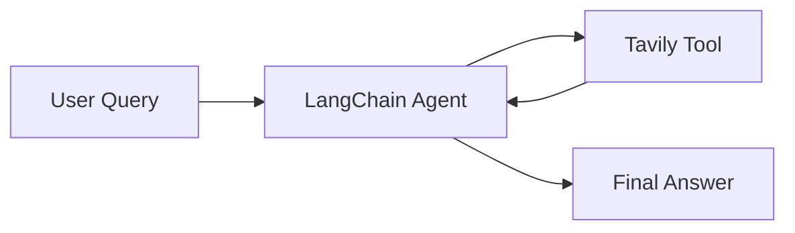
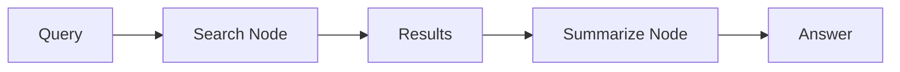
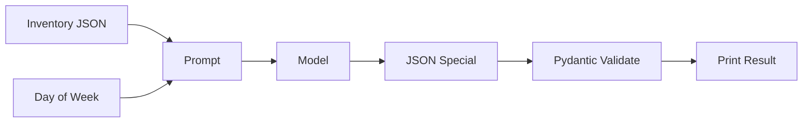
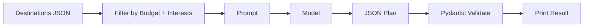
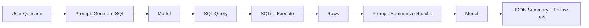

# Chapter 3: Your First Agent (Search & Summarize)

This chapter is your hands-on starting point. You will build a real agent that uses a tool, returns structured output, and follows clear instructions.

We will start with a **Search & Summarize** agent (a ReAct agent that can look things up). After that, you can build three additional agents tailored to different backgrounds: business owner, everyday user, and developer.

All four projects teach the same core skills. Start with Search & Summarize, then explore the others.

## What You Will Learn

- How to structure a simple agent loop
- How to call a tool safely
- How to return clean, predictable output
- How to test and improve prompts

## Prerequisites

- Python installed
- Basic comfort with running a script
- A model API key set in `.env` (for OpenAI) or Ollama installed locally

If you are new to Python or APIs, skim Chapter 2 before starting.

## Quick Setup (OpenAI or Ollama)

Choose one provider. You can switch later without changing the core logic.

### Option A: OpenAI

1. Create a `.env` file:

```
OPENAI_API_KEY=your_key_here
```

2. Install dependencies:

```bash
pip install openai python-dotenv pydantic requests
```

### Option B: Ollama (Local)

1. Install Ollama and pull a model:

```bash
ollama pull llama3
```

2. Install dependencies:

```bash
pip install ollama python-dotenv pydantic requests
```

## The Core Agent Pattern (Used in All Projects)

Every starter agent in this chapter follows the same pattern:

1. Receive a goal from the user
2. Decide if a tool is needed
3. Call the tool and collect data
4. Return a structured response

Think of this as a tiny, reliable loop. We are not aiming for magic. We are aiming for a clean, repeatable system.

### Core Agent Flow (Visual)



## Main Project: Search & Summarize (ReAct Agent)

### 1. What Is This Agent?

This is a **ReAct Agent** (Reasoning + Acting). It is not just a chatbot that remembers training data from 2023. It is a system that can say:

> "I don't know the answer, so I will go look it up."

Think of it like a research assistant with a smartphone.

- **Standard ChatGPT**: A genius locked in a windowless room with no internet.
- **Your Search Agent**: The same genius, but you gave them a smartphone.

It cannot memorize the stock market, but it _can_ search to find the current answer.

### 2. How Does It Work? (The Logic Flow)

When you run `agent.run("What is the stock price of Tesla?")`, a 4-step invisible loop happens. This is called the **Agentic Loop**.

**Step 1: The Pause (Reasoning)**
The LLM receives your question. Instead of answering immediately, it pauses and checks its instructions.

Internal thought:
"The user asked for the current stock price. My training data is old. I have a search tool. I should use it."

**Step 2: The Call (Tool Use)**
The LLM outputs a tool call instead of a human answer.

LLM output (example):
`{"action": "search", "query": "Tesla stock price today"}`

It does not search the web itself. It asks your Python script to do it.

**Step 3: The Execution (Action)**
Your Python script detects the tool call and runs the search API.

Python script flow:
Search API -> receives result -> sends result back to the model

**Step 4: The Synthesis (Final Response)**
The LLM receives the search results and writes the final answer.

Final output (example):
"The current stock price of Tesla is $215.50, which is up 2% today."

### ReAct Loop (Visual)



### 3. The Code Explained (Line by Line)

Below is the "Hello World" Search & Summarize agent. You can run it with **OpenAI** or **Ollama**. Each variant uses the same logic but different model providers.

### Search API (Beginner Default: Tavily)

If you are new to search APIs, use **Tavily**. It is simple and beginner-friendly.

1. Create a `.env` file and add:

```
TAVILY_API_KEY=your_key_here
```

2. The function below calls Tavily and returns results in a clean format.

Create `react_search_openai.py` (OpenAI):

::: code-group

```python [Python]
import os
import json
import requests
from pydantic import BaseModel
from openai import OpenAI
from dotenv import load_dotenv

class ToolCall(BaseModel):
    action: str
    query: str

class FinalAnswer(BaseModel):
    answer: str
    sources: list[str]

load_dotenv()
client = OpenAI(api_key=os.getenv("OPENAI_API_KEY"))

def search_web(query: str) -> dict:
    url = "https://api.tavily.com/search"
    payload = {
        "api_key": os.getenv("TAVILY_API_KEY"),
        "query": query,
        "max_results": 3,
        "include_answer": False,
    }
    resp = requests.post(url, json=payload, timeout=30)
    resp.raise_for_status()
    data = resp.json()
    return {
        "results": [
            {
                "title": r.get("title", ""),
                "url": r.get("url", ""),
                "snippet": r.get("content", ""),
            }
            for r in data.get("results", [])
        ]
    }

system_prompt = (
    "You are a ReAct agent. If you need current information, "
    "return a JSON tool call with keys: action, query. "
    "Otherwise return a JSON final answer with keys: answer, sources."
)

user_question = "What is the stock price of Tesla right now?"

resp = client.responses.create(
    model="gpt-4.1-mini",
    input=[
        {"role": "system", "content": system_prompt},
        {"role": "user", "content": user_question},
    ],
)

raw = resp.output_text
try:
    parsed = json.loads(raw)
except json.JSONDecodeError:
    cleaned = raw.strip()
    if cleaned.startswith("```"):
        cleaned = cleaned.split("\n", 1)[1]
        if cleaned.endswith("```"):
            cleaned = cleaned.rsplit("\n", 1)[0]
    parsed = json.loads(cleaned)

if "action" in parsed:
    tool_call = ToolCall.model_validate(parsed)
    search_data = search_web(tool_call.query)
    followup = (
        f"Search results: {json.dumps(search_data)}\n"
        "Write a final answer as JSON with keys: answer, sources."
    )
    resp2 = client.responses.create(
        model="gpt-4.1-mini",
        input=[
            {"role": "system", "content": "You summarize search results."},
            {"role": "user", "content": followup},
        ],
    )
    final_raw = resp2.output_text
    try:
        final_parsed = json.loads(final_raw)
    except json.JSONDecodeError:
        cleaned = final_raw.strip()
        if cleaned.startswith("```"):
            cleaned = cleaned.split("\n", 1)[1]
            if cleaned.endswith("```"):
                cleaned = cleaned.rsplit("\n", 1)[0]
        final_parsed = json.loads(cleaned)
    final = FinalAnswer.model_validate(final_parsed)
    print(final.model_dump_json(indent=2))
else:
    final = FinalAnswer.model_validate(parsed)
    print(final.model_dump_json(indent=2))
```

```javascript [Node.js]
// npm install openai dotenv
import OpenAI from "openai";
import { config } from "dotenv";

config();

const client = new OpenAI({ apiKey: process.env.OPENAI_API_KEY });

async function searchWeb(query) {
  const resp = await fetch("https://api.tavily.com/search", {
    method: "POST",
    headers: { "Content-Type": "application/json" },
    body: JSON.stringify({
      api_key: process.env.TAVILY_API_KEY,
      query,
      max_results: 3,
      include_answer: false,
    }),
  });
  const data = await resp.json();
  return {
    results: (data.results || []).map((r) => ({
      title: r.title || "",
      url: r.url || "",
      snippet: r.content || "",
    })),
  };
}

const systemPrompt =
  "You are a ReAct agent. If you need current information, " +
  "return a JSON tool call with keys: action, query. " +
  "Otherwise return a JSON final answer with keys: answer, sources.";

const userQuestion = "What is the stock price of Tesla right now?";

const resp = await client.responses.create({
  model: "gpt-4.1-mini",
  input: [
    { role: "system", content: systemPrompt },
    { role: "user", content: userQuestion },
  ],
});

let parsed;
try {
  parsed = JSON.parse(resp.output_text);
} catch {
  let cleaned = resp.output_text.trim();
  if (cleaned.startsWith("```")) cleaned = cleaned.split("\n").slice(1).join("\n");
  if (cleaned.endsWith("```")) cleaned = cleaned.split("\n").slice(0, -1).join("\n");
  parsed = JSON.parse(cleaned);
}

if ("action" in parsed) {
  const searchData = await searchWeb(parsed.query);
  const followup =
    `Search results: ${JSON.stringify(searchData)}\n` +
    "Write a final answer as JSON with keys: answer, sources.";

  const resp2 = await client.responses.create({
    model: "gpt-4.1-mini",
    input: [
      { role: "system", content: "You summarize search results." },
      { role: "user", content: followup },
    ],
  });

  let finalParsed;
  try {
    finalParsed = JSON.parse(resp2.output_text);
  } catch {
    let cleaned = resp2.output_text.trim();
    if (cleaned.startsWith("```")) cleaned = cleaned.split("\n").slice(1).join("\n");
    if (cleaned.endsWith("```")) cleaned = cleaned.split("\n").slice(0, -1).join("\n");
    finalParsed = JSON.parse(cleaned);
  }
  console.log(JSON.stringify(finalParsed, null, 2));
} else {
  console.log(JSON.stringify(parsed, null, 2));
}
```

:::

Create `react_search_ollama.py` (Ollama):

::: code-group

```python [Python]
import os
import json
import requests
from pydantic import BaseModel
import ollama
from dotenv import load_dotenv

class ToolCall(BaseModel):
    action: str
    query: str

class FinalAnswer(BaseModel):
    answer: str
    sources: list[str]

load_dotenv()

def search_web(query: str) -> dict:
    url = "https://api.tavily.com/search"
    payload = {
        "api_key": os.getenv("TAVILY_API_KEY"),
        "query": query,
        "max_results": 3,
        "include_answer": False,
    }
    resp = requests.post(url, json=payload, timeout=30)
    resp.raise_for_status()
    data = resp.json()
    return {
        "results": [
            {
                "title": r.get("title", ""),
                "url": r.get("url", ""),
                "snippet": r.get("content", ""),
            }
            for r in data.get("results", [])
        ]
    }

system_prompt = (
    "You are a ReAct agent. If you need current information, "
    "return a JSON tool call with keys: action, query. "
    "Otherwise return a JSON final answer with keys: answer, sources."
)

user_question = "What is the stock price of Tesla right now?"

resp = ollama.chat(
    model="llama3",
    messages=[
        {"role": "system", "content": system_prompt},
        {"role": "user", "content": user_question},
    ],
    options={"temperature": 0.2},
)
raw = resp["message"]["content"]
try:
    parsed = json.loads(raw)
except json.JSONDecodeError:
    cleaned = raw.strip()
    if cleaned.startswith("```"):
        cleaned = cleaned.split("\n", 1)[1]
        if cleaned.endswith("```"):
            cleaned = cleaned.rsplit("\n", 1)[0]
    parsed = json.loads(cleaned)

if "action" in parsed:
    tool_call = ToolCall.model_validate(parsed)
    search_data = search_web(tool_call.query)
    followup = (
        f"Search results: {json.dumps(search_data)}\n"
        "Write a final answer as JSON with keys: answer, sources."
    )
    resp2 = ollama.chat(
        model="llama3",
        messages=[
            {"role": "system", "content": "You summarize search results."},
            {"role": "user", "content": followup},
        ],
        options={"temperature": 0.2},
    )
    final_raw = resp2["message"]["content"]
    try:
        final_parsed = json.loads(final_raw)
    except json.JSONDecodeError:
        cleaned = final_raw.strip()
        if cleaned.startswith("```"):
            cleaned = cleaned.split("\n", 1)[1]
            if cleaned.endswith("```"):
                cleaned = cleaned.rsplit("\n", 1)[0]
        final_parsed = json.loads(cleaned)
    final = FinalAnswer.model_validate(final_parsed)
    print(final.model_dump_json(indent=2))
else:
    final = FinalAnswer.model_validate(parsed)
    print(final.model_dump_json(indent=2))
```

```javascript [Node.js]
// npm install ollama dotenv
// Note: Ollama also has an npm package; alternatively use the OpenAI-compatible API
import { Ollama } from "ollama";
import { config } from "dotenv";

config();

const ollama = new Ollama();

async function searchWeb(query) {
  const resp = await fetch("https://api.tavily.com/search", {
    method: "POST",
    headers: { "Content-Type": "application/json" },
    body: JSON.stringify({
      api_key: process.env.TAVILY_API_KEY,
      query,
      max_results: 3,
      include_answer: false,
    }),
  });
  const data = await resp.json();
  return {
    results: (data.results || []).map((r) => ({
      title: r.title || "",
      url: r.url || "",
      snippet: r.content || "",
    })),
  };
}

const systemPrompt =
  "You are a ReAct agent. If you need current information, " +
  "return a JSON tool call with keys: action, query. " +
  "Otherwise return a JSON final answer with keys: answer, sources.";

const userQuestion = "What is the stock price of Tesla right now?";

const resp = await ollama.chat({
  model: "llama3",
  messages: [
    { role: "system", content: systemPrompt },
    { role: "user", content: userQuestion },
  ],
  options: { temperature: 0.2 },
});

let parsed;
try {
  parsed = JSON.parse(resp.message.content);
} catch {
  let cleaned = resp.message.content.trim();
  if (cleaned.startsWith("```")) cleaned = cleaned.split("\n").slice(1).join("\n");
  if (cleaned.endsWith("```")) cleaned = cleaned.split("\n").slice(0, -1).join("\n");
  parsed = JSON.parse(cleaned);
}

if ("action" in parsed) {
  const searchData = await searchWeb(parsed.query);
  const followup =
    `Search results: ${JSON.stringify(searchData)}\n` +
    "Write a final answer as JSON with keys: answer, sources.";

  const resp2 = await ollama.chat({
    model: "llama3",
    messages: [
      { role: "system", content: "You summarize search results." },
      { role: "user", content: followup },
    ],
    options: { temperature: 0.2 },
  });

  let finalParsed;
  try {
    finalParsed = JSON.parse(resp2.message.content);
  } catch {
    let cleaned = resp2.message.content.trim();
    if (cleaned.startsWith("```")) cleaned = cleaned.split("\n").slice(1).join("\n");
    if (cleaned.endsWith("```")) cleaned = cleaned.split("\n").slice(0, -1).join("\n");
    finalParsed = JSON.parse(cleaned);
  }
  console.log(JSON.stringify(finalParsed, null, 2));
} else {
  console.log(JSON.stringify(parsed, null, 2));
}
```

:::

### Terminal Dry Run (Simulated)

```bash
python react_search_openai.py
```

```text
{
  "answer": "Tesla's stock is trading around $215.50 at the moment, up about 2% today.",
  "sources": [
    "https://example.com/market-data",
    "https://example.com/tesla-quote"
  ]
}
```

```bash
python react_search_ollama.py
```

```text
{
  "answer": "Tesla's stock is around $215 today. It is up roughly 2% from the previous close.",
  "sources": [
    "https://example.com/market-data",
    "https://example.com/tesla-quote"
  ]
}
```

## Framework Shortcuts (Same Example, New Tools)

You already built the Search & Summarize agent from scratch. Now you will see the exact same idea using popular frameworks. This helps you recognize the pattern in any tool.

### What Are These Tools?

- **LangChain**: A toolkit that wraps prompts, tools, memory, and agent logic so you write less plumbing code.
- **LangGraph**: A framework for multi-step flows modeled as a graph of nodes and edges.
- **Other tools you may hear about**:
- **CrewAI**: Multi-agent role-based teamwork.
- **AutoGen**: Agent-to-agent conversation workflows.
- **LlamaIndex**: Retrieval-focused pipeline for documents and knowledge bases.

### LangChain Version (Search & Summarize)

This version uses the same Search & Summarize goal but with a built-in ReAct-style agent.

**Flow (LangChain)**:



**Install**:

```bash
pip install langchain langchain-community langchain-openai tavily-python python-dotenv
```

**If you use Ollama**:

```bash
pip install langchain-ollama
```

**OpenAI example**:

::: code-group

```python [Python]
import os
from dotenv import load_dotenv
from langchain_openai import ChatOpenAI
# TavilySearchResults lives in langchain-community + tavily-python
from langchain_community.tools.tavily_search import TavilySearchResults
from langchain.agents import initialize_agent, AgentType

load_dotenv()

llm = ChatOpenAI(model="gpt-4o-mini", temperature=0)
tools = [TavilySearchResults(max_results=3)]

agent = initialize_agent(
    tools=tools,
    llm=llm,
    agent=AgentType.STRUCTURED_CHAT_ZERO_SHOT_REACT_DESCRIPTION,
    verbose=True,
)

query = "What is the stock price of Tesla right now?"
response = agent.invoke({"input": query})
print(response["output"])
```

```javascript [Node.js]
// npm install langchain @langchain/openai dotenv
import { ChatOpenAI } from "@langchain/openai";
import { TavilySearchResults } from "@langchain/community/tools/tavily_search";
import { AgentExecutor, createStructuredChatAgent } from "langchain/agents";
import { pull } from "langchain/hub";
import { config } from "dotenv";

config();

const llm = new ChatOpenAI({ model: "gpt-4o-mini", temperature: 0 });
const tools = [new TavilySearchResults({ maxResults: 3 })];

const prompt = await pull("hwchase17/structured-chat-agent");
const agent = await createStructuredChatAgent({ llm, tools, prompt });
const executor = new AgentExecutor({ agent, tools, verbose: true });

const query = "What is the stock price of Tesla right now?";
const response = await executor.invoke({ input: query });
console.log(response.output);
```

:::

**Ollama example**:

::: code-group

```python [Python]
from langchain_community.tools.tavily_search import TavilySearchResults
from langchain.agents import initialize_agent, AgentType
from dotenv import load_dotenv

load_dotenv()

try:
    from langchain_ollama import ChatOllama
except ImportError:
    from langchain_community.chat_models import ChatOllama

llm = ChatOllama(model="llama3", temperature=0)
tools = [TavilySearchResults(max_results=3)]

agent = initialize_agent(
    tools=tools,
    llm=llm,
    agent=AgentType.STRUCTURED_CHAT_ZERO_SHOT_REACT_DESCRIPTION,
    verbose=True,
)

query = "What is the stock price of Tesla right now?"
response = agent.invoke({"input": query})
print(response["output"])
```

```javascript [Node.js]
// npm install langchain @langchain/community dotenv
// Ollama must be running locally; this example uses the Ollama OpenAI-compatible endpoint
import { ChatOpenAI } from "@langchain/openai";
import { TavilySearchResults } from "@langchain/community/tools/tavily_search";
import { AgentExecutor, createStructuredChatAgent } from "langchain/agents";
import { pull } from "langchain/hub";
import { config } from "dotenv";

config();

// Point to Ollama's OpenAI-compatible API
const llm = new ChatOpenAI({
  model: "llama3",
  temperature: 0,
  configuration: { baseURL: "http://localhost:11434/v1", apiKey: "ollama" },
});
const tools = [new TavilySearchResults({ maxResults: 3 })];

const prompt = await pull("hwchase17/structured-chat-agent");
const agent = await createStructuredChatAgent({ llm, tools, prompt });
const executor = new AgentExecutor({ agent, tools, verbose: true });

const query = "What is the stock price of Tesla right now?";
const response = await executor.invoke({ input: query });
console.log(response.output);
```

:::

**What changed**:

- You no longer write the tool-call parser.
- The framework chooses when to call tools.
- The result is plain text unless you add a structured output step.

### LangGraph Version (Search & Summarize)

LangGraph turns the same pattern into an explicit graph. This helps when you need branching logic, retries, or multi-agent systems.

**Flow (LangGraph)**:



**Install**:

```bash
pip install langgraph langchain langchain-community langchain-openai tavily-python python-dotenv
```

**OpenAI example**:

::: code-group

```python [Python]
import os
from typing import TypedDict, List
from dotenv import load_dotenv
from langchain_openai import ChatOpenAI
from langchain_community.tools.tavily_search import TavilySearchResults
from langgraph.graph import StateGraph, END

load_dotenv()

class GraphState(TypedDict):
    query: str
    results: List[dict]
    answer: str

llm = ChatOpenAI(model="gpt-4o-mini", temperature=0)
search_tool = TavilySearchResults(max_results=3)

def search_node(state: GraphState) -> GraphState:
    results = search_tool.invoke(state["query"])
    return {**state, "results": results}

def summarize_node(state: GraphState) -> GraphState:
    prompt = f"Search results: {state['results']}\nSummarize in 3 sentences."
    answer = llm.invoke(prompt).content
    return {**state, "answer": answer}

graph = StateGraph(GraphState)
graph.add_node("search", search_node)
graph.add_node("summarize", summarize_node)
graph.set_entry_point("search")
graph.add_edge("search", "summarize")
graph.add_edge("summarize", END)

app = graph.compile()
final_state = app.invoke({"query": "What is the stock price of Tesla right now?"})
print(final_state["answer"])
```

```javascript [Node.js]
// npm install @langchain/langgraph @langchain/openai @langchain/community dotenv
import { ChatOpenAI } from "@langchain/openai";
import { TavilySearchResults } from "@langchain/community/tools/tavily_search";
import { StateGraph, END } from "@langchain/langgraph";
import { config } from "dotenv";

config();

const llm = new ChatOpenAI({ model: "gpt-4o-mini", temperature: 0 });
const searchTool = new TavilySearchResults({ maxResults: 3 });

async function searchNode(state) {
  const results = await searchTool.invoke(state.query);
  return { ...state, results };
}

async function summarizeNode(state) {
  const prompt = `Search results: ${JSON.stringify(state.results)}\nSummarize in 3 sentences.`;
  const res = await llm.invoke(prompt);
  return { ...state, answer: res.content };
}

const graph = new StateGraph({
  channels: {
    query: { value: (x, y) => y ?? x },
    results: { value: (x, y) => y ?? x, default: () => [] },
    answer: { value: (x, y) => y ?? x, default: () => "" },
  },
});

graph.addNode("search", searchNode);
graph.addNode("summarize", summarizeNode);
graph.setEntryPoint("search");
graph.addEdge("search", "summarize");
graph.addEdge("summarize", END);

const app = graph.compile();
const finalState = await app.invoke({ query: "What is the stock price of Tesla right now?" });
console.log(finalState.answer);
```

:::

**What changed**:

- You see each step as a node.
- It is easy to insert retries, tools, or human approval.
- The flow is explicit and scalable.

## Next Practice Projects

Now that you have built a working ReAct agent, try one of the practice projects below to reinforce the same pattern in different contexts.

## Project A: Cafe Helper Agent (Business Owner)

**Goal**: Help a cafe owner plan daily specials based on inventory and the day of week.

**Input example**:

- Inventory: `eggs, spinach, mushrooms, sourdough`
- Day: `Saturday`

**Output (structured)**:

- `special_name`
- `ingredients_used`
- `estimated_prep_time`
- `short_marketing_blurb`

**Tool**:

- A simple inventory lookup (local JSON or a tiny CSV file)

**Why this project works**:

- The problem is small
- The output must be structured
- It feels realistic for business owners

### Cafe Agent Flow (Visual)



### Steps

1. Create a small inventory file
2. Load it in Python
3. Send the inventory + day to the model
4. Validate the model output
5. Print the result in a clean format

### Exact Code (Cafe Helper)

Create a file `inventory.json`:

```json
{
  "eggs": 24,
  "spinach": 12,
  "mushrooms": 10,
  "sourdough": 16,
  "tomatoes": 8
}
```

Create `cafe_agent_openai.py` (OpenAI):

::: code-group

```python [Python]
import os
import json
from pydantic import BaseModel
from openai import OpenAI
from dotenv import load_dotenv
from dotenv import load_dotenv

class CafeSpecial(BaseModel):
    special_name: str
    ingredients_used: list[str]
    estimated_prep_time: str
    short_marketing_blurb: str

load_dotenv()
load_dotenv()
client = OpenAI(api_key=os.getenv("OPENAI_API_KEY"))

inventory = json.load(open("inventory.json", "r", encoding="utf-8"))
day = "Saturday"

system_prompt = (
    "You are a helpful cafe assistant. "
    "Return JSON only, matching this schema: "
    "{special_name, ingredients_used, estimated_prep_time, short_marketing_blurb}."
)
user_prompt = (
    f"Inventory: {inventory}\n"
    f"Day: {day}\n"
    "Create a single daily special using available ingredients."
)

resp = client.responses.create(
    model="gpt-4.1-mini",
    input=[
        {"role": "system", "content": system_prompt},
        {"role": "user", "content": user_prompt},
    ],
)
raw = resp.output_text
special = CafeSpecial.model_validate_json(raw)
print(special.model_dump_json(indent=2))
```

```javascript [Node.js]
// npm install openai dotenv
import OpenAI from "openai";
import { readFileSync } from "fs";
import { config } from "dotenv";

config();

const client = new OpenAI({ apiKey: process.env.OPENAI_API_KEY });

const inventory = JSON.parse(readFileSync("inventory.json", "utf-8"));
const day = "Saturday";

const systemPrompt =
  "You are a helpful cafe assistant. " +
  "Return JSON only, matching this schema: " +
  "{special_name, ingredients_used, estimated_prep_time, short_marketing_blurb}.";

const userPrompt =
  `Inventory: ${JSON.stringify(inventory)}\n` +
  `Day: ${day}\n` +
  "Create a single daily special using available ingredients.";

const resp = await client.responses.create({
  model: "gpt-4.1-mini",
  input: [
    { role: "system", content: systemPrompt },
    { role: "user", content: userPrompt },
  ],
});

const special = JSON.parse(resp.output_text);
console.log(JSON.stringify(special, null, 2));
```

:::

Create `cafe_agent_ollama.py` (Ollama):

::: code-group

```python [Python]
import json
import ollama
from pydantic import BaseModel

class CafeSpecial(BaseModel):
    special_name: str
    ingredients_used: list[str]
    estimated_prep_time: str
    short_marketing_blurb: str

inventory = json.load(open("inventory.json", "r", encoding="utf-8"))
day = "Saturday"

system_prompt = (
    "You are a helpful cafe assistant. "
    "Return JSON only, matching this schema: "
    "{special_name, ingredients_used, estimated_prep_time, short_marketing_blurb}."
)
user_prompt = (
    f"Inventory: {inventory}\n"
    f"Day: {day}\n"
    "Create a single daily special using available ingredients."
)

resp = ollama.chat(
    model="llama3",
    messages=[
        {"role": "system", "content": system_prompt},
        {"role": "user", "content": user_prompt},
    ],
    options={"temperature": 0.2},
)
raw = resp["message"]["content"]
special = CafeSpecial.model_validate_json(raw)
print(special.model_dump_json(indent=2))
```

```javascript [Node.js]
// npm install ollama
import { Ollama } from "ollama";
import { readFileSync } from "fs";

const ollama = new Ollama();

const inventory = JSON.parse(readFileSync("inventory.json", "utf-8"));
const day = "Saturday";

const systemPrompt =
  "You are a helpful cafe assistant. " +
  "Return JSON only, matching this schema: " +
  "{special_name, ingredients_used, estimated_prep_time, short_marketing_blurb}.";

const userPrompt =
  `Inventory: ${JSON.stringify(inventory)}\n` +
  `Day: ${day}\n` +
  "Create a single daily special using available ingredients.";

const resp = await ollama.chat({
  model: "llama3",
  messages: [
    { role: "system", content: systemPrompt },
    { role: "user", content: userPrompt },
  ],
  options: { temperature: 0.2 },
});

const special = JSON.parse(resp.message.content);
console.log(JSON.stringify(special, null, 2));
```

:::

### Example Output

```json
{
  "special_name": "Spinach & Mushroom Toast",
  "ingredients_used": ["spinach", "mushrooms", "sourdough", "eggs"],
  "estimated_prep_time": "12 minutes",
  "short_marketing_blurb": "A cozy weekend toast topped with sauteed greens and a soft egg."
}
```

## Project B: Vacation Planner Agent (Daily User)

**Goal**: Help a person plan a short vacation based on budget and preferences.

**Input example**:

- Budget: `$900`
- Duration: `3 days`
- Interests: `food, museums, walkable areas`

**Output (structured)**:

- `destination`
- `day_by_day_plan`
- `estimated_cost`
- `packing_list`

**Tool**:

- A simple dataset of destinations (local JSON)

**Why this project works**:

- Easy for beginners to relate
- Teaches planning and structure
- Demonstrates how tools guide the model

### Vacation Agent Flow (Visual)



### Steps

1. Create a tiny destinations file
2. Filter based on budget and duration
3. Provide the filtered list to the model
4. Ask for a clean JSON plan
5. Validate the response and print it

### Exact Code (Vacation Planner)

Create a file `destinations.json`:

```json
[
  {
    "city": "Chicago",
    "avg_3day_cost": 850,
    "tags": ["food", "museums", "walkable"]
  },
  {
    "city": "Austin",
    "avg_3day_cost": 780,
    "tags": ["food", "music", "nightlife"]
  },
  {
    "city": "Portland",
    "avg_3day_cost": 700,
    "tags": ["coffee", "walkable", "parks"]
  }
]
```

Create `vacation_agent_openai.py` (OpenAI):

::: code-group

```python [Python]
import os
import json
from pydantic import BaseModel
from openai import OpenAI

class VacationPlan(BaseModel):
    destination: str
    day_by_day_plan: list[str]
    estimated_cost: str
    packing_list: list[str]

client = OpenAI(api_key=os.getenv("OPENAI_API_KEY"))

budget = 900
duration_days = 3
interests = ["food", "museums", "walkable"]

destinations = json.load(open("destinations.json", "r", encoding="utf-8"))
filtered = [
    d for d in destinations
    if d["avg_3day_cost"] <= budget and all(i in d["tags"] for i in interests)
]

system_prompt = (
    "You are a vacation planner. "
    "Return JSON only, matching this schema: "
    "{destination, day_by_day_plan, estimated_cost, packing_list}."
)
user_prompt = (
    f"Options: {filtered}\n"
    f"Budget: {budget}\n"
    f"Duration: {duration_days} days\n"
    f"Interests: {interests}\n"
    "Pick the best destination and build a simple plan."
)

resp = client.responses.create(
    model="gpt-4.1-mini",
    input=[
        {"role": "system", "content": system_prompt},
        {"role": "user", "content": user_prompt},
    ],
)
raw = resp.output_text
plan = VacationPlan.model_validate_json(raw)
print(plan.model_dump_json(indent=2))
```

```javascript [Node.js]
// npm install openai dotenv
import OpenAI from "openai";
import { readFileSync } from "fs";

const client = new OpenAI({ apiKey: process.env.OPENAI_API_KEY });

const budget = 900;
const durationDays = 3;
const interests = ["food", "museums", "walkable"];

const destinations = JSON.parse(readFileSync("destinations.json", "utf-8"));
const filtered = destinations.filter(
  (d) =>
    d.avg_3day_cost <= budget && interests.every((i) => d.tags.includes(i))
);

const systemPrompt =
  "You are a vacation planner. " +
  "Return JSON only, matching this schema: " +
  "{destination, day_by_day_plan, estimated_cost, packing_list}.";

const userPrompt =
  `Options: ${JSON.stringify(filtered)}\n` +
  `Budget: ${budget}\n` +
  `Duration: ${durationDays} days\n` +
  `Interests: ${JSON.stringify(interests)}\n` +
  "Pick the best destination and build a simple plan.";

const resp = await client.responses.create({
  model: "gpt-4.1-mini",
  input: [
    { role: "system", content: systemPrompt },
    { role: "user", content: userPrompt },
  ],
});

const plan = JSON.parse(resp.output_text);
console.log(JSON.stringify(plan, null, 2));
```

:::

Create `vacation_agent_ollama.py` (Ollama):

::: code-group

```python [Python]
import json
import ollama
from pydantic import BaseModel

class VacationPlan(BaseModel):
    destination: str
    day_by_day_plan: list[str]
    estimated_cost: str
    packing_list: list[str]

budget = 900
duration_days = 3
interests = ["food", "museums", "walkable"]

destinations = json.load(open("destinations.json", "r", encoding="utf-8"))
filtered = [
    d for d in destinations
    if d["avg_3day_cost"] <= budget and all(i in d["tags"] for i in interests)
]

system_prompt = (
    "You are a vacation planner. "
    "Return JSON only, matching this schema: "
    "{destination, day_by_day_plan, estimated_cost, packing_list}."
)
user_prompt = (
    f"Options: {filtered}\n"
    f"Budget: {budget}\n"
    f"Duration: {duration_days} days\n"
    f"Interests: {interests}\n"
    "Pick the best destination and build a simple plan."
)

resp = ollama.chat(
    model="llama3",
    messages=[
        {"role": "system", "content": system_prompt},
        {"role": "user", "content": user_prompt},
    ],
    options={"temperature": 0.2},
)
raw = resp["message"]["content"]
plan = VacationPlan.model_validate_json(raw)
print(plan.model_dump_json(indent=2))
```

```javascript [Node.js]
// npm install ollama
import { Ollama } from "ollama";
import { readFileSync } from "fs";

const ollama = new Ollama();

const budget = 900;
const durationDays = 3;
const interests = ["food", "museums", "walkable"];

const destinations = JSON.parse(readFileSync("destinations.json", "utf-8"));
const filtered = destinations.filter(
  (d) =>
    d.avg_3day_cost <= budget && interests.every((i) => d.tags.includes(i))
);

const systemPrompt =
  "You are a vacation planner. " +
  "Return JSON only, matching this schema: " +
  "{destination, day_by_day_plan, estimated_cost, packing_list}.";

const userPrompt =
  `Options: ${JSON.stringify(filtered)}\n` +
  `Budget: ${budget}\n` +
  `Duration: ${durationDays} days\n` +
  `Interests: ${JSON.stringify(interests)}\n` +
  "Pick the best destination and build a simple plan.";

const resp = await ollama.chat({
  model: "llama3",
  messages: [
    { role: "system", content: systemPrompt },
    { role: "user", content: userPrompt },
  ],
  options: { temperature: 0.2 },
});

const plan = JSON.parse(resp.message.content);
console.log(JSON.stringify(plan, null, 2));
```

:::

### Example Output

```json
{
  "destination": "Chicago",
  "day_by_day_plan": [
    "Day 1: Riverwalk, deep dish dinner, architecture boat tour",
    "Day 2: Art Institute, Millennium Park, local food market",
    "Day 3: Museum of Science and Industry, coffee crawl"
  ],
  "estimated_cost": "$850",
  "packing_list": ["comfortable shoes", "light jacket", "museum pass"]
}
```

## Project C: SQL Data Helper Agent (Developer)

**Goal**: Help a developer query their own database and explain results.

**Input example**:

- Question: "Which products had the highest revenue last quarter?"

**Output (structured)**:

- `sql_query`
- `result_summary`
- `follow_up_questions`

**Tool**:

- A local SQLite database with sample data

**Why this project works**:

- Very practical for developers
- Shows how agents can work with real data
- Introduces safe SQL practices

### SQL Agent Flow (Visual)



### Steps

1. Create a small SQLite database
2. Ask the model to generate a SQL query
3. Run the query
4. Feed results back to the model
5. Return a summary and follow-ups

### Exact Code (SQL Data Helper)

Create `init_db.py`:

::: code-group

```python [Python]
import sqlite3

conn = sqlite3.connect("sales.db")
cur = conn.cursor()
cur.execute("DROP TABLE IF EXISTS sales")
cur.execute("""
CREATE TABLE sales (
  product_name TEXT,
  quarter TEXT,
  revenue INTEGER
)
""")
cur.executemany(
    "INSERT INTO sales VALUES (?, ?, ?)",
    [
        ("Product A", "Q4", 120000),
        ("Product B", "Q4", 108000),
        ("Product C", "Q4", 65000),
        ("Product A", "Q3", 98000),
        ("Product B", "Q3", 91000),
    ],
)
conn.commit()
conn.close()
```

```javascript [Node.js]
// npm install better-sqlite3
import Database from "better-sqlite3";

const db = new Database("sales.db");
db.exec("DROP TABLE IF EXISTS sales");
db.exec(`
  CREATE TABLE sales (
    product_name TEXT,
    quarter TEXT,
    revenue INTEGER
  )
`);

const insert = db.prepare("INSERT INTO sales VALUES (?, ?, ?)");
const rows = [
  ["Product A", "Q4", 120000],
  ["Product B", "Q4", 108000],
  ["Product C", "Q4", 65000],
  ["Product A", "Q3", 98000],
  ["Product B", "Q3", 91000],
];
for (const row of rows) insert.run(...row);
db.close();
```

:::

Create `sql_agent_openai.py` (OpenAI):

::: code-group

```python [Python]
import os
import json
import sqlite3
from pydantic import BaseModel
from openai import OpenAI
from dotenv import load_dotenv

class SQLAnswer(BaseModel):
    sql_query: str
    result_summary: str
    follow_up_questions: list[str]

load_dotenv()
client = OpenAI(api_key=os.getenv("OPENAI_API_KEY"))

question = "Which products had the highest revenue last quarter?"

system_prompt = (
    "You are a data assistant. "
    "Return JSON only, matching this schema: "
    "{sql_query, result_summary, follow_up_questions}. "
    "Use SQLite syntax."
)
user_prompt = f"Question: {question}"

resp = client.responses.create(
    model="gpt-4.1-mini",
    input=[
        {"role": "system", "content": system_prompt},
        {"role": "user", "content": user_prompt},
    ],
)
raw = resp.output_text
answer = SQLAnswer.model_validate_json(raw)

conn = sqlite3.connect("sales.db")
cur = conn.cursor()
cur.execute(answer.sql_query)
rows = cur.fetchall()
conn.close()

result_prompt = (
    f"SQL: {answer.sql_query}\n"
    f"Rows: {rows}\n"
    "Summarize in one short paragraph and suggest 2 follow-up questions. "
    "Return JSON with keys: sql_query, result_summary, follow_up_questions. "
    "Use the exact sql_query shown above."
)

resp2 = client.responses.create(
    model="gpt-4.1-mini",
    input=[
        {"role": "system", "content": "You summarize SQL results."},
        {"role": "user", "content": result_prompt},
    ],
)
raw2 = resp2.output_text
try:
    parsed2 = json.loads(raw2)
except json.JSONDecodeError:
    cleaned = raw2.strip()
    if cleaned.startswith("```"):
        cleaned = cleaned.split("\n", 1)[1]
        if cleaned.endswith("```"):
            cleaned = cleaned.rsplit("\n", 1)[0]
    parsed2 = json.loads(cleaned)
summary = SQLAnswer.model_validate(parsed2)

print(summary.model_dump_json(indent=2))
```

```javascript [Node.js]
// npm install openai better-sqlite3 dotenv
import OpenAI from "openai";
import Database from "better-sqlite3";
import { config } from "dotenv";

config();

const client = new OpenAI({ apiKey: process.env.OPENAI_API_KEY });

const question = "Which products had the highest revenue last quarter?";

const systemPrompt =
  "You are a data assistant. " +
  "Return JSON only, matching this schema: " +
  "{sql_query, result_summary, follow_up_questions}. " +
  "Use SQLite syntax.";

const resp = await client.responses.create({
  model: "gpt-4.1-mini",
  input: [
    { role: "system", content: systemPrompt },
    { role: "user", content: `Question: ${question}` },
  ],
});

const answer = JSON.parse(resp.output_text);

const db = new Database("sales.db");
const rows = db.prepare(answer.sql_query).all();
db.close();

const resultPrompt =
  `SQL: ${answer.sql_query}\n` +
  `Rows: ${JSON.stringify(rows)}\n` +
  "Summarize in one short paragraph and suggest 2 follow-up questions. " +
  "Return JSON with keys: sql_query, result_summary, follow_up_questions. " +
  "Use the exact sql_query shown above.";

const resp2 = await client.responses.create({
  model: "gpt-4.1-mini",
  input: [
    { role: "system", content: "You summarize SQL results." },
    { role: "user", content: resultPrompt },
  ],
});

let summary;
try {
  summary = JSON.parse(resp2.output_text);
} catch {
  let cleaned = resp2.output_text.trim();
  if (cleaned.startsWith("```")) cleaned = cleaned.split("\n").slice(1).join("\n");
  if (cleaned.endsWith("```")) cleaned = cleaned.split("\n").slice(0, -1).join("\n");
  summary = JSON.parse(cleaned);
}

console.log(JSON.stringify(summary, null, 2));
```

:::

Create `sql_agent_ollama.py` (Ollama):

::: code-group

```python [Python]
import json
import sqlite3
import ollama
from pydantic import BaseModel

class SQLAnswer(BaseModel):
    sql_query: str
    result_summary: str
    follow_up_questions: list[str]

question = "Which products had the highest revenue last quarter?"

system_prompt = (
    "You are a data assistant. "
    "Return JSON only, matching this schema: "
    "{sql_query, result_summary, follow_up_questions}. "
    "Use SQLite syntax."
)
user_prompt = f"Question: {question}"

resp = ollama.chat(
    model="llama3",
    messages=[
        {"role": "system", "content": system_prompt},
        {"role": "user", "content": user_prompt},
    ],
    options={"temperature": 0.2},
)
raw = resp["message"]["content"]
answer = SQLAnswer.model_validate_json(raw)

conn = sqlite3.connect("sales.db")
cur = conn.cursor()
cur.execute(answer.sql_query)
rows = cur.fetchall()
conn.close()

result_prompt = (
    f"SQL: {answer.sql_query}\n"
    f"Rows: {rows}\n"
    "Summarize in one short paragraph and suggest 2 follow-up questions. "
    "Return JSON with keys: sql_query, result_summary, follow_up_questions. "
    "Use the exact sql_query shown above."
)

resp2 = ollama.chat(
    model="llama3",
    messages=[
        {"role": "system", "content": "You summarize SQL results."},
        {"role": "user", "content": result_prompt},
    ],
    options={"temperature": 0.2},
)
raw2 = resp2["message"]["content"]
try:
    parsed2 = json.loads(raw2)
except json.JSONDecodeError:
    cleaned = raw2.strip()
    if cleaned.startswith("```"):
        cleaned = cleaned.split("\n", 1)[1]
        if cleaned.endswith("```"):
            cleaned = cleaned.rsplit("\n", 1)[0]
    parsed2 = json.loads(cleaned)
summary = SQLAnswer.model_validate(parsed2)

print(summary.model_dump_json(indent=2))
```

```javascript [Node.js]
// npm install ollama better-sqlite3
import { Ollama } from "ollama";
import Database from "better-sqlite3";

const ollama = new Ollama();

const question = "Which products had the highest revenue last quarter?";

const systemPrompt =
  "You are a data assistant. " +
  "Return JSON only, matching this schema: " +
  "{sql_query, result_summary, follow_up_questions}. " +
  "Use SQLite syntax.";

const resp = await ollama.chat({
  model: "llama3",
  messages: [
    { role: "system", content: systemPrompt },
    { role: "user", content: `Question: ${question}` },
  ],
  options: { temperature: 0.2 },
});

const answer = JSON.parse(resp.message.content);

const db = new Database("sales.db");
const rows = db.prepare(answer.sql_query).all();
db.close();

const resultPrompt =
  `SQL: ${answer.sql_query}\n` +
  `Rows: ${JSON.stringify(rows)}\n` +
  "Summarize in one short paragraph and suggest 2 follow-up questions. " +
  "Return JSON with keys: sql_query, result_summary, follow_up_questions. " +
  "Use the exact sql_query shown above.";

const resp2 = await ollama.chat({
  model: "llama3",
  messages: [
    { role: "system", content: "You summarize SQL results." },
    { role: "user", content: resultPrompt },
  ],
  options: { temperature: 0.2 },
});

let summary;
try {
  summary = JSON.parse(resp2.message.content);
} catch {
  let cleaned = resp2.message.content.trim();
  if (cleaned.startsWith("```")) cleaned = cleaned.split("\n").slice(1).join("\n");
  if (cleaned.endsWith("```")) cleaned = cleaned.split("\n").slice(0, -1).join("\n");
  summary = JSON.parse(cleaned);
}

console.log(JSON.stringify(summary, null, 2));
```

:::

### Example Output

```json
{
  "sql_query": "SELECT product_name, SUM(revenue) AS total_revenue FROM sales WHERE quarter = 'Q4' GROUP BY product_name ORDER BY total_revenue DESC LIMIT 5;",
  "result_summary": "Product A and Product B led revenue in Q4, with Product A ahead by roughly 12 percent.",
  "follow_up_questions": [
    "Do you want this broken down by region?",
    "Should we compare against Q3?"
  ]
}
```

## Choose Your Path

Pick one project and build it end-to-end. If you finish early, try another project to strengthen the pattern.

## Common Pitfalls

- Vague prompts produce messy output
- Missing validation causes fragile systems
- Tool results should be passed back to the model, not ignored

## Running Each Project

```bash
python react_search_openai.py
python react_search_ollama.py
python cafe_agent_openai.py
python cafe_agent_ollama.py
python vacation_agent_openai.py
python vacation_agent_ollama.py
python init_db.py
python sql_agent_openai.py
python sql_agent_ollama.py
```

## Terminal Dry Run (Simulated)

These are example terminal runs so you know what "good" looks like. Your output will vary slightly.

### Cafe Agent (OpenAI)

```bash
python cafe_agent_openai.py
```

```text
{
  "special_name": "Spinach & Mushroom Toast",
  "ingredients_used": ["spinach", "mushrooms", "sourdough", "eggs"],
  "estimated_prep_time": "12 minutes",
  "short_marketing_blurb": "A cozy weekend toast topped with sauteed greens and a soft egg."
}
```

### Cafe Agent (Ollama)

```bash
python cafe_agent_ollama.py
```

```text
{
  "special_name": "Saturday Sunrise Toast",
  "ingredients_used": ["sourdough", "eggs", "spinach", "tomatoes"],
  "estimated_prep_time": "10 minutes",
  "short_marketing_blurb": "Weekend toast with soft eggs, greens, and fresh tomatoes."
}
```

### Vacation Agent (OpenAI)

```bash
python vacation_agent_openai.py
```

```text
{
  "destination": "Chicago",
  "day_by_day_plan": [
    "Day 1: Riverwalk, deep dish dinner, architecture boat tour",
    "Day 2: Art Institute, Millennium Park, local food market",
    "Day 3: Museum of Science and Industry, coffee crawl"
  ],
  "estimated_cost": "$850",
  "packing_list": ["comfortable shoes", "light jacket", "museum pass"]
}
```

### Vacation Agent (Ollama)

```bash
python vacation_agent_ollama.py
```

```text
{
  "destination": "Portland",
  "day_by_day_plan": [
    "Day 1: Coffee tour, Washington Park, local food carts",
    "Day 2: Art museum, river walk, dinner in Pearl District",
    "Day 3: Forest Park hike, Powell's Books, tea stop"
  ],
  "estimated_cost": "$720",
  "packing_list": ["comfortable shoes", "light jacket", "reusable water bottle"]
}
```

### SQL Agent (OpenAI)

```bash
python init_db.py
python sql_agent_openai.py
```

```text
{
  "sql_query": "SELECT product_name, SUM(revenue) AS total_revenue FROM sales WHERE quarter = 'Q4' GROUP BY product_name ORDER BY total_revenue DESC LIMIT 5;",
  "result_summary": "Product A and Product B led revenue in Q4, with Product A ahead by roughly 12 percent.",
  "follow_up_questions": [
    "Do you want this broken down by region?",
    "Should we compare against Q3?"
  ]
}
```

### SQL Agent (Ollama)

```bash
python init_db.py
python sql_agent_ollama.py
```

```text
{
  "sql_query": "SELECT product_name, SUM(revenue) AS total_revenue FROM sales WHERE quarter = 'Q4' GROUP BY product_name ORDER BY total_revenue DESC LIMIT 5;",
  "result_summary": "Product A has the highest Q4 revenue, followed by Product B and Product C.",
  "follow_up_questions": [
    "Do you want to compare Q4 to Q3?",
    "Should we group results by product category?"
  ]
}
```

## Checklist

- My agent accepts a clear user goal
- My agent uses at least one tool
- My output is structured (JSON or a defined schema)
- I can explain what happens at each step

## What Comes Next

In Chapter 4, you will add memory and context so your agent can handle larger tasks without losing the thread.

## What You Can Build Next (Real-World Use Cases)

Here are real projects you can build with the same tools in this chapter.

**Search & Summarize**
- Daily market brief for a business owner
- Competitor tracking for a local cafe or retail shop
- Policy update summaries for HR teams

**Cafe Helper**
- Daily specials planner tied to live inventory
- Seasonal menu generator with cost estimates
- Supplier reorder reminders

**Vacation Planner**
- Weekend trip generator based on budget and interests
- Packing checklist based on weather and activities
- Auto-generated itineraries for families or solo travelers

**SQL Data Helper**
- Weekly sales summaries
- Customer churn analysis questions
- Revenue breakdowns by product or region

**Framework Extensions**
- A multi-agent content pipeline using CrewAI
- A customer support triage bot using LangGraph
- A document Q&A assistant using LlamaIndex
