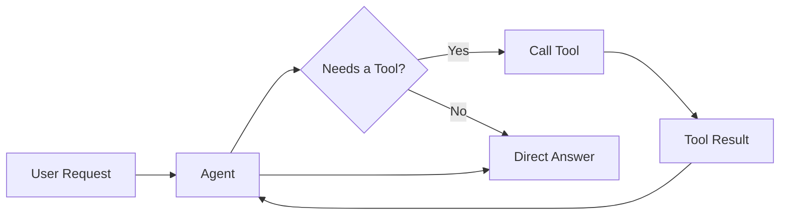
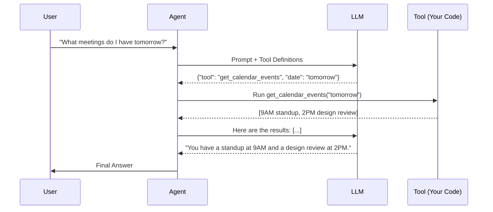
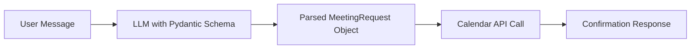
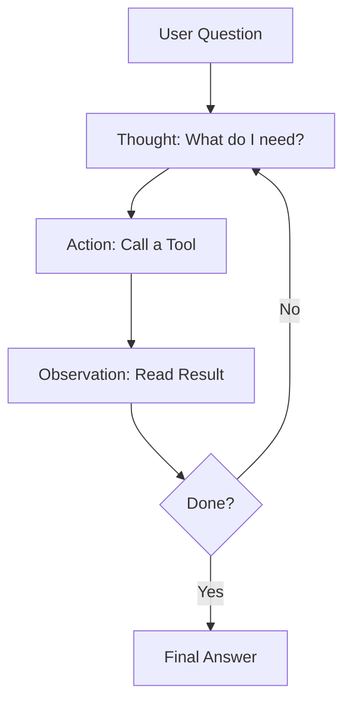
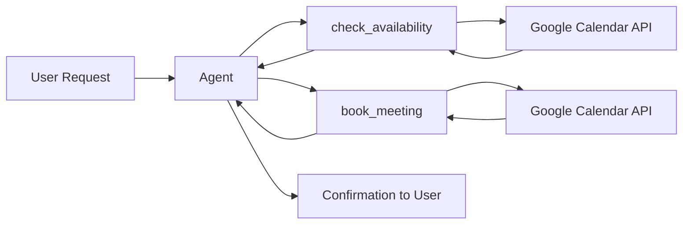

# Chapter 5: Tool Use, Function Calling & Integrations

If memory is the agent's brain, **tools are its hands**. A model that can only talk is useful. A model that can _act_ — search the web, book a meeting, send an email, query a database — is unstoppable.

This chapter explains how LLMs connect to the real world, how function calling works under the hood, and how to build a Calendar Assistant that books real meetings.

## What You Will Learn

- What tool use actually is (and why it's not magic)
- How function calling works at the API level
- How to define and register tools in LangChain
- How to use Pydantic to enforce structured outputs
- How to build a Calendar Assistant with Google Calendar API

## The Core Mental Model

Without tools, an LLM is a brilliant person locked in a room with no phone, no computer, and no access to the outside world. They can reason. They can write. But they cannot _do_.

Tools break down the wall.



The agent decides **when** to use a tool, **which** tool to call, and **what arguments** to pass. You define the tools. The model decides the rest.

---

## 1. How Function Calling Works

Function calling is the mechanism that lets an LLM output structured instructions to trigger code you wrote.

Here is the mental model: you give the model a **menu of tools** in the system prompt. When the model decides it needs one, instead of answering in plain text, it outputs a structured JSON object — the tool name and the arguments.

Your code intercepts that, runs the function, feeds the result back to the model, and the model finishes answering.



The model never ran your code. It only _asked for it to be run_. Your orchestration layer (LangChain, your own loop) is the bridge.

### Raw API Example (OpenAI)

Before using a framework, see what actually travels over the wire.

::: code-group

```python [Python]
import openai
import json

client = openai.OpenAI()

# Define the tool
tools = [
    {
        "type": "function",
        "function": {
            "name": "get_calendar_events",
            "description": "Get events on the user's calendar for a given date.",
            "parameters": {
                "type": "object",
                "properties": {
                    "date": {
                        "type": "string",
                        "description": "Date in YYYY-MM-DD format"
                    }
                },
                "required": ["date"]
            }
        }
    }
]

# First LLM call: model decides to use the tool
response = client.chat.completions.create(
    model="gpt-4o",
    messages=[{"role": "user", "content": "What do I have on 2025-07-10?"}],
    tools=tools
)

tool_call = response.choices[0].message.tool_calls[0]
print(tool_call.function.name)       # get_calendar_events
print(tool_call.function.arguments)  # {"date": "2025-07-10"}
```

```javascript [Node.js]
// npm install openai
import OpenAI from "openai";

const client = new OpenAI();

// Define the tool
const tools = [
  {
    type: "function",
    function: {
      name: "get_calendar_events",
      description: "Get events on the user's calendar for a given date.",
      parameters: {
        type: "object",
        properties: {
          date: {
            type: "string",
            description: "Date in YYYY-MM-DD format",
          },
        },
        required: ["date"],
      },
    },
  },
];

// First LLM call: model decides to use the tool
const response = await client.chat.completions.create({
  model: "gpt-4o",
  messages: [{ role: "user", content: "What do I have on 2025-07-10?" }],
  tools,
});

const toolCall = response.choices[0].message.tool_calls[0];
console.log(toolCall.function.name);       // get_calendar_events
console.log(toolCall.function.arguments);  // {"date":"2025-07-10"}
```

:::

The model returned JSON, not prose. Your code runs the actual function and sends the result back in a second call.

---

## 2. Defining Tools in LangChain

LangChain wraps function calling into a clean `@tool` decorator. This is the standard way to build tools for LangChain agents.

### The `@tool` Decorator

::: code-group

```python [Python]
from langchain_core.tools import tool

@tool
def get_weather(city: str) -> str:
    """Get the current weather for a city."""
    # Replace with a real API call
    return f"It is 72°F and sunny in {city}."
```

```javascript [Node.js]
// npm install langchain @langchain/core
import { tool } from "@langchain/core/tools";
import { z } from "zod";

const getWeather = tool(
  async ({ city }) => {
    // Replace with a real API call
    return `It is 72°F and sunny in ${city}.`;
  },
  {
    name: "get_weather",
    description: "Get the current weather for a city.",
    schema: z.object({ city: z.string() }),
  }
);
```

:::

Three things LangChain extracts automatically:

- **Name**: the function name (`get_weather`)
- **Description**: the docstring — this is what the LLM reads to decide when to use the tool
- **Schema**: the typed parameters

> **Rule**: Write your docstrings as if you are explaining the tool to a colleague, not a developer. The LLM reads them — not you.

### Registering Multiple Tools

::: code-group

```python [Python]
from langchain_core.tools import tool

@tool
def get_weather(city: str) -> str:
    """Get the current weather for a city."""
    return f"72°F and sunny in {city}."

@tool
def search_web(query: str) -> str:
    """Search the web for current information."""
    # Integrate Tavily, Serper, etc.
    return f"Top result for '{query}': ..."

@tool
def send_email(to: str, subject: str, body: str) -> str:
    """Send an email to a recipient."""
    return f"Email sent to {to}."

tools = [get_weather, search_web, send_email]
```

```javascript [Node.js]
// npm install langchain @langchain/core zod
import { tool } from "@langchain/core/tools";
import { z } from "zod";

const getWeather = tool(
  async ({ city }) => `72°F and sunny in ${city}.`,
  {
    name: "get_weather",
    description: "Get the current weather for a city.",
    schema: z.object({ city: z.string() }),
  }
);

const searchWeb = tool(
  async ({ query }) => `Top result for '${query}': ...`,
  {
    name: "search_web",
    description: "Search the web for current information.",
    schema: z.object({ query: z.string() }),
  }
);

const sendEmail = tool(
  async ({ to }) => `Email sent to ${to}.`,
  {
    name: "send_email",
    description: "Send an email to a recipient.",
    schema: z.object({
      to: z.string(),
      subject: z.string(),
      body: z.string(),
    }),
  }
);

const tools = [getWeather, searchWeb, sendEmail];
```

:::

---

## 3. Structured Output with Pydantic

By default, LLMs return freeform text. That is fine for chat. It is a disaster for production systems.

If your agent needs to output data that gets passed to another function, stored in a database, or displayed in a UI, you need **predictable structure**.

Pydantic enforces the shape of that output.

### The Problem

::: code-group

```python [Python]
# Unpredictable. Might say "Tomorrow at 9am" or "9:00 AM on July 10th" or "morning"
response = llm.invoke("When should we schedule the meeting?")
print(response.content)  # "I think tomorrow morning works well!"
```

```javascript [Node.js]
// Unpredictable. Might say "Tomorrow at 9am" or "9:00 AM on July 10th" or "morning"
const response = await llm.invoke("When should we schedule the meeting?");
console.log(response.content); // "I think tomorrow morning works well!"
```

:::

You cannot parse that reliably. Pydantic fixes it.

### Defining a Schema

::: code-group

```python [Python]
from pydantic import BaseModel, Field
from typing import Optional

class MeetingRequest(BaseModel):
    title: str = Field(description="Title or purpose of the meeting")
    date: str = Field(description="Date in YYYY-MM-DD format")
    start_time: str = Field(description="Start time in HH:MM 24-hour format")
    duration_minutes: int = Field(description="Duration of meeting in minutes")
    attendees: list[str] = Field(description="List of attendee email addresses")
    notes: Optional[str] = Field(default=None, description="Any additional notes")
```

```javascript [Node.js]
// In Node.js, use plain objects or zod for schema validation
import { z } from "zod";

const MeetingRequestSchema = z.object({
  title: z.string().describe("Title or purpose of the meeting"),
  date: z.string().describe("Date in YYYY-MM-DD format"),
  start_time: z.string().describe("Start time in HH:MM 24-hour format"),
  duration_minutes: z.number().describe("Duration of meeting in minutes"),
  attendees: z.array(z.string()).describe("List of attendee email addresses"),
  notes: z.string().optional().describe("Any additional notes"),
});
```

:::

### Binding the Schema to an LLM

::: code-group

```python [Python]
from langchain_openai import ChatOpenAI

llm = ChatOpenAI(model="gpt-4o", temperature=0)
structured_llm = llm.with_structured_output(MeetingRequest)

result = structured_llm.invoke(
    "Schedule a 30-minute design review with alice@acme.com and bob@acme.com on July 10th at 2pm"
)

print(result.title)            # "Design Review"
print(result.date)             # "2025-07-10"
print(result.start_time)       # "14:00"
print(result.duration_minutes) # 30
print(result.attendees)        # ["alice@acme.com", "bob@acme.com"]
```

```javascript [Node.js]
// npm install @langchain/openai zod
import { ChatOpenAI } from "@langchain/openai";
import { z } from "zod";

const llm = new ChatOpenAI({ model: "gpt-4o", temperature: 0 });
const structuredLlm = llm.withStructuredOutput(MeetingRequestSchema);

const result = await structuredLlm.invoke(
  "Schedule a 30-minute design review with alice@acme.com and bob@acme.com on July 10th at 2pm"
);

console.log(result.title);            // "Design Review"
console.log(result.date);             // "2025-07-10"
console.log(result.start_time);       // "14:00"
console.log(result.duration_minutes); // 30
console.log(result.attendees);        // ["alice@acme.com", "bob@acme.com"]
```

:::

Now the output is a typed object. You can pass it directly to your Google Calendar function.



---

## 4. Tool Choice and Agent Reasoning

You can control how aggressively an agent reaches for tools.

::: code-group

```python [Python]
from langchain_openai import ChatOpenAI

llm = ChatOpenAI(model="gpt-4o")

# Default: model decides when to use tools
llm_with_tools = llm.bind_tools(tools)

# Force the model to always call a tool
llm_forced = llm.bind_tools(tools, tool_choice="any")

# Force a specific tool
llm_specific = llm.bind_tools(tools, tool_choice="get_calendar_events")
```

```javascript [Node.js]
// npm install @langchain/openai
import { ChatOpenAI } from "@langchain/openai";

const llm = new ChatOpenAI({ model: "gpt-4o" });

// Default: model decides when to use tools
const llmWithTools = llm.bindTools(tools);

// Force the model to always call a tool
const llmForced = llm.bindTools(tools, { tool_choice: "any" });

// Force a specific tool
const llmSpecific = llm.bindTools(tools, { tool_choice: "get_calendar_events" });
```

:::

For most agents, leave this on default. Let the model decide. Override only when the task always requires a specific tool (e.g., a booking agent that must always check availability first).

---

## 5. Building a ReAct Agent

**ReAct** (Reasoning + Acting) is the dominant pattern for tool-using agents. The model alternates between:

- **Thought**: reasoning about what to do next
- **Action**: calling a tool
- **Observation**: reading the result
- Repeat until done



LangChain's `create_react_agent` gives you this loop out of the box.

::: code-group

```python [Python]
from langchain import hub
from langchain.agents import create_react_agent, AgentExecutor
from langchain_openai import ChatOpenAI
from langchain_core.tools import tool

llm = ChatOpenAI(model="gpt-4o", temperature=0)

@tool
def check_calendar(date: str) -> str:
    """Check the calendar for available time slots on a given date (YYYY-MM-DD)."""
    # Stub — replace with real API
    return f"Available slots on {date}: 9:00, 11:00, 14:00, 16:00"

@tool
def book_meeting(date: str, time: str, title: str, attendees: str) -> str:
    """Book a meeting on the calendar. Attendees should be comma-separated emails."""
    # Stub — replace with real API
    return f"Meeting '{title}' booked on {date} at {time} with {attendees}."

tools = [check_calendar, book_meeting]

# Pull the standard ReAct prompt from LangChain Hub
prompt = hub.pull("hwchase17/react")

agent = create_react_agent(llm, tools, prompt)
executor = AgentExecutor(agent=agent, tools=tools, verbose=True)

executor.invoke({"input": "Book a 1-hour sync with sarah@acme.com on July 10th, find the first available slot."})
```

```javascript [Node.js]
// npm install langchain @langchain/openai zod
import { ChatOpenAI } from "@langchain/openai";
import { tool } from "@langchain/core/tools";
import { createReactAgent, AgentExecutor } from "langchain/agents";
import { pull } from "langchain/hub";
import { z } from "zod";

const llm = new ChatOpenAI({ model: "gpt-4o", temperature: 0 });

const checkCalendar = tool(
  async ({ date }) => `Available slots on ${date}: 9:00, 11:00, 14:00, 16:00`,
  {
    name: "check_calendar",
    description: "Check the calendar for available time slots on a given date (YYYY-MM-DD).",
    schema: z.object({ date: z.string() }),
  }
);

const bookMeeting = tool(
  async ({ date, time, title, attendees }) =>
    `Meeting '${title}' booked on ${date} at ${time} with ${attendees}.`,
  {
    name: "book_meeting",
    description: "Book a meeting on the calendar. Attendees should be comma-separated emails.",
    schema: z.object({
      date: z.string(),
      time: z.string(),
      title: z.string(),
      attendees: z.string(),
    }),
  }
);

const tools = [checkCalendar, bookMeeting];

// Pull the standard ReAct prompt from LangChain Hub
const prompt = await pull("hwchase17/react");

const agent = await createReactAgent({ llm, tools, prompt });
const executor = new AgentExecutor({ agent, tools, verbose: true });

await executor.invoke({
  input: "Book a 1-hour sync with sarah@acme.com on July 10th, find the first available slot.",
});
```

:::

With `verbose=True` you will see the full ReAct trace: Thought → Action → Observation → repeat.

---

## 6. Project: Calendar Assistant

Now let us build the real thing. The Calendar Assistant will:

1. Understand a natural language meeting request
2. Check Google Calendar for availability
3. Book the meeting if a slot is free
4. Confirm with the user

### Setup: Google Calendar API

**Step 1**: Enable the Calendar API in [Google Cloud Console](https://console.cloud.google.com/)

**Step 2**: Create OAuth 2.0 credentials and download `credentials.json`

**Step 3**: Install the client library

```bash
pip install --upgrade google-api-python-client google-auth-httplib2 google-auth-oauthlib langchain-openai langchain pydantic
```

### Google Calendar Helpers

::: code-group

```python [Python]
# calendar_utils.py
import datetime
from google.auth.transport.requests import Request
from google.oauth2.credentials import Credentials
from google_auth_oauthlib.flow import InstalledAppFlow
from googleapiclient.discovery import build
import os

SCOPES = ["https://www.googleapis.com/auth/calendar"]

def get_calendar_service():
    creds = None
    if os.path.exists("token.json"):
        creds = Credentials.from_authorized_user_file("token.json", SCOPES)
    if not creds or not creds.valid:
        if creds and creds.expired and creds.refresh_token:
            creds.refresh(Request())
        else:
            flow = InstalledAppFlow.from_client_secrets_file("credentials.json", SCOPES)
            creds = flow.run_local_server(port=0)
        with open("token.json", "w") as token:
            token.write(creds.to_json())
    return build("calendar", "v3", credentials=creds)


def list_events(date: str) -> list[dict]:
    """Return events on a given date (YYYY-MM-DD)."""
    service = get_calendar_service()
    day_start = f"{date}T00:00:00Z"
    day_end   = f"{date}T23:59:59Z"
    result = service.events().list(
        calendarId="primary",
        timeMin=day_start,
        timeMax=day_end,
        singleEvents=True,
        orderBy="startTime"
    ).execute()
    return result.get("items", [])


def create_event(title: str, date: str, start_time: str, duration_minutes: int, attendees: list[str]) -> str:
    """Create a calendar event and return the event link."""
    service = get_calendar_service()
    start_dt = datetime.datetime.fromisoformat(f"{date}T{start_time}:00")
    end_dt   = start_dt + datetime.timedelta(minutes=duration_minutes)
    event = {
        "summary": title,
        "start": {"dateTime": start_dt.isoformat(), "timeZone": "UTC"},
        "end":   {"dateTime": end_dt.isoformat(),   "timeZone": "UTC"},
        "attendees": [{"email": e} for e in attendees]
    }
    created = service.events().insert(calendarId="primary", body=event, sendUpdates="all").execute()
    return created.get("htmlLink", "Event created.")
```

```javascript [Node.js]
// calendar_utils.js
// npm install googleapis
import { google } from "googleapis";
import { readFileSync, writeFileSync, existsSync } from "fs";
import { createServer } from "http";

const SCOPES = ["https://www.googleapis.com/auth/calendar"];

export async function getCalendarService() {
  const credentials = JSON.parse(readFileSync("credentials.json", "utf-8"));
  const { client_secret, client_id, redirect_uris } = credentials.installed;
  const auth = new google.auth.OAuth2(client_id, client_secret, redirect_uris[0]);

  if (existsSync("token.json")) {
    auth.setCredentials(JSON.parse(readFileSync("token.json", "utf-8")));
  } else {
    // In a real app, implement the OAuth flow here
    throw new Error("token.json not found. Complete OAuth flow first.");
  }

  return google.calendar({ version: "v3", auth });
}

export async function listEvents(date) {
  const service = await getCalendarService();
  const res = await service.events.list({
    calendarId: "primary",
    timeMin: `${date}T00:00:00Z`,
    timeMax: `${date}T23:59:59Z`,
    singleEvents: true,
    orderBy: "startTime",
  });
  return res.data.items || [];
}

export async function createEvent(title, date, startTime, durationMinutes, attendees) {
  const service = await getCalendarService();
  const startDt = new Date(`${date}T${startTime}:00Z`);
  const endDt = new Date(startDt.getTime() + durationMinutes * 60000);
  const event = {
    summary: title,
    start: { dateTime: startDt.toISOString(), timeZone: "UTC" },
    end: { dateTime: endDt.toISOString(), timeZone: "UTC" },
    attendees: attendees.map((email) => ({ email })),
  };
  const res = await service.events.insert({
    calendarId: "primary",
    requestBody: event,
    sendUpdates: "all",
  });
  return res.data.htmlLink || "Event created.";
}
```

:::

### Agent Tools

::: code-group

```python [Python]
# tools.py
from langchain_core.tools import tool
from calendar_utils import list_events, create_event
import json

@tool
def check_availability(date: str) -> str:
    """
    Check what time slots are available on a given date (YYYY-MM-DD).
    Returns busy times and free slots in 1-hour blocks.
    """
    events = list_events(date)
    if not events:
        return f"No events on {date}. Fully available."
    busy = []
    for e in events:
        start = e["start"].get("dateTime", e["start"].get("date"))
        end   = e["end"].get("dateTime",   e["end"].get("date"))
        busy.append({"title": e.get("summary", "Busy"), "start": start, "end": end})
    return json.dumps(busy, indent=2)


@tool
def book_meeting(title: str, date: str, start_time: str, duration_minutes: int, attendees: str) -> str:
    """
    Book a meeting on the calendar.
    - title: meeting title
    - date: YYYY-MM-DD
    - start_time: HH:MM in 24-hour format
    - duration_minutes: how long the meeting runs
    - attendees: comma-separated list of email addresses
    """
    email_list = [e.strip() for e in attendees.split(",")]
    link = create_event(title, date, start_time, duration_minutes, email_list)
    return f"Meeting booked. Link: {link}"
```

```javascript [Node.js]
// tools.js
// npm install @langchain/core zod
import { tool } from "@langchain/core/tools";
import { z } from "zod";
import { listEvents, createEvent } from "./calendar_utils.js";

export const checkAvailability = tool(
  async ({ date }) => {
    const events = await listEvents(date);
    if (!events.length) return `No events on ${date}. Fully available.`;
    const busy = events.map((e) => ({
      title: e.summary || "Busy",
      start: e.start?.dateTime || e.start?.date,
      end: e.end?.dateTime || e.end?.date,
    }));
    return JSON.stringify(busy, null, 2);
  },
  {
    name: "check_availability",
    description:
      "Check what time slots are available on a given date (YYYY-MM-DD). " +
      "Returns busy times and free slots in 1-hour blocks.",
    schema: z.object({ date: z.string() }),
  }
);

export const bookMeeting = tool(
  async ({ title, date, start_time, duration_minutes, attendees }) => {
    const emailList = attendees.split(",").map((e) => e.trim());
    const link = await createEvent(title, date, start_time, duration_minutes, emailList);
    return `Meeting booked. Link: ${link}`;
  },
  {
    name: "book_meeting",
    description:
      "Book a meeting on the calendar. " +
      "title: meeting title, date: YYYY-MM-DD, start_time: HH:MM 24-hour, " +
      "duration_minutes: how long, attendees: comma-separated emails.",
    schema: z.object({
      title: z.string(),
      date: z.string(),
      start_time: z.string(),
      duration_minutes: z.number(),
      attendees: z.string(),
    }),
  }
);
```

:::

### The Agent

::: code-group

```python [Python]
# agent.py
from langchain import hub
from langchain.agents import create_react_agent, AgentExecutor
from langchain_openai import ChatOpenAI
from tools import check_availability, book_meeting

llm   = ChatOpenAI(model="gpt-4o", temperature=0)
tools = [check_availability, book_meeting]

prompt   = hub.pull("hwchase17/react")
agent    = create_react_agent(llm, tools, prompt)
executor = AgentExecutor(agent=agent, tools=tools, verbose=True, max_iterations=6)

if __name__ == "__main__":
    user_input = input("What would you like to schedule? > ")
    result = executor.invoke({"input": user_input})
    print("\n", result["output"])
```

```javascript [Node.js]
// agent.js
// npm install langchain @langchain/openai
import { ChatOpenAI } from "@langchain/openai";
import { createReactAgent, AgentExecutor } from "langchain/agents";
import { pull } from "langchain/hub";
import { checkAvailability, bookMeeting } from "./tools.js";
import * as readline from "readline";

const llm = new ChatOpenAI({ model: "gpt-4o", temperature: 0 });
const tools = [checkAvailability, bookMeeting];

const prompt = await pull("hwchase17/react");
const agent = await createReactAgent({ llm, tools, prompt });
const executor = new AgentExecutor({ agent, tools, verbose: true, maxIterations: 6 });

const rl = readline.createInterface({ input: process.stdin, output: process.stdout });
rl.question("What would you like to schedule? > ", async (userInput) => {
  rl.close();
  const result = await executor.invoke({ input: userInput });
  console.log("\n", result.output);
});
```

:::

### What Just Happened?



The agent checked availability first, then booked — without you writing a single line of scheduling logic. The model handled the reasoning.

---

## 7. Parallel Tool Calls

Modern models can call multiple tools at once instead of waiting for each result sequentially. This cuts latency dramatically.

::: code-group

```python [Python]
from langchain_openai import ChatOpenAI
from langchain_core.tools import tool

llm = ChatOpenAI(model="gpt-4o")

@tool
def get_weather(city: str) -> str:
    """Get weather for a city."""
    return f"72°F in {city}"

@tool
def get_news(topic: str) -> str:
    """Get latest news on a topic."""
    return f"Latest on {topic}: markets are up."

llm_with_tools = llm.bind_tools([get_weather, get_news])

# Model fires both tool calls simultaneously
response = llm_with_tools.invoke(
    "What is the weather in Tokyo and what is the latest news on AI?"
)

for call in response.tool_calls:
    print(call["name"], call["args"])
# get_weather  {"city": "Tokyo"}
# get_news     {"topic": "AI"}
```

```javascript [Node.js]
// npm install @langchain/openai zod
import { ChatOpenAI } from "@langchain/openai";
import { tool } from "@langchain/core/tools";
import { z } from "zod";

const llm = new ChatOpenAI({ model: "gpt-4o" });

const getWeather = tool(
  async ({ city }) => `72°F in ${city}`,
  {
    name: "get_weather",
    description: "Get weather for a city.",
    schema: z.object({ city: z.string() }),
  }
);

const getNews = tool(
  async ({ topic }) => `Latest on ${topic}: markets are up.`,
  {
    name: "get_news",
    description: "Get latest news on a topic.",
    schema: z.object({ topic: z.string() }),
  }
);

const llmWithTools = llm.bindTools([getWeather, getNews]);

// Model fires both tool calls simultaneously
const response = await llmWithTools.invoke(
  "What is the weather in Tokyo and what is the latest news on AI?"
);

for (const call of response.tool_calls) {
  console.log(call.name, call.args);
}
// get_weather  { city: 'Tokyo' }
// get_news     { topic: 'AI' }
```

:::

Use parallel calls for independent operations. Keep them sequential when the output of one tool is the input of another.

---

## Common Pitfalls

- **Vague docstrings**: the model picks tools based on the description. If it is unclear, the model will guess wrong.
- **Too many tools**: an agent with 20 tools gets confused. Keep it under 10 for a single task scope.
- **No max_iterations**: without a cap, a stuck agent loops forever burning tokens. Always set `max_iterations`.
- **Trusting tool output blindly**: validate what tools return before passing it back to users or other systems.
- **Skipping structured output**: if the tool result feeds another function, enforce a Pydantic schema. Freeform text breaks pipelines.

---

## Checklist

- My tools have clear, specific docstrings
- My agent has a capped max_iterations
- Structured outputs use Pydantic models
- Independent tool calls run in parallel
- Tool errors are caught and handled gracefully

---

## What Comes Next

In Chapter 6, you will scale up from a single agent to a **multi-agent system** — a Manager that plans, Workers that execute, and a workflow that ties them together into something that can run an entire marketing campaign while you sleep.
