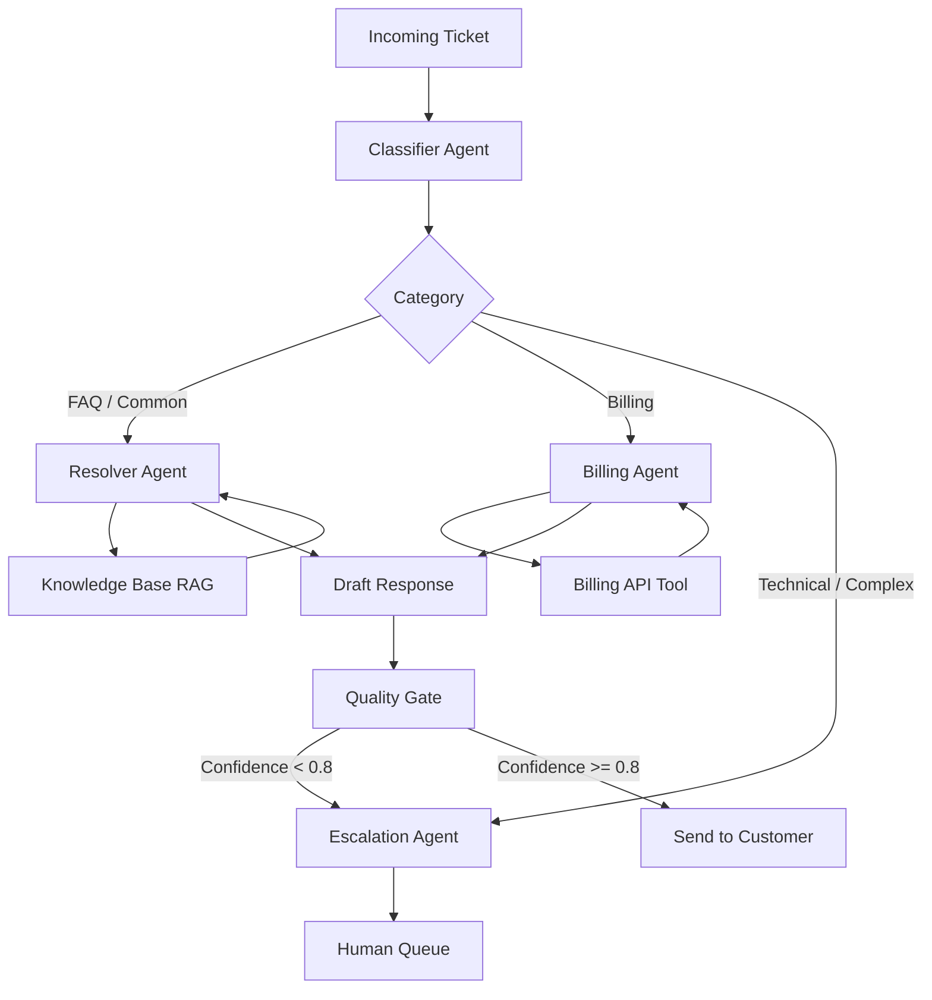
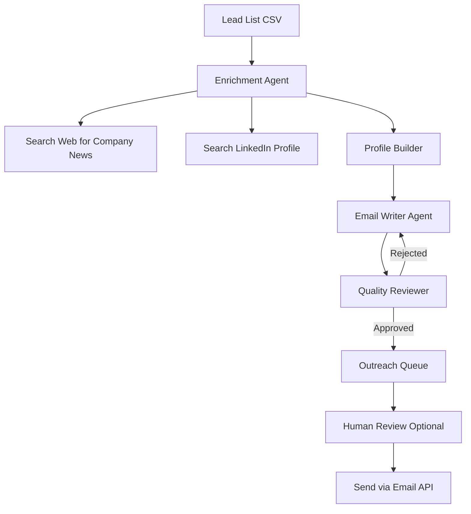
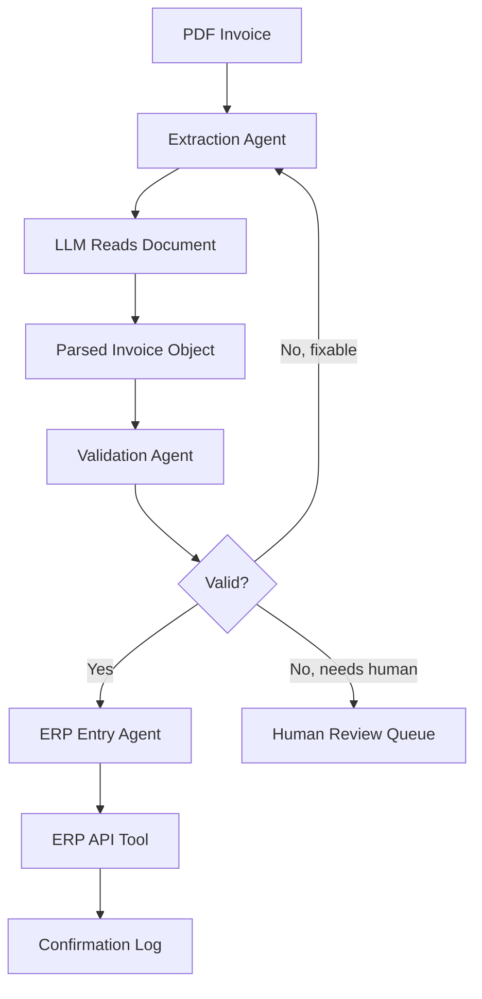

# Chapter 11: Real-World Projects

Everything in the previous ten chapters has been building toward this: agents that do real work, for real clients, in real industries.

This chapter is a portfolio. Three complete, production-ready project blueprints — the kind clients actually pay for. Each one includes the architecture, the full agent graph, the tools, a working code skeleton, and an honest breakdown of where the complexity lives. By the end you will have three projects you can demo, deploy, and charge for.

The three projects:

- **Project 1**: Customer Support Automation Agent — deflect tickets, resolve the common ones, escalate the hard ones
- **Project 2**: Lead Generation & Outreach Agent — research prospects, personalize cold emails at scale
- **Project 3**: Data Extraction & Entry Agent — pull structured data from unstructured documents and push it into systems of record

## What You Will Learn

- How to translate a business problem into an agent architecture
- The non-obvious design decisions that make agents production-ready
- How each project maps to a real pricing conversation with a client
- Where the edge cases are — and how to handle them

---

## Project 1: Customer Support Automation Agent

### The Business Problem

A SaaS company receives 500 support tickets per day. 60% are the same 20 questions — billing, password resets, plan upgrades, feature lookups. A human agent handles all 500. Response time is 4 hours average. Cost per ticket is $8–12.

An agent handles the 60%. Humans handle the 40% that actually needs them. Response time for the 60%: under 30 seconds. Cost per ticket: under $0.05.

### Architecture



Three agents. One quality gate. The classifier routes. The resolver and billing agents act. The quality gate decides whether to send or escalate. Humans only see what the agent cannot confidently handle.

### The State

::: code-group

```python [Python]
from typing import TypedDict, Optional
from enum import Enum

class TicketCategory(str, Enum):
    FAQ        = "faq"
    BILLING    = "billing"
    TECHNICAL  = "technical"
    UNKNOWN    = "unknown"

class SupportState(TypedDict):
    ticket_id:    str
    customer_id:  str
    subject:      str
    body:         str
    category:     str
    draft_reply:  str
    confidence:   float
    escalated:    bool
    escalation_reason: str
    sent:         bool
```

```javascript [Node.js]
// State is a plain object passed through each node function.
// TypeScript users can define an interface for type safety.

/**
 * @typedef {Object} SupportState
 * @property {string} ticket_id
 * @property {string} customer_id
 * @property {string} subject
 * @property {string} body
 * @property {string} category
 * @property {string} draft_reply
 * @property {number} confidence
 * @property {boolean} escalated
 * @property {string} escalation_reason
 * @property {boolean} sent
 */

function initialState(ticketId, customerId, subject, body) {
  return {
    ticket_id: ticketId,
    customer_id: customerId,
    subject,
    body,
    category: "",
    draft_reply: "",
    confidence: 0,
    escalated: false,
    escalation_reason: "",
    sent: false,
  };
}
```

:::

### The Tools

::: code-group

```python [Python]
from langchain_core.tools import tool
from pydantic import BaseModel

# --- Knowledge Base Tool ---
@tool
def search_knowledge_base(query: str) -> str:
    """
    Search the support knowledge base for relevant articles, FAQs,
    and troubleshooting guides. Returns the top 3 matching articles.
    """
    # In production: vector search over your docs
    return f"Knowledge base results for '{query}': [article 1], [article 2], [article 3]"

# --- Billing Tools ---
@tool
def get_customer_plan(customer_id: str) -> str:
    """Get the current subscription plan and status for a customer."""
    # In production: call your billing API (Stripe, Chargebee, etc.)
    return f"Customer {customer_id}: Pro plan, active, renews 2025-08-01, $99/mo"

@tool
def apply_refund(customer_id: str, amount_usd: float, reason: str) -> str:
    """
    Apply a refund to a customer account.
    Only call this for clear-cut refund cases under $50.
    Escalate larger refunds to a human.
    """
    if amount_usd > 50:
        return f"ESCALATE: Refund of ${amount_usd} exceeds automated limit."
    # In production: call billing API
    return f"Refund of ${amount_usd} applied to {customer_id}. Reason: {reason}"

@tool
def get_ticket_history(customer_id: str) -> str:
    """Get the last 5 support tickets for a customer to understand context."""
    return f"Customer {customer_id} last 3 tickets: [2025-06-01: billing question], [2025-05-15: login issue - resolved]"
```

```javascript [Node.js]
// Tool definitions for the OpenAI function-calling interface
const supportTools = [
  {
    type: "function",
    function: {
      name: "search_knowledge_base",
      description: "Search the support knowledge base for relevant articles, FAQs, and troubleshooting guides.",
      parameters: { type: "object", properties: { query: { type: "string" } }, required: ["query"] },
    },
  },
  {
    type: "function",
    function: {
      name: "get_customer_plan",
      description: "Get the current subscription plan and status for a customer.",
      parameters: { type: "object", properties: { customer_id: { type: "string" } }, required: ["customer_id"] },
    },
  },
  {
    type: "function",
    function: {
      name: "apply_refund",
      description: "Apply a refund under $50 to a customer account. Escalate larger refunds.",
      parameters: {
        type: "object",
        properties: {
          customer_id: { type: "string" },
          amount_usd: { type: "number" },
          reason: { type: "string" },
        },
        required: ["customer_id", "amount_usd", "reason"],
      },
    },
  },
];

function executeTool(name, args) {
  if (name === "search_knowledge_base")
    return `Knowledge base results for '${args.query}': [article 1], [article 2], [article 3]`;
  if (name === "get_customer_plan")
    return `Customer ${args.customer_id}: Pro plan, active, renews 2025-08-01, $99/mo`;
  if (name === "apply_refund") {
    if (args.amount_usd > 50) return `ESCALATE: Refund of $${args.amount_usd} exceeds automated limit.`;
    return `Refund of $${args.amount_usd} applied to ${args.customer_id}. Reason: ${args.reason}`;
  }
  return "Unknown tool";
}
```

:::

### The Agents (Nodes)

::: code-group

```python [Python]
from langchain_openai import ChatOpenAI
from pydantic import BaseModel
from langchain.agents import create_react_agent, AgentExecutor
from langchain import hub

cheap_llm = ChatOpenAI(model="gpt-4o-mini", temperature=0)
power_llm = ChatOpenAI(model="gpt-4o", temperature=0.3)

# --- Classifier ---
class ClassificationResult(BaseModel):
    category: str   # "faq", "billing", "technical", "unknown"
    confidence: float

def classifier(state: SupportState) -> dict:
    structured = cheap_llm.with_structured_output(ClassificationResult)
    result = structured.invoke(
        f"Classify this support ticket.\n\n"
        f"Subject: {state['subject']}\nBody: {state['body']}\n\n"
        f"Categories: faq (common how-to questions), "
        f"billing (payments, refunds, plans), "
        f"technical (bugs, integrations, errors), "
        f"unknown (cannot determine)"
    )
    return {"category": result.category, "confidence": result.confidence}

# --- Resolver (FAQ agent) ---
resolver_prompt = hub.pull("hwchase17/react")
resolver_executor = AgentExecutor(
    agent=create_react_agent(power_llm, [search_knowledge_base, get_ticket_history], resolver_prompt),
    tools=[search_knowledge_base, get_ticket_history],
    max_iterations=4
)

def resolver(state: SupportState) -> dict:
    result = resolver_executor.invoke({
        "input": (
            f"Write a helpful, friendly support reply to this ticket.\n\n"
            f"Subject: {state['subject']}\nBody: {state['body']}\n\n"
            f"Use the knowledge base to find accurate information. "
            f"Keep the reply under 200 words. Do not make up information."
        )
    })
    return {"draft_reply": result["output"]}

# --- Billing agent ---
billing_executor = AgentExecutor(
    agent=create_react_agent(power_llm, [get_customer_plan, apply_refund, get_ticket_history], resolver_prompt),
    tools=[get_customer_plan, apply_refund, get_ticket_history],
    max_iterations=4
)

def billing_agent(state: SupportState) -> dict:
    result = billing_executor.invoke({
        "input": (
            f"Handle this billing support ticket for customer {state['customer_id']}.\n\n"
            f"Subject: {state['subject']}\nBody: {state['body']}\n\n"
            f"Check their plan and history first. Only apply refunds under $50 automatically. "
            f"Escalate larger refunds."
        )
    })
    return {"draft_reply": result["output"]}

# --- Quality gate ---
class QualityResult(BaseModel):
    approved: bool
    confidence: float
    reason: str

def quality_gate(state: SupportState) -> dict:
    structured = cheap_llm.with_structured_output(QualityResult)
    result = structured.invoke(
        f"Review this support reply. Is it accurate, helpful, and safe to send?\n\n"
        f"Original ticket: {state['body']}\n"
        f"Draft reply: {state['draft_reply']}\n\n"
        f"Reject if: reply is vague, makes promises we cannot keep, "
        f"contains incorrect information, or is rude."
    )
    return {"confidence": result.confidence, "escalated": not result.approved, "escalation_reason": result.reason}

# --- Escalation node ---
def escalate(state: SupportState) -> dict:
    print(f"[escalate] Ticket {state['ticket_id']} → human queue. Reason: {state.get('escalation_reason', 'complex')}")
    return {"escalated": True}

# --- Send node ---
def send_reply(state: SupportState) -> dict:
    print(f"[send] Reply sent for ticket {state['ticket_id']}")
    return {"sent": True}
```

```javascript [Node.js]
import OpenAI from "openai";

const openai = new OpenAI();

async function runAgentLoop(systemPrompt, userPrompt, tools, maxIterations = 4) {
  const messages = [
    { role: "system", content: systemPrompt },
    { role: "user", content: userPrompt },
  ];
  for (let i = 0; i < maxIterations; i++) {
    const response = await openai.chat.completions.create({ model: "gpt-4o", messages, tools });
    const msg = response.choices[0].message;
    messages.push(msg);
    if (response.choices[0].finish_reason === "stop") return msg.content;
    for (const call of msg.tool_calls ?? []) {
      const result = executeTool(call.function.name, JSON.parse(call.function.arguments));
      messages.push({ role: "tool", tool_call_id: call.id, content: result });
    }
  }
  return messages[messages.length - 1].content ?? "";
}

async function classifier(state) {
  const response = await openai.chat.completions.create({
    model: "gpt-4o-mini",
    temperature: 0,
    response_format: { type: "json_object" },
    messages: [{
      role: "user",
      content: `Classify this support ticket.\nSubject: ${state.subject}\nBody: ${state.body}\n\nCategories: faq, billing, technical, unknown\nRespond with JSON: {"category": "...", "confidence": 0.0-1.0}`,
    }],
  });
  return JSON.parse(response.choices[0].message.content);
}

async function resolver(state) {
  const draft_reply = await runAgentLoop(
    "You are a helpful support agent.",
    `Write a helpful, friendly support reply to this ticket.\nSubject: ${state.subject}\nBody: ${state.body}\nUse the knowledge base. Keep under 200 words.`,
    supportTools
  );
  return { draft_reply };
}

async function billingAgent(state) {
  const draft_reply = await runAgentLoop(
    "You are a billing support agent.",
    `Handle this billing ticket for customer ${state.customer_id}.\nSubject: ${state.subject}\nBody: ${state.body}\nCheck plan first. Only apply refunds under $50.`,
    supportTools
  );
  return { draft_reply };
}

async function qualityGate(state) {
  const response = await openai.chat.completions.create({
    model: "gpt-4o-mini",
    temperature: 0,
    response_format: { type: "json_object" },
    messages: [{
      role: "user",
      content: `Review this support reply.\nTicket: ${state.body}\nDraft: ${state.draft_reply}\nRespond with JSON: {"approved": bool, "confidence": 0.0-1.0, "reason": "..."}`,
    }],
  });
  const result = JSON.parse(response.choices[0].message.content);
  return { confidence: result.confidence, escalated: !result.approved, escalation_reason: result.reason };
}
```

:::

### Routing and Graph

::: code-group

```python [Python]
from langgraph.graph import StateGraph, END

def route_category(state: SupportState) -> str:
    return {"faq": "resolver", "billing": "billing_agent"}.get(state["category"], "escalate")

def route_quality(state: SupportState) -> str:
    return "send" if not state.get("escalated") else "escalate"

graph = StateGraph(SupportState)
graph.add_node("classifier",    classifier)
graph.add_node("resolver",      resolver)
graph.add_node("billing_agent", billing_agent)
graph.add_node("quality_gate",  quality_gate)
graph.add_node("escalate",      escalate)
graph.add_node("send_reply",    send_reply)

graph.set_entry_point("classifier")
graph.add_conditional_edges("classifier", route_category, {
    "resolver":      "resolver",
    "billing_agent": "billing_agent",
    "escalate":      "escalate"
})
graph.add_edge("resolver",      "quality_gate")
graph.add_edge("billing_agent", "quality_gate")
graph.add_conditional_edges("quality_gate", route_quality, {
    "send":     "send_reply",
    "escalate": "escalate"
})
graph.add_edge("send_reply", END)
graph.add_edge("escalate",   END)

support_agent = graph.compile()
```

```javascript [Node.js]
// Lightweight graph runner without a framework
async function runSupportAgent(state) {
  // Step 1: Classify
  const classification = await classifier(state);
  Object.assign(state, classification);

  // Step 2: Route to specialist
  if (state.category === "faq") {
    Object.assign(state, await resolver(state));
  } else if (state.category === "billing") {
    Object.assign(state, await billingAgent(state));
  } else {
    state.escalated = true;
    state.escalation_reason = "Unknown category";
  }

  // Step 3: Quality gate (if not already escalated)
  if (!state.escalated && state.draft_reply) {
    Object.assign(state, await qualityGate(state));
  }

  // Step 4: Send or escalate
  if (!state.escalated) {
    console.log(`[send] Reply sent for ticket ${state.ticket_id}`);
    state.sent = true;
  } else {
    console.log(`[escalate] Ticket ${state.ticket_id} → human queue. Reason: ${state.escalation_reason}`);
  }

  return state;
}
```

:::

### The Pitch to a Client

> "Your team spends $4,000 per day handling 500 tickets. We automate the 300 that do not need a human. That is $2,400 per day — $50,000 per month — in saved labor. Our system costs a fraction of that and improves average response time from 4 hours to 30 seconds for the easy cases."

---

## Project 2: Lead Generation & Outreach Agent

### The Business Problem

A B2B sales team needs to send 200 personalized cold emails per week. Manually researching each prospect and writing a tailored email takes 20–30 minutes per lead. That is 70–100 hours of a salesperson's week — or $3,000–5,000 in labor cost — before a single deal is booked.

An agent researches each prospect, extracts the right hooks, and writes a personalized email in under 60 seconds per lead.

### Architecture



### The State

::: code-group

```python [Python]
from typing import TypedDict, Optional

class LeadState(TypedDict):
    lead_id:          str
    first_name:       str
    last_name:        str
    email:            str
    company:          str
    title:            str
    linkedin_url:     Optional[str]
    company_news:     str
    prospect_profile: str
    email_draft:      str
    approved:         bool
    revision_count:   int
```

```javascript [Node.js]
function initialLeadState(row) {
  return {
    lead_id: row.id,
    first_name: row.first_name,
    last_name: row.last_name,
    email: row.email,
    company: row.company,
    title: row.title,
    linkedin_url: row.linkedin_url ?? null,
    company_news: "",
    prospect_profile: "",
    email_draft: "",
    approved: false,
    revision_count: 0,
  };
}
```

:::

### The Tools

::: code-group

```python [Python]
from langchain_core.tools import tool

@tool
def search_company_news(company_name: str) -> str:
    """
    Search for recent news, funding announcements, product launches,
    or hiring trends for a company. Returns the top 3 results.
    Use this to find a relevant hook for the outreach email.
    """
    # In production: Tavily or Serper API
    return f"Recent news for {company_name}: [Series B announcement], [new product launch], [key hire]"

@tool
def search_linkedin_profile(full_name: str, company: str) -> str:
    """
    Search for a person's LinkedIn profile to find their background,
    recent posts, skills, and tenure. Use to personalize the email.
    """
    # In production: Proxycurl or PhantomBuster API
    return f"{full_name} at {company}: 3 years in role, posts about AI automation, background in ops"

@tool
def check_email_deliverability(email: str) -> str:
    """Verify an email address is deliverable before adding to outreach queue."""
    # In production: Hunter.io or ZeroBounce API
    return f"{email}: valid, deliverable, no spam flags"
```

```javascript [Node.js]
const leadTools = [
  {
    type: "function",
    function: {
      name: "search_company_news",
      description: "Search for recent news, funding, or product launches for a company.",
      parameters: { type: "object", properties: { company_name: { type: "string" } }, required: ["company_name"] },
    },
  },
  {
    type: "function",
    function: {
      name: "search_linkedin_profile",
      description: "Search for a person's LinkedIn profile to personalize outreach.",
      parameters: {
        type: "object",
        properties: { full_name: { type: "string" }, company: { type: "string" } },
        required: ["full_name", "company"],
      },
    },
  },
];

function executeLeadTool(name, args) {
  if (name === "search_company_news")
    return `Recent news for ${args.company_name}: [Series B announcement], [new product launch], [key hire]`;
  if (name === "search_linkedin_profile")
    return `${args.full_name} at ${args.company}: 3 years in role, posts about AI automation, background in ops`;
  return "Unknown tool";
}
```

:::

### The Agents

::: code-group

```python [Python]
from langchain_openai import ChatOpenAI
from langchain.agents import create_react_agent, AgentExecutor
from langchain import hub
from pydantic import BaseModel

llm    = ChatOpenAI(model="gpt-4o", temperature=0.4)
prompt = hub.pull("hwchase17/react")

# --- Enrichment agent ---
enrichment_executor = AgentExecutor(
    agent=create_react_agent(llm, [search_company_news, search_linkedin_profile], prompt),
    tools=[search_company_news, search_linkedin_profile],
    max_iterations=4
)

def enrichment_agent(state: LeadState) -> dict:
    result = enrichment_executor.invoke({
        "input": (
            f"Research this prospect and build a brief profile.\n\n"
            f"Name: {state['first_name']} {state['last_name']}\n"
            f"Title: {state['title']}\n"
            f"Company: {state['company']}\n\n"
            f"Find: 1 recent company news item that could be a relevant hook, "
            f"and 1–2 things about their background or interests that make this outreach personal."
        )
    })
    return {"prospect_profile": result["output"]}

# --- Email writer ---
def email_writer(state: LeadState) -> dict:
    feedback = f"\n\nFix this: {state.get('email_draft', '')}" if state.get("revision_count", 0) > 0 else ""
    result = llm.invoke(
        f"Write a cold outreach email using this prospect profile.\n\n"
        f"Profile: {state['prospect_profile']}\n"
        f"Sender: a B2B SaaS company that automates operational workflows\n\n"
        f"Rules:\n"
        f"- Subject line: specific and curiosity-driven, no clickbait\n"
        f"- Opening: reference something specific about them or their company\n"
        f"- Value prop: one sentence, concrete outcome (time saved, cost reduced)\n"
        f"- CTA: low-friction ask (15-min call, reply with a question)\n"
        f"- Total length: under 120 words\n"
        f"- Tone: peer-to-peer, not salesy{feedback}"
    )
    return {
        "email_draft": result.content,
        "revision_count": state.get("revision_count", 0) + 1
    }

# --- Quality reviewer ---
class EmailQualityResult(BaseModel):
    approved: bool
    issues: str

def quality_reviewer(state: LeadState) -> dict:
    structured = ChatOpenAI(model="gpt-4o-mini", temperature=0).with_structured_output(EmailQualityResult)
    result = structured.invoke(
        f"Review this cold email for quality.\n\n{state['email_draft']}\n\n"
        f"Reject if: generic opener, obvious template language, more than 150 words, "
        f"no specific hook, or aggressive sales language.\n"
        f"Approve if: personalized, concise, value is clear, CTA is easy to say yes to."
    )
    return {"approved": result.approved, "email_draft": state["email_draft"] if result.approved else result.issues}

def route_quality(state: LeadState) -> str:
    if state["approved"] or state.get("revision_count", 0) >= 3:
        return "end"
    return "revise"
```

```javascript [Node.js]
async function enrichmentAgent(state) {
  const messages = [
    { role: "system", content: "You are a B2B research agent." },
    {
      role: "user",
      content: `Research this prospect and build a brief profile.\nName: ${state.first_name} ${state.last_name}\nTitle: ${state.title}\nCompany: ${state.company}\nFind: 1 recent company news item and 1-2 personal details for outreach.`,
    },
  ];
  for (let i = 0; i < 4; i++) {
    const response = await openai.chat.completions.create({ model: "gpt-4o", messages, tools: leadTools });
    const msg = response.choices[0].message;
    messages.push(msg);
    if (response.choices[0].finish_reason === "stop") return { prospect_profile: msg.content };
    for (const call of msg.tool_calls ?? []) {
      messages.push({ role: "tool", tool_call_id: call.id, content: executeLeadTool(call.function.name, JSON.parse(call.function.arguments)) });
    }
  }
  return { prospect_profile: messages[messages.length - 1].content ?? "" };
}

async function emailWriter(state) {
  const feedback = state.revision_count > 0 ? `\n\nFix this: ${state.email_draft}` : "";
  const response = await openai.chat.completions.create({
    model: "gpt-4o",
    temperature: 0.4,
    messages: [{
      role: "user",
      content: `Write a cold outreach email using this profile.\nProfile: ${state.prospect_profile}\nSender: B2B SaaS company automating operational workflows\nRules: specific subject, personal opening, one-sentence value prop, low-friction CTA, under 120 words, peer-to-peer tone${feedback}`,
    }],
  });
  return { email_draft: response.choices[0].message.content, revision_count: state.revision_count + 1 };
}

async function qualityReviewer(state) {
  const response = await openai.chat.completions.create({
    model: "gpt-4o-mini",
    temperature: 0,
    response_format: { type: "json_object" },
    messages: [{
      role: "user",
      content: `Review this cold email.\n\n${state.email_draft}\n\nReject if: generic, template-like, over 150 words, no hook, aggressive. Respond with JSON: {"approved": bool, "issues": "..."}`,
    }],
  });
  const result = JSON.parse(response.choices[0].message.content);
  return { approved: result.approved, email_draft: result.approved ? state.email_draft : result.issues };
}
```

:::

### Graph Assembly

::: code-group

```python [Python]
from langgraph.graph import StateGraph, END

graph = StateGraph(LeadState)
graph.add_node("enrichment",      enrichment_agent)
graph.add_node("email_writer",    email_writer)
graph.add_node("quality_reviewer", quality_reviewer)

graph.set_entry_point("enrichment")
graph.add_edge("enrichment",   "email_writer")
graph.add_edge("email_writer", "quality_reviewer")
graph.add_conditional_edges("quality_reviewer", route_quality, {
    "revise": "email_writer",
    "end":    END
})

outreach_agent = graph.compile()

# --- Batch processing a CSV of leads ---
import csv

def process_lead_list(csv_path: str) -> list[dict]:
    results = []
    with open(csv_path) as f:
        for row in csv.DictReader(f):
            state = outreach_agent.invoke({
                "lead_id":        row["id"],
                "first_name":     row["first_name"],
                "last_name":      row["last_name"],
                "email":          row["email"],
                "company":        row["company"],
                "title":          row["title"],
                "linkedin_url":   row.get("linkedin_url"),
                "company_news":   "",
                "prospect_profile": "",
                "email_draft":    "",
                "approved":       False,
                "revision_count": 0
            })
            results.append({
                "email":   row["email"],
                "subject": state["email_draft"].split("\n")[0].replace("Subject: ", ""),
                "body":    state["email_draft"],
                "approved": state["approved"]
            })
            print(f"✓ {row['first_name']} {row['last_name']} — approved: {state['approved']}")
    return results
```

```javascript [Node.js]
async function runOutreachAgent(state) {
  Object.assign(state, await enrichmentAgent(state));
  for (let i = 0; i < 3; i++) {
    Object.assign(state, await emailWriter(state));
    Object.assign(state, await qualityReviewer(state));
    if (state.approved) break;
  }
  return state;
}

// --- Batch processing a CSV of leads ---
import { createReadStream } from "fs";
import { parse } from "csv-parse";

async function processLeadList(csvPath) {
  const results = [];
  const parser = createReadStream(csvPath).pipe(parse({ columns: true }));
  for await (const row of parser) {
    const state = await runOutreachAgent(initialLeadState(row));
    results.push({
      email: row.email,
      subject: state.email_draft.split("\n")[0].replace("Subject: ", ""),
      body: state.email_draft,
      approved: state.approved,
    });
    console.log(`${row.first_name} ${row.last_name} — approved: ${state.approved}`);
  }
  return results;
}
```

:::

### The Pitch to a Client

> "Your SDR spends 25 minutes per prospect. We do it in 45 seconds. For 200 leads per week that is 80 hours returned to your team — or $4,000 in SDR time — every week. We charge a setup fee and a per-lead rate. You break even on lead number seven."

---

## Project 3: Data Extraction & Entry Agent

### The Business Problem

A logistics company receives 300 PDF invoices per day from suppliers. Each invoice has a different format. A data entry clerk manually pulls: invoice number, date, vendor name, line items, totals, and payment terms — then enters them into the ERP system. At 5 minutes per invoice, that is 25 hours per day of manual data entry.

An agent reads each PDF, extracts the structured data, validates it, and pushes it into the ERP API.

### Architecture



### The Schemas

Pydantic does the heavy lifting here. The structure of an invoice is the contract.

::: code-group

```python [Python]
from pydantic import BaseModel, field_validator
from typing import Optional
from decimal import Decimal

class LineItem(BaseModel):
    description: str
    quantity:    float
    unit_price:  float
    total:       float

    @field_validator("total")
    @classmethod
    def total_must_match(cls, v, info) -> float:
        if "quantity" in info.data and "unit_price" in info.data:
            expected = round(info.data["quantity"] * info.data["unit_price"], 2)
            if abs(v - expected) > 0.02:  # allow for rounding
                raise ValueError(f"Line item total {v} does not match qty × price = {expected}")
        return v

class ParsedInvoice(BaseModel):
    invoice_number: str
    invoice_date:   str   # YYYY-MM-DD
    due_date:       Optional[str]
    vendor_name:    str
    vendor_address: Optional[str]
    line_items:     list[LineItem]
    subtotal:       float
    tax:            Optional[float]
    total:          float
    payment_terms:  Optional[str]
    currency:       str = "USD"

    @field_validator("total")
    @classmethod
    def total_must_balance(cls, v, info) -> float:
        if "subtotal" in info.data and "tax" in info.data:
            expected = round(info.data["subtotal"] + (info.data["tax"] or 0), 2)
            if abs(v - expected) > 0.05:
                raise ValueError(f"Invoice total {v} does not balance: {expected}")
        return v
```

```javascript [Node.js]
import { z } from "zod"; // npm install zod

const LineItemSchema = z.object({
  description: z.string(),
  quantity: z.number(),
  unit_price: z.number(),
  total: z.number(),
}).refine((item) => Math.abs(item.total - Math.round(item.quantity * item.unit_price * 100) / 100) <= 0.02, {
  message: "Line item total does not match qty × price",
});

const ParsedInvoiceSchema = z.object({
  invoice_number: z.string(),
  invoice_date: z.string(), // YYYY-MM-DD
  due_date: z.string().nullable().optional(),
  vendor_name: z.string(),
  vendor_address: z.string().nullable().optional(),
  line_items: z.array(LineItemSchema),
  subtotal: z.number(),
  tax: z.number().nullable().optional(),
  total: z.number(),
  payment_terms: z.string().nullable().optional(),
  currency: z.string().default("USD"),
});
```

:::

### The Tools

::: code-group

```python [Python]
from langchain_core.tools import tool
import base64, json

@tool
def read_pdf_invoice(file_path: str) -> str:
    """
    Extract all text content from a PDF invoice file.
    Returns the raw text for further structured extraction.
    """
    from pypdf import PdfReader
    reader = PdfReader(file_path)
    return "\n".join(page.extract_text() for page in reader.pages)

@tool
def push_to_erp(invoice_data: str) -> str:
    """
    Submit a validated invoice to the ERP system.
    invoice_data must be a JSON string matching the ParsedInvoice schema.
    Returns the ERP record ID on success.
    """
    # In production: POST to your ERP API (NetSuite, SAP, QuickBooks, etc.)
    data = json.loads(invoice_data)
    erp_id = f"INV-{data['invoice_number']}-{data['invoice_date'].replace('-', '')}"
    return f"ERP record created: {erp_id}"

@tool
def flag_for_human_review(file_path: str, reason: str) -> str:
    """Flag an invoice for human review when automated extraction fails."""
    print(f"[human queue] {file_path}: {reason}")
    return f"Flagged for review: {reason}"
```

```javascript [Node.js]
import { readFileSync } from "fs";
import { getDocument } from "pdfjs-dist"; // npm install pdfjs-dist

async function readPdfInvoice(filePath) {
  const data = new Uint8Array(readFileSync(filePath));
  const pdf = await getDocument({ data }).promise;
  const pages = [];
  for (let i = 1; i <= pdf.numPages; i++) {
    const page = await pdf.getPage(i);
    const content = await page.getTextContent();
    pages.push(content.items.map((item) => item.str).join(" "));
  }
  return pages.join("\n");
}

async function pushToErp(invoiceData) {
  // In production: POST to your ERP API (NetSuite, SAP, QuickBooks, etc.)
  const data = typeof invoiceData === "string" ? JSON.parse(invoiceData) : invoiceData;
  const erpId = `INV-${data.invoice_number}-${data.invoice_date.replace(/-/g, "")}`;
  return `ERP record created: ${erpId}`;
}

function flagForHumanReview(filePath, reason) {
  console.log(`[human queue] ${filePath}: ${reason}`);
  return `Flagged for review: ${reason}`;
}
```

:::

### The Agents

::: code-group

```python [Python]
from langchain_openai import ChatOpenAI
from langchain.agents import create_react_agent, AgentExecutor
from langchain import hub
import json

llm    = ChatOpenAI(model="gpt-4o", temperature=0)
prompt = hub.pull("hwchase17/react")

# --- Extraction agent ---
def extraction_agent(file_path: str) -> ParsedInvoice | None:
    structured_llm = llm.with_structured_output(ParsedInvoice)
    raw_text = read_pdf_invoice.invoke({"file_path": file_path})
    try:
        return structured_llm.invoke(
            f"Extract all invoice data from this document into the required structure.\n\n"
            f"DOCUMENT TEXT:\n{raw_text}\n\n"
            f"Rules:\n"
            f"- Dates must be YYYY-MM-DD format\n"
            f"- All amounts must be numbers, not strings\n"
            f"- If a field is missing from the document, use null\n"
            f"- Calculate totals from line items if not explicit"
        )
    except Exception as e:
        print(f"[extraction] Failed: {e}")
        return None

# --- Validation agent ---
class ValidationResult(BaseModel):
    valid: bool
    issues: list[str]
    fixable: bool

def validation_agent(invoice: ParsedInvoice) -> ValidationResult:
    structured = ChatOpenAI(model="gpt-4o-mini", temperature=0).with_structured_output(ValidationResult)
    return structured.invoke(
        f"Validate this extracted invoice data for business logic correctness.\n\n"
        f"{invoice.model_dump_json(indent=2)}\n\n"
        f"Check: dates are valid and in order, all required fields present, "
        f"amounts are positive, line items sum to subtotal, "
        f"invoice number looks like a real invoice number (not a test or placeholder)."
    )

# --- ERP entry agent ---
erp_executor = AgentExecutor(
    agent=create_react_agent(llm, [push_to_erp, flag_for_human_review], prompt),
    tools=[push_to_erp, flag_for_human_review],
    max_iterations=3
)

def erp_agent(invoice: ParsedInvoice) -> str:
    result = erp_executor.invoke({
        "input": (
            f"Submit this validated invoice to the ERP system.\n\n"
            f"Invoice JSON: {invoice.model_dump_json()}\n\n"
            f"Use push_to_erp to submit. If it fails, flag for human review."
        )
    })
    return result["output"]
```

```javascript [Node.js]
async function extractionAgent(filePath) {
  const rawText = await readPdfInvoice(filePath);
  const response = await openai.chat.completions.create({
    model: "gpt-4o",
    temperature: 0,
    response_format: { type: "json_object" },
    messages: [{
      role: "user",
      content: `Extract all invoice data from this document.\n\nDOCUMENT TEXT:\n${rawText}\n\nRules:\n- Dates: YYYY-MM-DD\n- Amounts: numbers not strings\n- Missing fields: null\n- Calculate totals from line items if not explicit\n\nRespond with a JSON object matching the ParsedInvoice schema.`,
    }],
  });
  try {
    const data = JSON.parse(response.choices[0].message.content);
    return ParsedInvoiceSchema.parse(data);
  } catch (e) {
    console.log(`[extraction] Failed: ${e.message}`);
    return null;
  }
}

async function validationAgent(invoice) {
  const response = await openai.chat.completions.create({
    model: "gpt-4o-mini",
    temperature: 0,
    response_format: { type: "json_object" },
    messages: [{
      role: "user",
      content: `Validate this extracted invoice data.\n\n${JSON.stringify(invoice, null, 2)}\n\nCheck: valid dates, required fields present, positive amounts, line items sum to subtotal, realistic invoice number.\nRespond with JSON: {"valid": bool, "issues": [...], "fixable": bool}`,
    }],
  });
  return JSON.parse(response.choices[0].message.content);
}

async function erpAgent(invoice) {
  try {
    const confirmation = await pushToErp(JSON.stringify(invoice));
    return confirmation;
  } catch (e) {
    flagForHumanReview("unknown", `ERP push failed: ${e.message}`);
    return `Failed: ${e.message}`;
  }
}
```

:::

### The Orchestrator

::: code-group

```python [Python]
import os
from pathlib import Path

def process_invoice_batch(inbox_folder: str):
    pdf_files = list(Path(inbox_folder).glob("*.pdf"))
    print(f"Processing {len(pdf_files)} invoices...")

    results = {"success": 0, "human_review": 0, "failed": 0}

    for pdf_path in pdf_files:
        print(f"\n--- {pdf_path.name} ---")

        # Step 1: Extract
        invoice = extraction_agent(str(pdf_path))
        if not invoice:
            flag_for_human_review.invoke({
                "file_path": str(pdf_path),
                "reason":    "Extraction failed — could not parse document structure"
            })
            results["human_review"] += 1
            continue

        # Step 2: Validate
        validation = validation_agent(invoice)
        if not validation.valid:
            if validation.fixable:
                print(f"  ✗ Validation issues (fixable): {validation.issues}")
                # In a full implementation: retry extraction with specific guidance
            else:
                flag_for_human_review.invoke({
                    "file_path": str(pdf_path),
                    "reason":    f"Validation failed: {', '.join(validation.issues)}"
                })
                results["human_review"] += 1
            continue

        # Step 3: Push to ERP
        confirmation = erp_agent(invoice)
        print(f"  ✓ {confirmation}")
        results["success"] += 1

    print(f"\n=== Batch Complete ===")
    print(f"Success:      {results['success']}")
    print(f"Human review: {results['human_review']}")
    print(f"Failed:       {results['failed']}")
    return results

# Run it
process_invoice_batch("./invoices/inbox")
```

```javascript [Node.js]
import { readdirSync } from "fs";
import { join } from "path";

async function processInvoiceBatch(inboxFolder) {
  const pdfFiles = readdirSync(inboxFolder).filter((f) => f.endsWith(".pdf"));
  console.log(`Processing ${pdfFiles.length} invoices...`);

  const results = { success: 0, human_review: 0, failed: 0 };

  for (const fileName of pdfFiles) {
    const filePath = join(inboxFolder, fileName);
    console.log(`\n--- ${fileName} ---`);

    // Step 1: Extract
    const invoice = await extractionAgent(filePath);
    if (!invoice) {
      flagForHumanReview(filePath, "Extraction failed — could not parse document structure");
      results.human_review++;
      continue;
    }

    // Step 2: Validate
    const validation = await validationAgent(invoice);
    if (!validation.valid) {
      if (validation.fixable) {
        console.log(`  Validation issues (fixable): ${validation.issues.join(", ")}`);
      } else {
        flagForHumanReview(filePath, `Validation failed: ${validation.issues.join(", ")}`);
        results.human_review++;
      }
      continue;
    }

    // Step 3: Push to ERP
    const confirmation = await erpAgent(invoice);
    console.log(`  ${confirmation}`);
    results.success++;
  }

  console.log(`\n=== Batch Complete ===`);
  console.log(`Success:      ${results.success}`);
  console.log(`Human review: ${results.human_review}`);
  console.log(`Failed:       ${results.failed}`);
  return results;
}

processInvoiceBatch("./invoices/inbox");
```

:::

### The Pitch to a Client

> "Your team spends 25 hours per day on data entry that produces no value — it just moves numbers from one system to another. We automate that entirely. 95% of invoices go straight through in under 10 seconds. The other 5% get flagged for your team with the issue highlighted. You stop paying for data entry and start paying only for exceptions."

---

## Choosing Your First Client Project

Each of these three projects targets a different buyer and sells on different ROI math.

| Project            | Buyer                   | ROI Hook                           | Setup Complexity                            |
| ------------------ | ----------------------- | ---------------------------------- | ------------------------------------------- |
| Support Automation | Head of Support / CS VP | Cost per ticket, response time     | Medium — needs your KB and ticketing system |
| Lead Generation    | Head of Sales / Founder | SDR hours saved, pipeline velocity | Low — CSV in, emails out                    |
| Data Extraction    | Head of Finance / Ops   | Data entry FTEs displaced          | High — needs ERP API access                 |

**Start with Lead Generation** if you are new to client work. The scope is narrow, the integration surface is small (CSV + email API), and the before/after is immediately visible. You can build a working demo in a day and show it to a prospect the same week.

**Support Automation** is the highest-value pitch but requires access to a client's ticket history to build a meaningful knowledge base. Lead with a pilot: handle one ticket category for 30 days, measure deflection rate, then expand.

**Data Extraction** is the most technically complex but also the stickiest — once it is connected to an ERP, clients do not churn. Target professional services firms, logistics companies, and accountants who live in document hell.

---

## Common Pitfalls Across All Three Projects

- **Skipping the validation layer**: extraction without validation ships bad data silently. A wrong invoice number in an ERP is worse than no entry at all.
- **Automating the exception**: always design the human escalation path before you design the happy path. Clients accept 95% automation. They will not forgive a system with no fallback.
- **Building for the demo, not the edge case**: the demo always works. Production has corrupt PDFs, invoices in German, emails that bounce, and API rate limits. Budget for edge cases in your timeline.
- **Not measuring deflection / accuracy from day one**: you cannot improve what you do not measure. Log every run — category, outcome, confidence, escalated yes/no — from the first day in production.

---

## Checklist

- [ ] Happy path works end-to-end before edge cases are handled
- [ ] Human escalation path exists for every agent decision point
- [ ] All extracted data validated before being written to any system of record
- [ ] Batch processing has per-item error handling (one bad input does not stop the whole batch)
- [ ] Every run is logged with outcome, confidence, and latency
- [ ] Demo uses realistic data, not toy examples

---

## What Comes Next

In Chapter 12, you will learn how to price these projects, find the clients who need them, and structure engagements so you get paid for the value you deliver — not the hours you spend.
