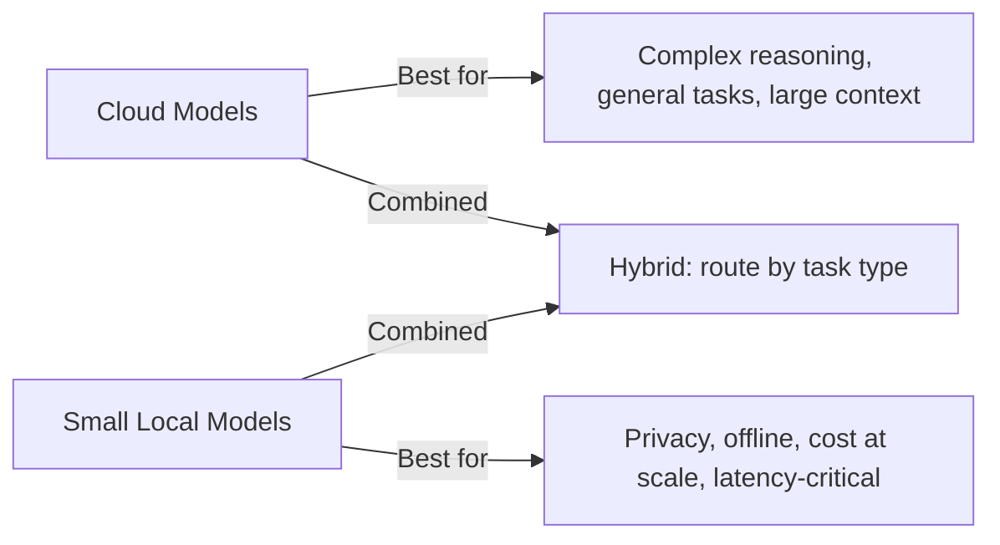
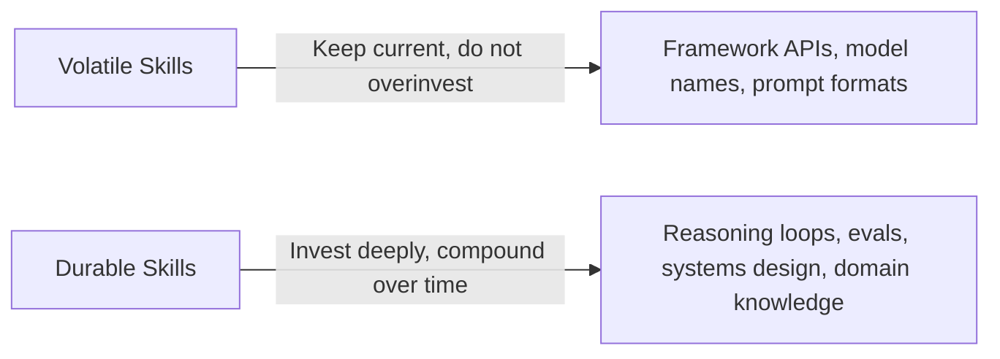

# Chapter 15: Future-Proofing

The one certainty in AI is that the stack you built on last year is not the stack you will build on next year. Models get cheaper, faster, and more capable on a timeline that outpaces every other technology most developers have worked with. Frameworks that were standard six months ago are deprecated. Capabilities that required 500 lines of custom code ship as a native API feature.

Most developers respond to this by chasing every new release, rebuilding constantly, and never shipping anything durable. The developers who build lasting careers do the opposite: they understand which parts of the stack are volatile and which are stable, they invest deeply in the stable parts, and they stay curious about the volatile parts without being dependent on any specific version of them.

This final chapter covers the forces shaping the near future of agentic AI — Small Language Models, voice agents, and the meta-skill of staying relevant — and how to build a practice that compounds instead of churns.

## What You Will Learn

- How Small Language Models (SLMs) change the deployment landscape
- How to run agents locally with Ollama
- How to build voice agents with the OpenAI Realtime API and Vapi
- Which skills are durable and which are perishable
- How to build a learning system that keeps you ahead

---

## 1. Small Language Models: Intelligence at the Edge

For the last three years, the implicit assumption in agentic AI has been: you call an API, the model lives in the cloud, you pay per token. That model is starting to fracture.

Small Language Models (SLMs) — Llama 3, Mistral, Phi-3, Gemma, Qwen — are capable models that run on a laptop. Not a server farm. A MacBook Pro. A user's own machine. Increasingly, a phone.

This changes the deployment calculus in ways that matter to builders.

### Why SLMs Matter

**Privacy**: for healthcare, legal, and financial applications, the data never leaves the device. No API call means no data in transit, no provider logging, no compliance risk from third-party model APIs.

**Cost**: inference is free once the model is running locally. A document processing agent that runs entirely on a client's hardware has zero per-token cost regardless of volume.

**Latency**: a local model responds in milliseconds with no network round-trip. For real-time applications — voice, on-device assistants, embedded systems — this matters enormously.

**Offline capability**: a field agent that works without internet access. A document reviewer that runs on an air-gapped machine. A customer-facing kiosk with no cloud dependency. These are real requirements that only local models can meet.



### Running Models Locally with Ollama

Ollama is the simplest way to run open-source models locally. One command to pull a model, one endpoint to call.

```bash
# Install Ollama (Mac / Linux)
curl -fsSL https://ollama.com/install.sh | sh

# Pull a model
ollama pull llama3
ollama pull mistral
ollama pull phi3

# Run it
ollama run llama3
# Now available at http://localhost:11434
```

### Using Ollama with LangChain

Because Ollama exposes an OpenAI-compatible API, you swap it in with minimal code changes.

::: code-group
```python [Python]
from langchain_ollama import ChatOllama
from langchain_openai import ChatOpenAI

# Local: free, private, slightly less capable
local_llm = ChatOllama(model="llama3", temperature=0)

# Cloud: paid, powerful, full capability
cloud_llm = ChatOpenAI(model="gpt-4o", temperature=0)

# Same interface — swap as needed
result = local_llm.invoke("Summarize the key points of transformer architecture.")
print(result.content)
```
```javascript [Node.js]
// Ollama exposes an OpenAI-compatible API — use the openai npm package
import OpenAI from "openai";

// Local: free, private, slightly less capable
const localClient = new OpenAI({
  baseURL: "http://localhost:11434/v1",
  apiKey: "ollama", // required but ignored by Ollama
});

// Cloud: paid, powerful, full capability
const cloudClient = new OpenAI({ apiKey: process.env.OPENAI_API_KEY });

// Same interface — swap as needed
const result = await localClient.chat.completions.create({
  model: "llama3",
  temperature: 0,
  messages: [
    { role: "user", content: "Summarize the key points of transformer architecture." },
  ],
});
console.log(result.choices[0].message.content);
```
:::

### Building a Hybrid Router

Use the local model for tasks it can handle well, the cloud model only when necessary. This pattern keeps costs near zero for the majority of tasks.

::: code-group
```python [Python]
from langchain_ollama import ChatOllama
from langchain_openai import ChatOpenAI
from pydantic import BaseModel

local_llm = ChatOllama(model="llama3",  temperature=0)
cloud_llm = ChatOpenAI(model="gpt-4o", temperature=0)

class RoutingDecision(BaseModel):
    use_cloud: bool
    reason:    str

def route_to_model(task: str) -> str:
    """
    Use the local model to decide whether to use the local model or cloud.
    Meta: the router itself is free.
    """
    structured = local_llm.with_structured_output(RoutingDecision)
    decision   = structured.invoke(
        f"Should this task be sent to a powerful cloud AI model, "
        f"or can a smaller local model handle it?\n\n"
        f"Task: {task}\n\n"
        f"Use cloud for: complex multi-step reasoning, code generation from scratch, "
        f"nuanced writing, tasks requiring up-to-date world knowledge.\n"
        f"Use local for: summarization, classification, extraction, "
        f"simple Q&A, format conversion, short drafts."
    )
    llm = cloud_llm if decision.use_cloud else local_llm
    print(f"[router] {'cloud' if decision.use_cloud else 'local'}: {decision.reason}")
    return llm.invoke(task).content

# Usage
result = route_to_model("Extract all dates from this text: 'Meeting on July 4th, deadline August 1st'")
result = route_to_model("Write a multi-step LangGraph agent that handles customer support escalations")
```
```javascript [Node.js]
import OpenAI from "openai";

const localClient = new OpenAI({
  baseURL: "http://localhost:11434/v1",
  apiKey: "ollama",
});
const cloudClient = new OpenAI({ apiKey: process.env.OPENAI_API_KEY });

/**
 * Use the local model to decide whether to use local or cloud.
 * Meta: the router itself is free.
 */
async function routeToModel(task) {
  const routingPrompt = `Should this task be sent to a powerful cloud AI model, or can a smaller local model handle it?

Task: ${task}

Use cloud for: complex multi-step reasoning, code generation from scratch, nuanced writing, tasks requiring up-to-date world knowledge.
Use local for: summarization, classification, extraction, simple Q&A, format conversion, short drafts.

Respond with JSON: { "use_cloud": true|false, "reason": "..." }`;

  const routingResp = await localClient.chat.completions.create({
    model: "llama3",
    temperature: 0,
    response_format: { type: "json_object" },
    messages: [{ role: "user", content: routingPrompt }],
  });

  const decision = JSON.parse(routingResp.choices[0].message.content);
  const client = decision.use_cloud ? cloudClient : localClient;
  const model  = decision.use_cloud ? "gpt-4o" : "llama3";

  console.log(`[router] ${decision.use_cloud ? "cloud" : "local"}: ${decision.reason}`);

  const resp = await client.chat.completions.create({
    model,
    temperature: 0,
    messages: [{ role: "user", content: task }],
  });
  return resp.choices[0].message.content;
}

// Usage
let result = await routeToModel("Extract all dates from this text: 'Meeting on July 4th, deadline August 1st'");
result = await routeToModel("Write a multi-step LangGraph agent that handles customer support escalations");
```
:::

### Model Selection by Task Type

| Task                           | Local SLM              | Cloud Model            |
| ------------------------------ | ---------------------- | ---------------------- |
| Text classification            | ✓                      | Overkill               |
| Named entity extraction        | ✓                      | Overkill               |
| Short summarization            | ✓                      | Overkill               |
| Complex reasoning chains       | —                      | ✓                      |
| Code generation (complex)      | —                      | ✓                      |
| Long document analysis (128k+) | —                      | ✓                      |
| RAG-based Q&A                  | ✓ (with small context) | ✓ (with large context) |
| Tool-calling agents            | Limited                | ✓                      |

### Deploying a Local Agent to a Client Machine

For clients who require on-premise deployment:

::: code-group
```python [Python]
# on_premise_agent.py
# Ships to the client. Runs entirely on their hardware. No API keys needed.

from langchain_ollama import ChatOllama
from langchain_community.vectorstores import FAISS
from langchain_community.embeddings import OllamaEmbeddings
from langchain.chains import RetrievalQA

# Local embeddings — no cloud call
embeddings = OllamaEmbeddings(model="nomic-embed-text")

# Local vector store — data never leaves the machine
vectorstore = FAISS.load_local("./knowledge_base", embeddings)

# Local LLM
llm = ChatOllama(model="llama3", temperature=0)

# Full RAG pipeline — entirely local
qa_chain = RetrievalQA.from_chain_type(llm=llm, retriever=vectorstore.as_retriever())

def ask(question: str) -> str:
    return qa_chain.run(question)

if __name__ == "__main__":
    while True:
        q = input("\nQuestion: ").strip()
        if q.lower() in ("exit", "quit"):
            break
        print(f"\nAnswer: {ask(q)}")
```
```javascript [Node.js]
// on_premise_agent.mjs
// Ships to the client. Runs entirely on their hardware. No API keys needed.
// npm install openai @xenova/transformers faiss-node readline

import OpenAI from "openai";
import { pipeline } from "@xenova/transformers";
import faiss from "faiss-node";
import { readFileSync, existsSync } from "fs";
import * as readline from "readline/promises";

const localClient = new OpenAI({
  baseURL: "http://localhost:11434/v1",
  apiKey: "ollama",
});

// Local embeddings via @xenova/transformers — no cloud call
const embedder = await pipeline("feature-extraction", "Xenova/all-MiniLM-L6-v2");

async function embed(text) {
  const output = await embedder(text, { pooling: "mean", normalize: true });
  return Array.from(output.data);
}

// Load FAISS index and document store saved at build time
const index = faiss.IndexFlatL2.read("./knowledge_base/index.faiss");
const docs   = JSON.parse(readFileSync("./knowledge_base/docs.json", "utf8"));

async function ask(question) {
  // Retrieve top-3 relevant chunks
  const qEmb = await embed(question);
  const { labels } = index.search(qEmb, 3);
  const context = labels.map((i) => docs[i]).join("\n\n");

  const resp = await localClient.chat.completions.create({
    model: "llama3",
    temperature: 0,
    messages: [
      {
        role: "system",
        content: `Answer the question using only the context below.\n\nContext:\n${context}`,
      },
      { role: "user", content: question },
    ],
  });
  return resp.choices[0].message.content;
}

// Interactive CLI loop
const rl = readline.createInterface({ input: process.stdin, output: process.stdout });
while (true) {
  const q = (await rl.question("\nQuestion: ")).trim();
  if (["exit", "quit"].includes(q.toLowerCase())) break;
  console.log(`\nAnswer: ${await ask(q)}`);
}
rl.close();
```
:::

This runs with zero recurring cost, zero cloud dependency, and zero data leaving the client's infrastructure. For regulated industries, this is not a nice-to-have — it is the only viable option.

---

## 2. Voice Agents: The Next Interface

Text is not the final interface for AI agents. Voice is. The evidence is already in the market: phone-based AI agents are answering customer service calls, booking appointments, conducting intake interviews, and handling sales qualification — tasks that previously required a human with a headset.

The technology is maturing fast. Two paths dominate the current landscape.

### Path 1: OpenAI Realtime API

The Realtime API streams bidirectional audio directly to and from a model. No speech-to-text step, no text-to-speech step — the model processes and responds to audio natively. This produces conversation latency under 300ms, which sounds and feels like a real phone call.

::: code-group
```python [Python]
# Voice agent using OpenAI Realtime API via WebSocket
import asyncio
import websockets
import json
import base64

async def realtime_voice_agent():
    url     = "wss://api.openai.com/v1/realtime?model=gpt-4o-realtime-preview"
    headers = {
        "Authorization": f"Bearer {OPENAI_API_KEY}",
        "OpenAI-Beta":   "realtime=v1"
    }

    async with websockets.connect(url, additional_headers=headers) as ws:

        # Configure the session
        await ws.send(json.dumps({
            "type": "session.update",
            "session": {
                "voice": "alloy",
                "instructions": (
                    "You are a friendly appointment scheduling assistant for a dental clinic. "
                    "Your goal is to collect: the patient's name, preferred date and time, "
                    "and the type of appointment. Keep responses short and conversational."
                ),
                "turn_detection": {"type": "server_vad"},  # auto detect when user stops speaking
                "input_audio_format":  "pcm16",
                "output_audio_format": "pcm16",
                "tools": [
                    {
                        "type":        "function",
                        "name":        "book_appointment",
                        "description": "Book a dental appointment once all details are collected.",
                        "parameters": {
                            "type": "object",
                            "properties": {
                                "patient_name": {"type": "string"},
                                "date":         {"type": "string"},
                                "time":         {"type": "string"},
                                "appointment_type": {"type": "string"}
                            },
                            "required": ["patient_name", "date", "time", "appointment_type"]
                        }
                    }
                ]
            }
        }))

        print("Voice agent ready. Listening...")

        async for message in ws:
            event = json.loads(message)

            if event["type"] == "response.audio.delta":
                # Stream audio chunk to the user's speaker
                audio_bytes = base64.b64decode(event["delta"])
                play_audio(audio_bytes)  # your audio playback function

            elif event["type"] == "response.function_call_arguments.done":
                # Agent called the booking tool
                args = json.loads(event["arguments"])
                result = book_appointment(**args)
                # Return the tool result to continue the conversation
                await ws.send(json.dumps({
                    "type": "conversation.item.create",
                    "item": {
                        "type":    "function_call_output",
                        "call_id": event["call_id"],
                        "output":  result
                    }
                }))
                await ws.send(json.dumps({"type": "response.create"}))

            elif event["type"] == "error":
                print(f"Error: {event['error']}")
                break
```
```javascript [Node.js]
// Voice agent using OpenAI Realtime API via WebSocket
// npm install ws

import WebSocket from "ws";

async function realtimeVoiceAgent() {
  const url = "wss://api.openai.com/v1/realtime?model=gpt-4o-realtime-preview";
  const ws  = new WebSocket(url, {
    headers: {
      Authorization: `Bearer ${process.env.OPENAI_API_KEY}`,
      "OpenAI-Beta": "realtime=v1",
    },
  });

  ws.on("open", () => {
    // Configure the session
    ws.send(JSON.stringify({
      type: "session.update",
      session: {
        voice: "alloy",
        instructions:
          "You are a friendly appointment scheduling assistant for a dental clinic. " +
          "Your goal is to collect: the patient's name, preferred date and time, " +
          "and the type of appointment. Keep responses short and conversational.",
        turn_detection: { type: "server_vad" }, // auto detect when user stops speaking
        input_audio_format:  "pcm16",
        output_audio_format: "pcm16",
        tools: [
          {
            type:        "function",
            name:        "book_appointment",
            description: "Book a dental appointment once all details are collected.",
            parameters: {
              type: "object",
              properties: {
                patient_name:     { type: "string" },
                date:             { type: "string" },
                time:             { type: "string" },
                appointment_type: { type: "string" },
              },
              required: ["patient_name", "date", "time", "appointment_type"],
            },
          },
        ],
      },
    }));

    console.log("Voice agent ready. Listening...");
  });

  ws.on("message", (raw) => {
    const event = JSON.parse(raw.toString());

    if (event.type === "response.audio.delta") {
      // Stream audio chunk to the user's speaker
      const audioBytes = Buffer.from(event.delta, "base64");
      playAudio(audioBytes); // your audio playback function
    } else if (event.type === "response.function_call_arguments.done") {
      // Agent called the booking tool
      const args   = JSON.parse(event.arguments);
      const result = bookAppointment(args);
      // Return the tool result to continue the conversation
      ws.send(JSON.stringify({
        type: "conversation.item.create",
        item: {
          type:    "function_call_output",
          call_id: event.call_id,
          output:  result,
        },
      }));
      ws.send(JSON.stringify({ type: "response.create" }));
    } else if (event.type === "error") {
      console.error("Error:", event.error);
      ws.close();
    }
  });
}

realtimeVoiceAgent();
```
:::

### Path 2: Vapi — Voice AI as a Service

Vapi abstracts the WebSocket complexity into a higher-level SDK. You define an assistant, give it a phone number, and it handles the call infrastructure — inbound and outbound calls, call recording, transcripts, and webhook notifications when calls complete.

```bash
pip install vapi-python
```

::: code-group
```python [Python]
from vapi import Vapi

client = Vapi(token=VAPI_API_KEY)

# Define the voice assistant
assistant = client.assistants.create(
    name="Appointment Scheduler",
    model={
        "provider": "openai",
        "model":    "gpt-4o",
        "messages": [
            {
                "role":    "system",
                "content": (
                    "You are a friendly appointment scheduler for a dental clinic. "
                    "Collect: patient name, preferred date/time, appointment type. "
                    "Speak naturally and confirm details before booking. "
                    "Keep each response under 30 words."
                )
            }
        ],
        "tools": [{
            "type": "function",
            "function": {
                "name":        "book_appointment",
                "description": "Book the appointment in the scheduling system.",
                "parameters": {
                    "type":       "object",
                    "properties": {
                        "patient_name":     {"type": "string"},
                        "date":             {"type": "string"},
                        "time":             {"type": "string"},
                        "appointment_type": {"type": "string"}
                    },
                    "required": ["patient_name", "date", "time", "appointment_type"]
                }
            }
        }]
    },
    voice={
        "provider": "11labs",
        "voiceId":  "rachel"       # natural-sounding ElevenLabs voice
    },
    first_message="Hi, thanks for calling Sunrise Dental. I'm here to help you schedule an appointment. What's your name?"
)

# Make an outbound call
call = client.calls.create(
    assistant_id=assistant.id,
    customer={"number": "+1-555-000-1234"}
)
print(f"Call started: {call.id}")
```
```javascript [Node.js]
// npm install @vapi-ai/server-sdk
import { VapiClient } from "@vapi-ai/server-sdk";

const client = new VapiClient({ token: process.env.VAPI_API_KEY });

// Define the voice assistant
const assistant = await client.assistants.create({
  name: "Appointment Scheduler",
  model: {
    provider: "openai",
    model:    "gpt-4o",
    messages: [
      {
        role:    "system",
        content:
          "You are a friendly appointment scheduler for a dental clinic. " +
          "Collect: patient name, preferred date/time, appointment type. " +
          "Speak naturally and confirm details before booking. " +
          "Keep each response under 30 words.",
      },
    ],
    tools: [
      {
        type: "function",
        function: {
          name:        "book_appointment",
          description: "Book the appointment in the scheduling system.",
          parameters: {
            type:       "object",
            properties: {
              patient_name:     { type: "string" },
              date:             { type: "string" },
              time:             { type: "string" },
              appointment_type: { type: "string" },
            },
            required: ["patient_name", "date", "time", "appointment_type"],
          },
        },
      },
    ],
  },
  voice: {
    provider: "11labs",
    voiceId:  "rachel", // natural-sounding ElevenLabs voice
  },
  firstMessage:
    "Hi, thanks for calling Sunrise Dental. I'm here to help you schedule an appointment. What's your name?",
});

// Make an outbound call
const call = await client.calls.create({
  assistantId: assistant.id,
  customer: { number: "+1-555-000-1234" },
});
console.log(`Call started: ${call.id}`);
```
:::

### Voice Agent Use Cases Ready to Build

| Use Case                     | Caller                     | Key Tools                   |
| ---------------------------- | -------------------------- | --------------------------- |
| Appointment scheduling       | Inbound patient / customer | Calendar API, CRM lookup    |
| Order status updates         | Inbound customer           | E-commerce API              |
| Lead qualification           | Outbound to prospects      | CRM write, calendar book    |
| Bill payment reminders       | Outbound to customers      | Payment API                 |
| Candidate phone screens      | Outbound to applicants     | ATS write, calendar book    |
| Customer satisfaction survey | Outbound post-purchase     | Survey write, sentiment log |

### Realtime API vs. Vapi

|                      | OpenAI Realtime API               | Vapi                            |
| -------------------- | --------------------------------- | ------------------------------- |
| **Control**          | Full, low-level                   | High-level, opinionated         |
| **Setup complexity** | High (WebSocket, audio handling)  | Low (SDK + phone number)        |
| **Phone numbers**    | You manage telephony              | Included                        |
| **Call recording**   | You implement                     | Included                        |
| **Best for**         | Custom voice interfaces, embedded | Phone-based agents, fast launch |

---

## 3. What Is Changing and What Is Not

The most important skill in a fast-moving field is distinguishing between what is volatile and what is durable. Invest time in the durable. Stay current on the volatile.

### What Is Volatile (Do Not Over-Invest)

- **Specific framework APIs**: LangChain's API has changed significantly across every major version. LangGraph's interface will continue to evolve. Build with frameworks but do not let your mental model fuse to a specific version.
- **Model names and providers**: GPT-4o will be superseded. Claude Sonnet 4 will be superseded. The provider landscape in two years will include players that do not exist today. Write model-agnostic code where you can.
- **Specific embedding models**: vector representations change as better embedding models ship. Your RAG pipeline should be re-indexable without rebuilding from scratch.
- **Prompt formats**: as models become more capable, prompts that work today may be suboptimal for the next generation. Treat prompts as code: version them, test them, refactor them.

### What Is Durable (Invest Deeply)

- **The reasoning loop**: Perception → Reasoning → Action → Feedback. This has been the architecture of intelligent systems since before LLMs. It will remain the architecture of intelligent systems after the current generation of models is obsolete.
- **Evaluation discipline**: the ability to measure whether your agent is doing the right thing, systematically and automatically, is valuable regardless of what the underlying model is. Eval infrastructure transfers across model generations.
- **Systems thinking**: understanding how multi-agent systems fail, how state flows through a graph, how to design for human-in-the-loop — these are architectural skills that do not expire when a new model ships.
- **Domain knowledge**: an agent builder who deeply understands accounting, or legal workflows, or logistics operations, is dramatically more valuable than one who only knows the API. Domain knowledge is your moat. It cannot be Googled.
- **The business translation skill**: the ability to hear a business problem and sketch the agent architecture that solves it is rare and valuable. Most developers can build what they are spec'd. Fewer can write the spec.



---

## 4. Staying Relevant: A Learning System

The developers who stay ahead in AI do not read everything — that is impossible. They have a system that surfaces the signal and filters the noise.

### The Three-Layer Learning Stack

**Layer 1: Weekly pulse (30 minutes per week)**

Track what is shipping, not what is speculated.

- [Hacker News](https://news.ycombinator.com) — filter for "AI" and "LLM" — real practitioners react here first
- [LangChain blog](https://blog.langchain.dev) — framework releases and patterns
- [Anthropic](https://anthropic.com/news) and [OpenAI](https://openai.com/news) release notes — read the actual capability notes, not the press coverage
- [Simon Willison's blog](https://simonwillison.net) — the best single-author technical commentary on LLM developments

**Layer 2: Monthly deep dive (3–4 hours per month)**

Pick one new capability or paper and build something small with it. Not a tutorial — something original, even if trivial. The act of building is 10x more retention than reading.

The test: can you explain what you built and why it works to someone who has never heard of the technique?

**Layer 3: Quarterly reassessment (2 hours per quarter)**

Look at your current stack and ask: is there a better tool for any of these jobs now?

- Is there a new embedding model that outperforms what I am using?
- Has prompt caching changed my cost math?
- Is there a new SLM that handles my classification tasks better than the cloud call?
- Are any of my custom implementations now available as a library primitive?

The goal is not to constantly rebuild. It is to consciously choose whether to stay on the current approach or upgrade. Passive inertia is how you end up maintaining code that the ecosystem has moved past.

### Building Your Technical Intuition

The most valuable thing in your stack is not your code — it is your judgment about what will work before you build it. That judgment is built from:

- Reading primary sources (papers, not summaries)
- Shipping things and seeing them fail in production
- Talking to other practitioners, not just consuming content
- Working in at least two different niches so you can see what transfers and what is niche-specific

The developer who has shipped a production support agent, a data extraction pipeline, and a voice scheduling system has a mental model of agentic AI that no course can give them. Ship things. The intuition follows.

---

## 5. The Developer Profile That Will Win

The agentic AI space is early. The roles that exist today are not the roles that will exist in three years. But based on the pattern of every previous platform shift, the developers who win in the long run share a consistent profile.

They are not the ones who know the most about the current tools. They are the ones who:

**Combine technical depth with domain fluency.** A developer who deeply understands how a medical referral workflow actually operates — the clinical note structure, the payer requirements, the urgency signals, the liability implications — will build a better medical agent than a developer with twice the technical skill and zero domain knowledge. Pick a domain. Go deep.

**Build in public.** The agents you build are invisible unless someone can see them working. Case studies, before/after comparisons, accuracy reports, and live demos compound over time. One published case study that shows 94% extraction accuracy generates more inbound than a month of cold outreach.

**Treat quality as engineering.** Every serious engineering discipline has a quality system: tests, metrics, regression detection, continuous improvement. Agentic AI is no different. The developers who build eval harnesses and improvement loops will consistently outperform the ones who ship and pray.

**Stay curious without being credulous.** New technique announcements are often oversold. New model releases are often underwhelming on real tasks. The response is not cynicism — it is the discipline to test claims on your actual use case before changing your stack. Benchmark on your data, not on the provider's benchmarks.

---

## What Has Not Changed

Throughout this book you have built:

- A research loop that retrieves, reasons, and cites
- A multi-agent pipeline with a manager, workers, and a quality gate
- A self-correcting agent that learns from failure
- An API that serves your agent over HTTP with streaming
- A deployed, observed, cost-optimized production service
- Three client-ready project templates
- A pricing and sales approach based on value, not hours
- A SaaS product with multi-tenancy, usage metering, and an onboarding flow
- An evaluation harness that measures quality continuously
- A local agent that runs without cloud dependency
- A voice agent that takes phone calls

Every one of those systems is built on the same four primitives that were true before LLMs existed and will be true after the current generation is obsolete:

1. **Perception**: take input from the environment
2. **Reasoning**: decide what to do
3. **Action**: change the environment
4. **Feedback**: observe the result and update

The models change. The frameworks change. The primitives do not.

Build systems that are durable. Measure what you build. Specialize in a domain. Ship to real users. Stay curious.

That is the whole thing.

---

## Final Checklist: The Complete Agent Developer

**Foundation**

- [ ] I can explain how an LLM decides to call a tool without magic words
- [ ] I can trace a LangGraph run and explain what happened at each node
- [ ] I know when to use RAG vs. MCP vs. fine-tuning for a given context problem

**Building**

- [ ] I can build a multi-agent pipeline with parallel execution and a quality gate
- [ ] I can implement retry logic and fallback models for resilient pipelines
- [ ] I can add a human-in-the-loop breakpoint for irreversible actions

**Production**

- [ ] I can wrap an agent in a FastAPI service with streaming
- [ ] I can containerize and deploy to Railway, Render, or AWS Lambda
- [ ] I have LangSmith tracing active and a budget hard limit set

**Security & Quality**

- [ ] I can identify and defend against prompt injection in my agent's inputs
- [ ] I run a deterministic eval suite on every release
- [ ] I A/B test prompt changes before shipping them to all users

**Business**

- [ ] I can translate a business process into an agent architecture
- [ ] I can price a project based on value delivered, not hours spent
- [ ] I have at least one niche I know deeply enough to be the expert in the room

**Future**

- [ ] I can run a local agent with Ollama and route tasks between local and cloud
- [ ] I understand the difference between volatile and durable skills in this stack
- [ ] I have a learning system that keeps me current without overwhelming me

---

## Where to Go From Here

The appendix that follows contains the resources you will reach for repeatedly:

- **Prompt Engineering Patterns**: the Chain of Thought, ReAct, Reflexion, and Constitutional AI templates, ready to copy
- **Tool Repository**: 50+ APIs organized by category — communication, data, productivity, finance, infrastructure — with notes on which agent use cases they unlock
- **The Cheat Sheet**: the one-page summary of every architecture decision in this book, the questions to ask, and the patterns to reach for

The repo itself is a living document. If you build something from these chapters, open a PR. If a chapter has gaps, file an issue. If the stack has moved on, update the code.

The community of people building serious agents is still small enough that every person who ships something real makes it larger. Go build something real.
