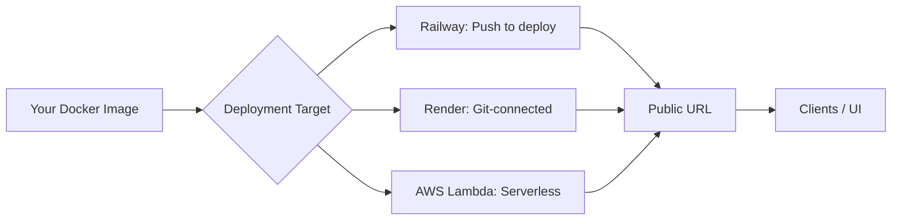
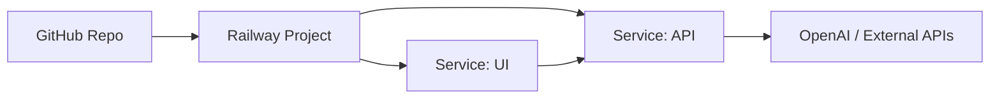
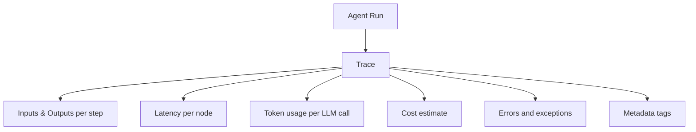
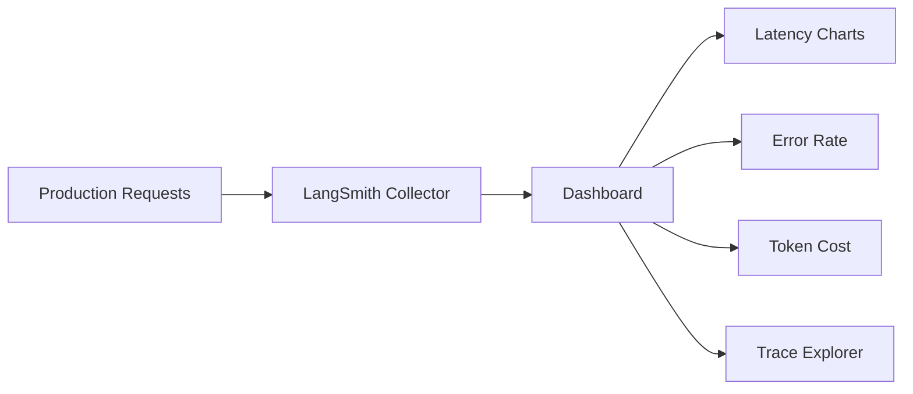

# Chapter 9: Hosting & Cloud

Your agent is containerized, your API is running, your UI looks good. Now it needs to live somewhere that is not your laptop.

This chapter covers three deployment targets — Railway, Render, and AWS Lambda — and then the part most developers skip until it is too late: **observability**. Knowing that your agent is running is not enough. You need to know what it is doing, what it is costing, and where it is failing.

## What You Will Learn

- How to deploy a containerized agent to Railway and Render
- When to use serverless (AWS Lambda) and when to avoid it
- How to manage environment variables safely in the cloud
- How to track every LLM call, tool use, and token cost with LangSmith
- How to set budget alerts before a runaway agent bankrupts you

## The Core Mental Model

Hosting is just running your Docker container on someone else's computer. The differences between platforms are: how much of the infrastructure you manage, how they scale, and how much they cost at zero traffic.



---

## 1. Railway: Fastest Path to Production

Railway is the fastest way to go from a Docker image to a live URL. No Kubernetes, no load balancer config, no VPC — just push and it runs.

**Best for**: side projects, client MVPs, solo developers who want to ship in an hour.

### Deploy in Five Steps

**Step 1**: Push your code to GitHub (Railway deploys from a repo or a Docker image).

**Step 2**: Go to [railway.app](https://railway.app) → New Project → Deploy from GitHub repo.

**Step 3**: Railway auto-detects your `Dockerfile`. If it finds one, it builds and deploys it automatically.

**Step 4**: Add environment variables under **Variables** in the Railway dashboard.

```
OPENAI_API_KEY=sk-...
LANGSMITH_API_KEY=ls-...
LANGSMITH_PROJECT=my-agent-prod
```

**Step 5**: Railway assigns a public URL like `https://my-agent.up.railway.app`. Done.

### Setting the Start Command

If Railway does not pick up your Dockerfile correctly, override the start command:

```
uvicorn api:app --host 0.0.0.0 --port $PORT
```

Railway injects `$PORT` automatically. Always use it instead of hardcoding `8000`.

### Deploying Multiple Services

Your agent stack has two containers (API + UI). Railway handles both as separate services in one project.



Create two services in the same Railway project. In the UI service's environment variables, set:

```
API_URL=https://your-api-service.up.railway.app
```

Railway services on the same project can also communicate over a private network using the internal hostname — faster and free of egress costs.

### Automatic Deploys

Every push to `main` triggers a rebuild and redeploy. No manual steps. Add a `railway.toml` to control the build:

```toml
# railway.toml
[build]
builder = "dockerfile"
dockerfilePath = "api/Dockerfile"

[deploy]
healthcheckPath = "/health"
healthcheckTimeout = 30
restartPolicyType = "on_failure"
restartPolicyMaxRetries = 3
```

---

## 2. Render: Git-Connected and Always On

Render is Railway's closest competitor. The key difference: Render's free tier keeps services alive on paid plans with no sleep, and its infrastructure is slightly more traditional (closer to Heroku) which some teams prefer.

**Best for**: teams that want a Heroku-like experience, persistent background workers, or PostgreSQL included in the same platform.

### Deploy a Web Service

**Step 1**: Push to GitHub.

**Step 2**: Go to [render.com](https://render.com) → New → Web Service → Connect your repo.

**Step 3**: Set the build and start commands:

```
Build command:  docker build -t agent .
Start command:  uvicorn api:app --host 0.0.0.0 --port $PORT
```

Or let Render auto-detect the Dockerfile — it will if the file is in the root.

**Step 4**: Add environment variables under **Environment** in the Render dashboard.

**Step 5**: Deploy. Render gives you a URL like `https://my-agent.onrender.com`.

### render.yaml: Infrastructure as Code

Define your entire stack in a single file and commit it to your repo.

```yaml
# render.yaml
services:
  - type: web
    name: agent-api
    runtime: docker
    dockerfilePath: ./api/Dockerfile
    envVars:
      - key: OPENAI_API_KEY
        sync: false # Render will prompt you to enter this manually
      - key: LANGSMITH_API_KEY
        sync: false
    healthCheckPath: /health
    autoDeploy: true

  - type: web
    name: agent-ui
    runtime: docker
    dockerfilePath: ./ui/Dockerfile
    envVars:
      - key: API_URL
        fromService:
          name: agent-api
          type: web
          property: host
    autoDeploy: true
```

`fromService` wires the API URL into the UI service automatically — no copy-pasting URLs between dashboards.

### Railway vs Render: Quick Comparison

|                           | Railway         | Render                          |
| ------------------------- | --------------- | ------------------------------- |
| **Speed to first deploy** | Fastest         | Fast                            |
| **Free tier**             | Trial credits   | Free tier (sleeps after 15 min) |
| **Dockerfile support**    | Yes             | Yes                             |
| **IaC config file**       | `railway.toml`  | `render.yaml`                   |
| **Managed PostgreSQL**    | Yes             | Yes                             |
| **Background workers**    | Yes             | Yes                             |
| **Best for**              | Solo devs, MVPs | Teams, Heroku migrants          |

---

## 3. AWS Lambda: Serverless Agents

Lambda runs your code only when a request comes in. No server to manage, no bill when idle. Sounds perfect — until you hit the constraints.

**Use Lambda when**:

- Traffic is spiky or unpredictable (bursts of requests, then silence)
- You are already deep in the AWS ecosystem
- Your agent handles short, discrete tasks (under 15 minutes)

**Do not use Lambda when**:

- Your agent runs long chains or loops (Lambda max timeout: 15 minutes)
- You need persistent in-memory state between requests
- You need WebSocket streaming (use API Gateway WebSocket or a container instead)

### Packaging a FastAPI Agent for Lambda

The cleanest approach is Mangum — a wrapper that adapts FastAPI to the Lambda handler interface.

```bash
pip install mangum
```

::: code-group

```python [Python]
# lambda_handler.py
from fastapi import FastAPI
from pydantic import BaseModel
from mangum import Mangum
from langchain_openai import ChatOpenAI

app = FastAPI()
llm = ChatOpenAI(model="gpt-4o", temperature=0)

class RunRequest(BaseModel):
    input: str

@app.post("/run")
def run(request: RunRequest):
    result = llm.invoke(request.input)
    return {"output": result.content}

# Mangum wraps FastAPI for Lambda
handler = Mangum(app)
```

```javascript [Node.js]
// lambda_handler.mjs — deploy with AWS SAM or the Lambda console
// Uses the built-in Lambda handler signature
import OpenAI from "openai";

const openai = new OpenAI({ apiKey: process.env.OPENAI_API_KEY });

export const handler = async (event) => {
  const body =
    typeof event.body === "string" ? JSON.parse(event.body) : event.body ?? {};
  const input = body.input ?? "";

  const response = await openai.chat.completions.create({
    model: "gpt-4o",
    temperature: 0,
    messages: [{ role: "user", content: input }],
  });

  return {
    statusCode: 200,
    headers: { "Content-Type": "application/json" },
    body: JSON.stringify({ output: response.choices[0].message.content }),
  };
};
```

:::

### Deploying with AWS SAM

AWS SAM (Serverless Application Model) is the simplest native way to deploy Lambda functions.

```bash
pip install aws-sam-cli
```

```yaml
# template.yaml
AWSTemplateFormatVersion: "2010-09-09"
Transform: AWS::Serverless-2016-10-31

Globals:
  Function:
    Timeout: 60
    MemorySize: 512
    Environment:
      Variables:
        OPENAI_API_KEY: !Sub "{{resolve:ssm:/myagent/openai_api_key}}"

Resources:
  AgentFunction:
    Type: AWS::Serverless::Function
    Properties:
      PackageType: Image
      ImageUri: my-agent:latest
      Events:
        Api:
          Type: HttpApi
          Properties:
            Path: /{proxy+}
            Method: ANY
```

```bash
# Build and deploy
sam build
sam deploy --guided
```

SAM provisions API Gateway → Lambda automatically and gives you a public HTTPS URL.

### Lambda Cold Starts

Lambda functions spin down when idle and take 1–3 seconds to restart (the "cold start"). For an LLM agent this is usually fine — your LLM API call is slower anyway. But if cold starts are unacceptable, use **Provisioned Concurrency** to keep instances warm, or switch to a container service (Railway/Render) instead.

---

## 4. Environment Variables and Secrets Management

Never hardcode API keys. Never commit `.env` to git. This is not optional.

### The Three Environments

```mermaid
flowchart LR
  D[Development] --> .env file
  S[Staging] --> Platform dashboard variables
  P[Production] --> Secrets manager
```

**Development**: `.env` file, never committed. Use `python-dotenv` to load it.

::: code-group

```python [Python]
from dotenv import load_dotenv
load_dotenv()
import os
api_key = os.getenv("OPENAI_API_KEY")
```

```javascript [Node.js]
import "dotenv/config"; // npm install dotenv
const apiKey = process.env.OPENAI_API_KEY;
```

:::

**Staging / Production on Railway or Render**: set variables in the platform dashboard. They are injected as environment variables at runtime — never touch your code.

**Production on AWS**: use AWS Systems Manager Parameter Store (free) or AWS Secrets Manager (paid, auto-rotation).

::: code-group

```python [Python]
import boto3

def get_secret(name: str) -> str:
    client = boto3.client("ssm", region_name="us-east-1")
    return client.get_parameter(Name=name, WithDecryption=True)["Parameter"]["Value"]

openai_key = get_secret("/myagent/openai_api_key")
```

```javascript [Node.js]
import {
  SSMClient,
  GetParameterCommand,
} from "@aws-sdk/client-ssm";

const ssm = new SSMClient({ region: "us-east-1" });

async function getSecret(name) {
  const cmd = new GetParameterCommand({ Name: name, WithDecryption: true });
  const result = await ssm.send(cmd);
  return result.Parameter.Value;
}

const openaiKey = await getSecret("/myagent/openai_api_key");
```

:::

### The `.env.example` Convention

Commit a `.env.example` with placeholder values. Your team knows what variables to set. Your secrets stay out of git.

```bash
# .env.example  ← commit this
OPENAI_API_KEY=your_openai_key_here
LANGSMITH_API_KEY=your_langsmith_key_here
LANGSMITH_PROJECT=my-agent-dev

# .env          ← never commit this (add to .gitignore)
OPENAI_API_KEY=sk-real-key-here
```

---

## 5. Observability with LangSmith

Deploying an agent without observability is like flying blind. You will not know which prompts are failing, which tools are slow, which runs are expensive, or where the agent is going off the rails — until a user complains.

LangSmith is Anthropic's (and the LangChain ecosystem's) observability platform for LLM applications. It captures every run: inputs, outputs, tool calls, latency, token counts, and costs.

### Setup

```bash
pip install langsmith
```

```bash
# .env
LANGCHAIN_TRACING_V2=true
LANGCHAIN_API_KEY=ls-...
LANGCHAIN_PROJECT=my-agent-prod
```

That is the entire integration. Once these three variables are set, every LangChain and LangGraph call is traced automatically — no code changes required.

### What LangSmith Captures



### Tagging Runs for Filtering

In production you will have hundreds of runs per hour. Tags let you filter by user, session, feature, or environment.

::: code-group

```python [Python]
from langchain_core.runnables import RunnableConfig

config = RunnableConfig(
    tags=["production", "chat-endpoint"],
    metadata={
        "user_id":    "user-abc-123",
        "thread_id":  "thread-xyz-456",
        "agent_version": "1.2.0"
    }
)

result = agent_app.invoke({"messages": [...]}, config=config)
```

```javascript [Node.js]
// LangSmith tracing from Node.js via the LangSmith SDK
import { Client } from "langsmith";
import OpenAI from "openai";

const ls = new Client();
const openai = new OpenAI();

async function tracedInvoke(userMessage, userId, threadId) {
  const run = await ls.createRun({
    name: "chat-endpoint",
    run_type: "chain",
    inputs: { message: userMessage },
    tags: ["production", "chat-endpoint"],
    extra: { metadata: { user_id: userId, thread_id: threadId, agent_version: "1.2.0" } },
  });

  const response = await openai.chat.completions.create({
    model: "gpt-4o",
    messages: [{ role: "user", content: userMessage }],
  });

  const output = response.choices[0].message.content;
  await ls.updateRun(run.id, { outputs: { output }, end_time: Date.now() });
  return output;
}
```

:::

Now in LangSmith you can filter all runs by `user_id` or `agent_version`. When a user reports a bug, you find their exact trace in seconds.

### Custom Feedback and Scores

You can attach human or automated feedback scores to any run — useful for tracking output quality over time.

::: code-group

```python [Python]
from langsmith import Client

client = Client()

# After a run completes, attach a score
client.create_feedback(
    run_id="...",              # from the trace
    key="output_quality",
    score=0.9,                 # 0.0 to 1.0
    comment="Accurate and concise"
)
```

```javascript [Node.js]
import { Client } from "langsmith";

const client = new Client();

await client.createFeedback(
  "run-id-here", // from the trace
  "output_quality",
  {
    score: 0.9,
    comment: "Accurate and concise",
  }
);
```

:::

### Monitoring a Live Deployment

LangSmith's dashboard gives you:

- **Latency percentiles** (p50, p95, p99) per chain and per model
- **Error rate** over time — spikes tell you when a prompt or API is breaking
- **Token usage per run** — sorted descending to find your most expensive queries
- **Trace explorer** — click any run, see the full tree of every LLM call and tool invocation



---

## 6. Cost Management: Not Going Broke

LLM API costs are invisible until they are not. A runaway loop, a forgotten test script hitting the production key, or a viral demo can produce a surprise bill in hours.

### The Three Cost Levers

**1. Model selection**: the single biggest cost driver.

| Model          | Relative Cost | Use for                               |
| -------------- | ------------- | ------------------------------------- |
| GPT-4o         | High          | Final output, complex reasoning       |
| GPT-4o-mini    | Low           | Classification, routing, simple tasks |
| Claude Haiku   | Low           | Fast, cheap subtasks                  |
| Ollama (local) | Free          | Development, testing                  |

Route cheap tasks to cheap models. Only use the expensive model where quality actually matters.

::: code-group

```python [Python]
from langchain_openai import ChatOpenAI

# Use cheap model for classification
classifier = ChatOpenAI(model="gpt-4o-mini", temperature=0)

# Use powerful model for generation
generator  = ChatOpenAI(model="gpt-4o", temperature=0.7)
```

```javascript [Node.js]
import OpenAI from "openai";

const openai = new OpenAI();

// Use cheap model for classification
async function classify(text) {
  const r = await openai.chat.completions.create({
    model: "gpt-4o-mini",
    temperature: 0,
    max_tokens: 20,
    messages: [{ role: "user", content: text }],
  });
  return r.choices[0].message.content;
}

// Use powerful model for generation
async function generate(prompt) {
  const r = await openai.chat.completions.create({
    model: "gpt-4o",
    temperature: 0.7,
    messages: [{ role: "user", content: prompt }],
  });
  return r.choices[0].message.content;
}
```

:::

**2. Prompt caching**: if you have a long system prompt (instructions, knowledge base, persona), enabling prompt caching means the provider charges you a fraction of the cost for repeated calls with the same prefix. Anthropic and OpenAI both support this — check their latest pricing pages for current rates.

**3. max_tokens on outputs**: long outputs cost more. If your agent only needs a classification or a short answer, cap the output.

::: code-group

```python [Python]
llm = ChatOpenAI(model="gpt-4o", max_tokens=256)
```

```javascript [Node.js]
const response = await openai.chat.completions.create({
  model: "gpt-4o",
  max_tokens: 256,
  messages: [{ role: "user", content: prompt }],
});
```

:::

### Set Budget Alerts

Set a hard budget alert **before** you launch anything public.

**OpenAI**: go to [platform.openai.com/settings/organization/billing](https://platform.openai.com/settings/organization/billing) → Usage limits → set a monthly soft limit (email alert) and hard limit (cuts off API calls).

**Anthropic**: go to [console.anthropic.com](https://console.anthropic.com) → Billing → set a spend limit.

A hard limit means a crashed agent stops costing money. Without one, a loop running at 3AM while you sleep will still be running at 9AM.

### Token Usage Tracking in LangSmith

LangSmith aggregates token usage per project. You can see:

- Daily cost trend
- Which chains are most expensive
- Which users are driving the most usage

Export the data to a spreadsheet or hook it to a Slack alert when spend exceeds a threshold.

---

## 7. Production Deployment Checklist

Before you give anyone a link to your live agent, run through this.

**Environment**

- [ ] All secrets in environment variables, not in code or Docker image
- [ ] `.env` in `.gitignore`
- [ ] `.env.example` committed with placeholder values

**API**

- [ ] `/health` endpoint returns 200
- [ ] `max_iterations` set on all agents
- [ ] Request timeout configured (agent cannot hang forever)
- [ ] Error responses return structured JSON, not stack traces

**Deployment**

- [ ] Service binds to `0.0.0.0:$PORT`
- [ ] Health check configured on Railway/Render
- [ ] Auto-deploy on push to `main` enabled
- [ ] Rollback strategy: can you redeploy the previous image in under 5 minutes?

**Observability**

- [ ] LangSmith tracing enabled (`LANGCHAIN_TRACING_V2=true`)
- [ ] Runs tagged with `user_id` and `session_id`
- [ ] Budget hard limit set on OpenAI and Anthropic dashboards
- [ ] At least one cost alert set below your monthly budget

---

## Common Pitfalls

- **Hardcoding `PORT=8000`**: cloud platforms inject `$PORT`. Your service will not start if you ignore it.
- **No health check**: Railway and Render will mark your service as unhealthy and restart it in a loop if there is no health endpoint.
- **Sharing one API key across dev and prod**: a runaway dev script will burn your production budget. Use separate keys for separate environments.
- **Deploying without LangSmith active**: the first production incident will be much harder to debug without traces. Turn it on before your first real user.
- **Forgetting to set a hard spend limit**: soft limits send an email. Hard limits stop the bleeding. Set both.

---

## What Comes Next

In Chapter 10, you will harden your deployment against the threats specific to AI agents: prompt injection, tool abuse, runaway costs from adversarial inputs, and the compliance requirements that enterprise clients will ask about on day one.
